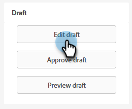

# Marketo EngageFormsの対話フロー設定{#conversational-flow-settings-for-marketo-engage-forms}

Marketo EngageFormsを対話型フローと統合して、対話型フローをDynamic Chatにします。 会議の予約、ホワイトペーパーのリンク、カスタム目標に対して、フォームデータまたはスマートリストのメンバーシップを使用して、リードを即座に評価します。

>[!AVAILABILITY]
>
>スマートリストのメンバーまたはリストのメンバーの条件には、Dynamic ChatPrime が必要です。 詳しくは、アドビアカウントチーム（担当のアカウントマネージャー）にお問い合わせください。

1. フォームを検索して選択します（または新しく作成します）。

   

1. 「**ドラフトを編集**」をクリックします。

   

1. フォーム編集ページで、「 **フォーム設定**&#x200B;を、 **設定**.

   

1. 次をクリック： **対話型フロー設定** スライダを使用して有効にします。

   

1. デフォルトの選択モーダルが表示されます。 好みを選択します。 この例では、を選択しています。 **対話フローの使用**.

   

1. 目的の対話フローおよび配信タイプを選択します。

   

   >[!NOTE]
   >
   >[対話型フローの詳細](/help/marketo/product-docs/demand-generation/dynamic-chat/automated-chat/conversational-flow-overview.md){target="_blank"}

   **オプションの手順**:「選択肢の追加」をクリックすると、特定の条件を満たすチャット訪問者をターゲットに設定できます。

   

   >[!IMPORTANT]
   >
   >訪問者のブラウザーが静的/スマートリストのメンバーに認定されるには、フォーム送信の前に、cookie が既知のユーザーである必要があります。

1. クリック **完了** 完了したら、

   
