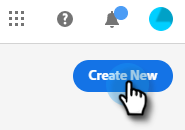

# ダイアログの作成 {#create-a-dialogue}

新しいダイアログを作成するには、次の手順に従います。

1. 「**[!UICONTROL ダイアログ]**」をクリックします。

   

1. 「**[!UICONTROL 新規作成]**」ボタンをクリックします。

   

1. 空のダイアログ、または事前入力済みのテンプレートを選択します。 名前を入力して（説明はオプションです）、優先度レベルを変更し（オプション）、「**[!UICONTROL 保存]**」をクリックします。

   

>[!NOTE]
>
>優先度は、訪問者が複数のダイアログに同時に振り分けた場合に、どのダイアログを訪問者に表示するかを決定します。

次に、[&#x200B; ストリームを作成する方法](/help/marketo/product-docs/demand-generation/dynamic-chat/automated-chat/stream-designer.md#create-a-stream){target="_blank"}を説明します。

>[!MORELIKETHIS]
>
>* [オーディエンス条件](/help/marketo/product-docs/demand-generation/dynamic-chat/automated-chat/audience-criteria.md){target="_blank"}
>* [ストリームデザイナー](/help/marketo/product-docs/demand-generation/dynamic-chat/automated-chat/stream-designer.md){target="_blank"}
