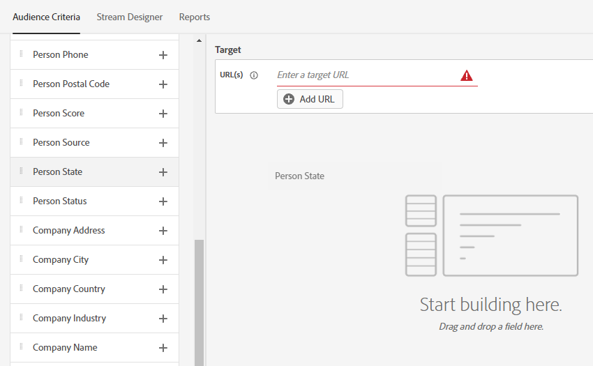
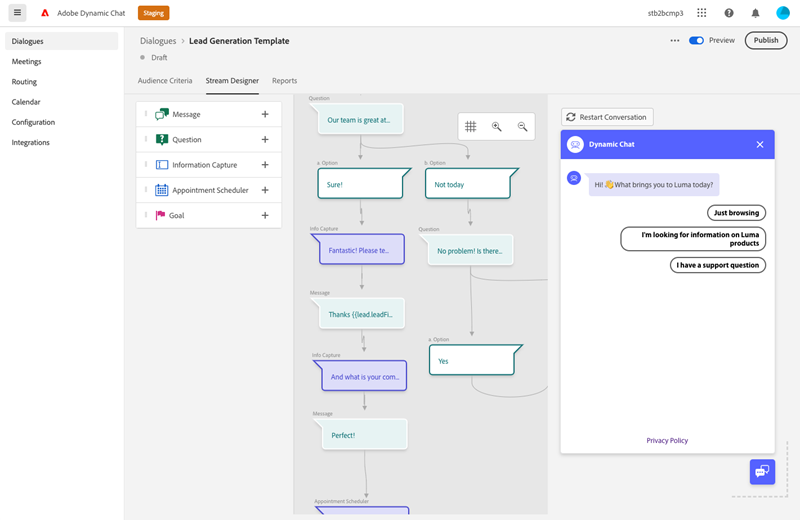
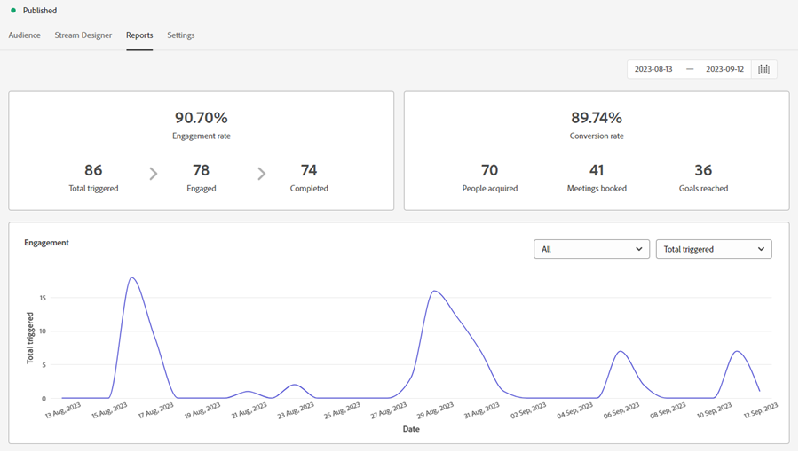
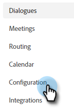
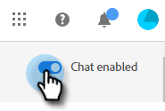

# ダイアログの概要 {#dialogue-overview}

ダイアログは個々のチャットの会話です。 各ダイアログで、特定のチャット会話を表示する場所、表示する対象者、会話の内容を決定します。 各ダイアログには、効果を監視できる独自のレポートページもあります。

## オーディエンス条件 {#audience-criteria}

ダイアログの「[オーディエンス条件](/help/marketo/product-docs/demand-generation/dynamic-chat/automated-chat/audience-criteria.md){target="_blank"}」セクションでは、チャット会話を表示する場所と対象者を定義します

## ストリームデザイナー {#stream-designer}

ダイアログの「[ストリームデザイナー](/help/marketo/product-docs/demand-generation/dynamic-chat/automated-chat/stream-designer.md){target="_blank"}」セクションで、web サイト訪問者との会話をデザインできます。

## レポート {#reports}

「レポート」タブでは、ダイアログのパフォーマンスに関する指標を確認できます。

<table>
 <tr>
  <td><strong>トリガーされた合計</strong></td>
  <td>訪問者がダイアログの表示条件を満たす、またはダイアログが表示されるたびにカウントが増加します。
</td>
 </tr>
 <tr>
  <td><strong>エンゲージ済</strong></td>
  <td>訪問者がダイアログ内の少なくとも 1 つのカード（質問、情報キャプチャなど）とやり取りすると増分されます。</td>
 </tr>
 <tr>
  <td><strong>完了</strong></td>
  <td>訪問者がダイアログ内の任意の分岐の終わりに達するたびにカウントが増加します。</td>
 </tr>
 <tr>
  <td><strong>獲得した人物</strong></td>
  <td>訪問者がダイアログフロー内で有効なメールアドレスを入力するたびにカウントが増加します。</td>
 </tr>
 <tr>
  <td><strong>予約済みの会議</strong></td>
  <td>訪問者がチャットボット経由で予定を正常に予約するたびにカウントが増加します。</td>
 </tr>
 <tr>
  <td><strong>達した目標</strong></td>
  <td>訪問者がいずれかのダイアログフローで目標に達するたびにカウントが増加します。</td>
 </tr>
</table>

## すべてのダイアログを無効／有効にする {#disable-enable-all-dialogues}

すべての公開ダイアログを同時に無効にする（および再度有効にする）ことができます。

1. 動的チャットで、「**[!UICONTROL 設定]**」タブをクリックします。

   

1. **[!UICONTROL チャットを有効]**&#x200B;切替スイッチで、すべてのダイアログを無効（または再度有効）にできます。

   
