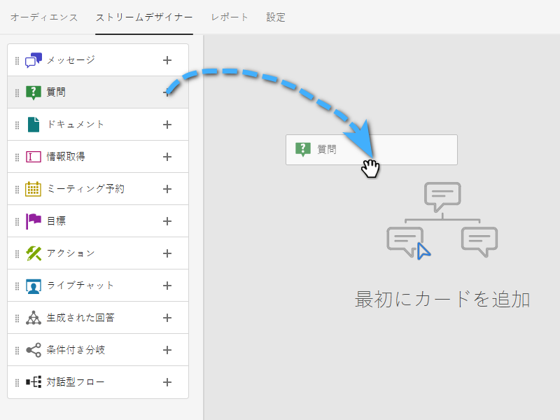

# ストリームデザイナー {#stream-designer}

_多数の_&#x200B;ストリームの組み合わせが可能です。この記事には、マーケターがサイト訪問者に製品に関する質問をする例が含まれています。「はい」の場合、訪問者は予定をスケジュールできます。「いいえ」の場合、訪問者には、今後の通信用にメーリングリストに参加するオプションが与えられます。また、無料の PDF も提供されます。最終的なゴールは、予定をスケジュールするか、訪問者のメールを収集することです。

>[!PREREQUISITES]
>
>ドキュメントカードを使用する前に、まずアドビアカウントを[設定する](/help/marketo/product-docs/demand-generation/dynamic-chat/integrations/adobe-pdf-embed-api.md){target="_blank"}必要があります。

## ストリームデザイナーのカード {#stream-designer-cards}

ストリームデザイナーには、チャット会話を形成するために追加できる複数のカードが含まれています。

<table>
 <tr>
  <td style="width:25%"><strong>メッセージ</strong></td>
  <td>応答を必要としない文を作成する場合に使用します（例：「こんにちは。コード「SAVE25」を使用すると、今日は全品が 25% オフです）。
</td>
 </tr>
 <tr>
  <td style="width:25%"><strong>質問</strong></td>
  <td>複数選択の質問に対して、利用可能な回答を提供する場合に使用します（例：どのような車に興味がありますか？応答 = SUV、コンパクト、トラックなど）。</td>
 </tr>
 <tr>
  <td style="width:25%"><strong>ドキュメント</strong></td>
  <td>ダイアログに PDF ドキュメントを埋め込み、訪問者のドキュメントのエンゲージメントアクティビティ（閲覧されたページ数、ダウンロードされた場合のドキュメントの数、使用された検索語）を追跡できます。</td>
 </tr>
 <tr>
  <td style="width:25%"><strong>情報取得</strong></td>
  <td>情報（名前、E メールアドレス、職位など）を収集する場合に使用します。 応答を関連付けるフィールドを選択した後、訪問者に応答を入力させるか、または決定した選択リストからオプションを選択できます（ヒント：後者はデータベースの清潔さを助けることができます）。 また、現在リストされているデータをその回答で上書きするか、値が既にある場合は質問を完全にスキップするかを選択できます。</td>
 </tr>
 <tr>
  <td style="width:25%"><strong>会議の予約</strong></td>
  <td>訪問者に、会議をスケジュールするために使用可能な日付のカレンダーを提供します。 ラウンドロビン、特定のエージェント、またはカスタムルールを使用して、カレンダーの可用性を選択します。 クリック <b>属性を追加</b> エージェントの名前または電子メールアドレスを取り込み、将来のクエリ用に chat 訪問者の個人レコードに割り当てる場合 ( ヒント： <a href="/help/marketo/product-docs/administration/field-management/create-a-custom-field-in-marketo.md" target="_blank">カスタムフィールド</a> エージェントの情報をにマッピングして、標準の「Marketo Engage」フィールドを上書きしないようにする )。</td>
 </tr>
 <tr>
  <td style="width:25%"><strong>ゴール</strong></td>
  <td>訪問者に表示されないカードはこれだけです。特定のチャット内で目標を達成した時点を決定する必要があります（例：訪問者のメールを収集することが目標の場合は、ストリームの情報キャプチャの直後に目標カードを配置します）。</td>
 </tr>
 <tr>
  <td style="width:25%"><strong>アクション</strong></td>
  <td>フォーム内の非表示のフィールドと同様に、アクションカードを使用して、( <a href="/help/marketo/product-docs/administration/field-management/custom-field-type-glossary.md#string">string データ型</a>) をリードレコードに対してキャプチャする暗黙の値に置き換えます。 会話の任意の時点でアクションカードを追加し、それぞれの値を自動的に設定する値またはネイティブトークンを使用して、各属性を更新できます。
  
<i>アクションカードにはDynamic ChatPrime が必要です。 詳しくは、アドビアカウントチーム（担当のアカウントマネージャー）にお問い合わせください。</i></td>
 </tr>
 <tr>
  <td style="width:25%"><strong>ライブチャット</strong></td>
  <td>訪問者がライブエージェントとチャットする場合は、ライブチャットカードを使用します。
  <li>ライブチャットカードは、ブランチの最後のカードである必要があります。</li>
  <li>訪問者は、ストリーム内のこのカードに到達するとすぐにエージェントにルーティングされるので、このカードの前に、ライブエージェントとのチャットを希望するかどうかを訪問者に尋ねる質問カードを付けることをお勧めします。</li></td>
 </tr>
</table>

## ストリームデザイナーのアイコン {#stream-designer-icons}

ストリームデザイナーの右上に、いくつかのアイコンが表示されます。以下に機能を説明します。

<table>
 <tr>
  <td style="width:10%"></td>
  <td>拡大して、大きなカードを作成します</td>
 </tr>
 <tr>
  <td style="width:10%"></td>
  <td>縮小して、小さいカードを作成します</td>
 </tr>
 <tr>
  <td style="width:10%"></td>
  <td>チャットをテストするためのウィンドウを開きます（同じボタンを押して閉じます）</td>
 </tr>
 <tr>
  <td style="width:10%"></td>
  <td>ストリーム内のカードのタイプまたはコンテンツを検索できます</td>
 </tr>
 <tr>
  <td style="width:10%"></td>
  <td>ストリーム内のすべてのカードを配置します</td>
 </tr>
</table>

## ストリームの作成 {#create-a-stream}

ダイアログのストリームを作成するか、 [対話型のForms](/help/marketo/product-docs/demand-generation/dynamic-chat/automated-chat/conversational-flow-overview.md){target="_blank"}. この例では、ダイアログ用に 1 つ作成します。

1. 以下の操作を実行した後： [ダイアログを作成しました](/help/marketo/product-docs/demand-generation/dynamic-chat/automated-chat/create-a-dialogue.md){target="_blank"}をクリックし、 **[!UICONTROL ストリームデザイナー]** タブをクリックします。

   

1. 次をドラッグ&amp;ドロップ： [!UICONTROL 質問] カード。

   

1. の下 [!UICONTROL Chatbot 応答]、質問をお読みください。

   

   >[!TIP]
   >
   >トークンを使用して、既知のチャット訪問者に対するエクスペリエンスをパーソナライズできます（例：こんにちは `{{lead.leadFirstName:""}}` さん）をクリックします。右側の中括弧アイコンをクリックして選択します。匿名訪問者に何か一般的なものを表示させたい場合は、引用符の間にデフォルト値を追加します（例：Hello `{{lead.leadFirstName:"there"}}` ）

   >[!NOTE]
   >
   >Poke はデフォルトでオンに設定されており、訪問者がチャットアイコンをクリックしなくてもチャットアイコンの横に開始の質問が表示されます。Poke は会話の最初のカードでのみ利用できます。

1. ユーザの回答を入力し、「**[!UICONTROL 保存]**」をクリックします。

   

   >[!NOTE]
   >
   >**[!UICONTROL 保存済みの値を編集]**&#x200B;は、質問カードでマッピングされた属性に対してチャットボットの訪問者に表示する値とは異なる値をデータベースに格納する場合のオプションの手順です（例：訪問者には「検索エンジン最適化」と表示されますが、この値を「SEO」として保存します）。

1. 「はい」の場合は、予定をスケジュールしたいので、下のオプションの予定スケジューラーカードにドラッグします。

   

1. 右側の列で、「**[!UICONTROL 保存]**」をクリックします。

   

1. これは目標なので、 [!UICONTROL 目標] 予約スケジューラーの下のカード。

   

1. 目標に名前を付け（または既存のものを選択）、「**[!UICONTROL 保存]**」をクリックします。

   

1. &quot;いいえ&quot;の場合は、彼らがメーリングリストに参加するかどうかを確認したいので、その下のオプションを別のオプションの上にドラッグします [!UICONTROL 質問] カード。

   

1. 回答を入力し、訪問者の回答を追加します。終了したら「**[!UICONTROL 保存]**」をクリックします。

   

   >[!NOTE]
   >
   >「**[!UICONTROL 回答を追加]**」をクリックすると、さらに回答を追加できます。

1. 「はい」の回答の下で、情報キャプチャカードをドラッグして、訪問者のメールを収集できます。

   

1. **[!UICONTROL タイプ]**&#x200B;ドロップダウンをクリックして、「**[!UICONTROL メール]**」を選択します。

   

1. チャットボットのメッセージとプレースホルダーを入力します。属性が Marketo の適切なフィールドにマッピングされていることを確認し、「**[!UICONTROL 保存]**」をクリックします。

   

   <table>
    <tr>
     <td style="width:30%"><strong>タイプ</strong></td>
     <td>取得する情報のタイプ（電話、テキスト、メール）</td>
    </tr>
    <tr>
     <td style="width:30%"><strong>チャットボットメッセージ</strong></td>
     <td>情報の提供を促すメッセージが訪問者に表示されます。</td>
    </tr>
    <tr>
     <td style="width:30%"><strong>プレースホルダー</strong></td>
     <td>訪問者が何を入力するかを確認するのに役立つサンプルテキスト。</td>
    </tr>
    <tr>
     <td style="width:30%"><strong>回答を属性にマッピング</strong></td>
     <td>訪問者の回答を、Marketo サブスクリプション内のユーザレコードの対応するフィールドに同期できます。</td>
    </tr>
   </table>

1. E メールの収集は目標なので、 [!UICONTROL 目標] 情報キャプチャの下のカード。

   

1. 目標に名前を付け（または既存のものを選択）、「**[!UICONTROL 保存]**」をクリックします。

   

1. 「いいえ」の場合は、必ず回答を追加してください。選択肢の 1 つは、メッセージカードをその下にドラッグして、「ありがとうございました」と表示することです。しかし、この例では、代わりに無料の PDF 文書を提供します。

   

1. この例では新規ドキュメントを作成します。名前を入力し、既にホストしている PDF の URL を入力して、「**[!UICONTROL 保存]**」をクリックします。

   

1. 「**[!UICONTROL プレビュー]**」切替スイッチを選択して、ダイアログをプレビューします。

   

1. ダイアログをアクティブにする準備が整ったら、「**[!UICONTROL 公開]**」をクリックします。

   

>[!NOTE]
>
>クリックする前に [!UICONTROL 公開]、忘れずに [ターゲット URL を入力しました](/help/marketo/product-docs/demand-generation/dynamic-chat/automated-chat/audience-criteria.md#target){target="_blank"}.

>[!MORELIKETHIS]
>
>* [ダイアログの作成](/help/marketo/product-docs/demand-generation/dynamic-chat/automated-chat/create-a-dialogue.md){target="_blank"}
>* [オーディエンス条件](/help/marketo/product-docs/demand-generation/dynamic-chat/automated-chat/audience-criteria.md){target="_blank"}
>* [Adobe PDF Embed API](/help/marketo/product-docs/demand-generation/dynamic-chat/integrations/adobe-pdf-embed-api.md){target="_blank"}
