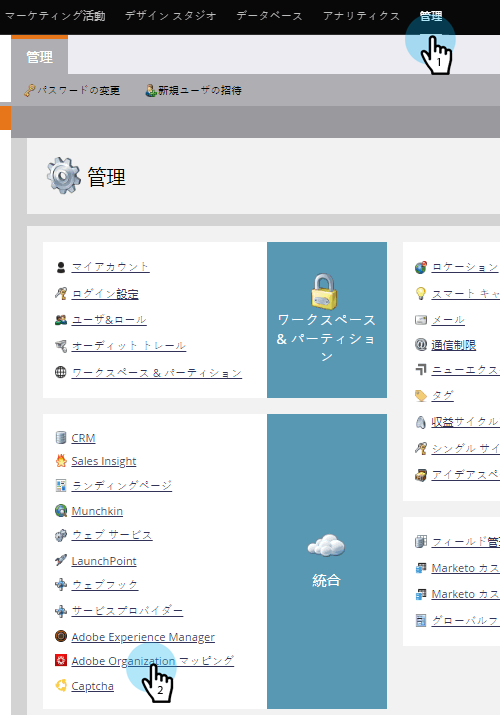

# Dynamic Chat をMarketoに接続 {#connect-dynamic-chat-to-marketo}

完了した後、 [初期設定](/help/marketo/product-docs/demand-generation/dynamic-chat/initial-setup.md)Dynamic Chat をMarketoサブスクリプションに接続する 1 回限りの同期を実行する時間です。

1. マイMarketoで、 **ダイナミックチャット** タイル。

   

   >[!NOTE]
   >
   >タイルが表示されない場合は、Marketo管理者にお問い合わせください。

1. 以前にAdobe IDでアプリにアクセスしたことがある場合は、Dynamic Chat に直接アクセスできます。 そうでない場合は、 [Adobe IDの設定](https://helpx.adobe.com/manage-account/using/create-update-adobe-id.html).

1. Marketoインスタンスに接続するには、「 **統合**.

   

1. Marketoカードで、 **同期の開始**.

   

>[!NOTE]
>
>同期が完了するまでに 2 ～ 24 時間かかる場合があります（データベースのサイズによって異なります）。

## Adobe組織とMarketoのリンク {#link-your-adobe-org-and-marketo}

次に、AdobeとMarketoをリンクします。

1. にログインします。 [experience.adobe.com](https://experience.adobe.com).

1. ホームページの右下隅から組織 ID をコピーします。 _-_ 「@AdobeOrg」

   

1. Marketoで、 **管理者** 「 」セクションで「 」を選択します。 **Adobe組織マッピング**.

   

1. 「**編集**」をクリックします。

   

1. 手順 2 でコピーした組織 ID を貼り付け、「 **OK**.

   

>[!MORELIKETHIS]
>
>[初期設定](/help/marketo/product-docs/demand-generation/dynamic-chat/initial-setup.md)
