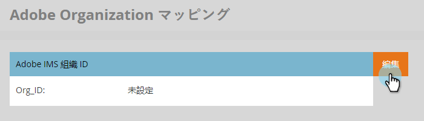
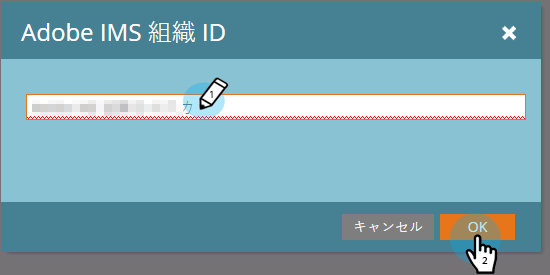

# 動的チャットを Marketo に接続する {#connect-dynamic-chat-to-marketo}

[初期設定](/help/marketo/product-docs/demand-generation/dynamic-chat/initial-setup.md)が完了したら、動的チャットを Marketo サブスクリプションに接続する 1 回限りの同期を実行する時間です。

1. マイ Marketo で、**動的チャット**&#x200B;タイルをクリックします。

   

   >[!NOTE]
   >
   >タイルが表示されない場合は、Marketo 管理者にお問い合わせください。

1. 以前に Adobe ID を使用してアプリケーションにアクセスしたことがある場合は、動的チャットに直接アクセスできます。そうでない場合、[Adobe ID を設定](https://helpx.adobe.com/jp/manage-account/using/create-update-adobe-id.html)してください。

1. Marketo インスタンスに接続するには、**統合**&#x200B;を選択します。

   

1. Marketo カードで、「**同期を開始**」をクリックします。

   

1. Marketoインスタンスから最大 50 個の標準フィールドまたはカスタムフィールドを選択し、オーディエンスのターゲティング、データマッピング、パーソナライゼーションで使用するために Dynamic Chat に同期します。 終了したら「**次へ**」をクリックします。

   

   >[!CAUTION]
   >
   >この時点で、属性の選択 **できません** は、最初の同期後に変更されます。 同期が完了したら、戻ってさらに追加するだけです（50 未満を選択した場合）。

1. 選択内容を確認します ( 注意：同期後に属性を削除することはできないので、 **選択項目の編集** （この手順で任意のを変更する必要がある場合）。 クリック **確認** 同期を開始するために完了した場合。

   

>[!NOTE]
>
>データベースのサイズに応じて、同期が完了するまでに 2 ～ 24 時間かかる場合があります。

## アドビ組織と Marketo のリンク {#link-your-adobe-org-and-marketo}

次に、アドビと Marketo をリンクする時です。

1. [experience.adobe.com](https://experience.adobe.com) にログインします。

1. ホームページの右下隅から組織 ID をコピーします。「@AdobeOrg」は&#x200B;_除きます_。

   

1. Marketo で、**管理者**&#x200B;セクションに移動して&#x200B;**アドビ組織マッピング**&#x200B;を選択します。

   

1. 「**編集**」をクリックします。

   

1. 手順 2 でコピーした組織 ID を貼り付け、「**OK**」をクリックします。

   

>[!MORELIKETHIS]
>
>[初期設定](/help/marketo/product-docs/demand-generation/dynamic-chat/initial-setup.md)
