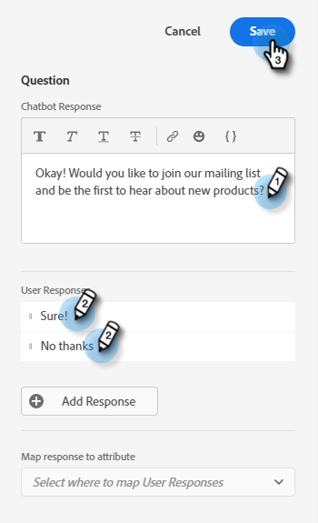

# ストリームの作成 {#create-a-stream}

作成するストリームの組み合わせは _多数_ です。 マーケターがサイト訪問者に質問する例を以下に示します。 設定されている場合、訪問者は予定をスケジュールできます。 いいえの場合、訪問者には、今後の通信用にメーリングリストに参加するオプションが与えられます。 目標は、予定をスケジュールするか、訪問者の E メールを収集することです。

1. [ ダイアログ ](/help/marketo/product-docs/demand-generation/dynamic-chat/dialogues.md#create-a-new-dialogue) を作成した後、「ストリームデザイナー」タブをクリックします。

   

1. 質問カードをドラッグ&amp;ドロップします。

   

1. Chatbot Response で、あなたの好きな方法を話してください。

   

   >[!NOTE]
   >
   >Poke はデフォルトでオンに設定されており、訪問者がチャットアイコンをクリックしなくてもチャットアイコンの横に開始の質問が表示されます。

1. ユーザーの回答を入力し、「**保存**」をクリックします。

   

1. 「はい」の場合は、予定をスケジュールします。その下のオプションで、予定スケジューラカードの上にドラッグします。

   

1. 右側の列で、「**保存**」をクリックします。

   

1. これは目標なので、予定スケジューラの下の目標カードをドラッグします。

   

1. 目標に名前を付け（または既存の目標を選択）、「**保存**」をクリックします。

   

1. 「いいえ」の場合は、彼らがメーリングリストに参加するかどうかを確認したいので、そのオプションの下に別の質問カードの上にドラッグします。

   

1. 回答を入力し、訪問者の回答を追加します。 終了したら「**保存**」をクリックします。

   

   >[!NOTE]
   >
   >「**応答を追加**」をクリックして、応答を追加できます。

1. 「はい」応答の下で、情報キャプチャカードの上にドラッグして、訪問者の E メールを収集できます。

   

1. 「**タイプ**」ドロップダウンをクリックし、「**電子メール**」を選択します。

   

1. チャットボットのメッセージとプレースホルダを入力します。 属性がMarketoの適切なフィールドにマッピングされていることを確認し、「**保存**」をクリックします。

   

   <table>
    <tr>
     <td><strong>タイプ</strong></td>
     <td>取得する情報のタイプ：電話、テキスト、電子メール。</td>
    </tr>
    <tr>
     <td><strong>Chatbot メッセージ</strong></td>
     <td>情報の提供を促すメッセージが訪問者に表示されます。</td>
    </tr>
    <tr>
     <td><strong>訪問者が何を入力するかを確認するのに役立つサンプルテキスト。</strong></td>
     <td>テキスト</td>
    </tr>
    <tr>
     <td><strong>応答を属性にマッピング</strong></td>
     <td>訪問者の応答を、Marketoサブスクリプション内のユーザーレコードの対応するフィールドに同期できます。</td>
    </tr>
   </table>

1. E メールの収集は目標なので、情報キャプチャの下にゴールカードをドラッグします。

   

1. 目標に名前を付け（または既存の目標を選択）、「**保存**」をクリックします。

   

1. 「いいえ」と答えた場合は、必ず応答を追加してください。 メッセージカードをそのオプションの下にドラッグします。

   

1. メッセージを入力し、「**保存**」をクリックします。

   

1. ダイアログをアクティブにする場合は、「**公開**」をクリックします。

   

>[!NOTE]
>
>「公開」をクリックする前に、必ず [ ターゲット URL](help/marketo/product-docs/demand-generation/dynamic-chat/dialogues.md#target) を入力してください。
