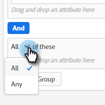

# ダイアログ {#dialogues}

ダイアログは個々のチャットの会話です。 視覚的にカスタマイズする方法、表示するページを決定する方法、表示するページを決定する方法、および表示するページを決定する方法を説明します。

## 新しいダイアログの作成 {#create-a-new-dialogue}

1. **ダイアログ** をクリックします。

   

1. 「**新規作成**」ボタンをクリックします。

   

1. 名前を入力し（説明はオプション）、優先度レベルを設定して、[**保存**] をクリックします。

   

>[!NOTE]
>
>優先度は、訪問者が複数のダイアログに同時に振り分けた場合に、どのダイアログを訪問者に表示するかを決定します。

## オーディエンス条件 {#audience-criteria}

Marketoのスマートリストと同様、オーディエンス条件属性を使用すると、ターゲットオーディエンスを定義できます。 推定、人、会社の属性（またはその組み合わせ）を使用して、既知の人または不明な人をターゲットに設定できます。

**認識済み担当者**

_多くの_ 属性の組み合わせから選択できます。 この例では、カリフォルニア州の **既知の人** をターゲットにし、従業員数が 50 人を超える会社で働いています。

1. **Person State** 属性を取得し、右にドラッグします。

   

1. __ デフォルトで設定される Isis。「値の選択」フィールドに「 CA 」と入力します（ドロップダウンをクリックして、リストから「 」を選択することもできます）。

   

1. **会社の規模** 属性を取得し、_ここに属性をドラッグ&amp;ドロップ_ します。

   

   >[!NOTE]
   >
   >**+** アイコンをクリックして、属性を選択することもできます。

1. 演算子のドロップダウンをクリックし、「**次よりも大きい**」を選択します。

   

1. 「 50 」と入力し、画面の別の場所をクリックして保存します。

   

**匿名担当者**

まだデータベースに格納されていないユーザーを絞り込む方法が簡単に用意されています。 この例では、ニューヨーク地域にある **匿名の人** をすべてターゲットにしています。

1. **Person Email** 属性を取得し、右にドラッグします。

   

1. 演算子のドロップダウンをクリックし、「**空である**」を選択します。

   

1. **推定状態** 属性を取得し、_ここに属性をドラッグ&amp;ドロップ_ します。

   

   >[!NOTE]
   >
   >誰かが Web サイトを訪問したとき、[Munchkin](/help/marketo/product-docs/administration/additional-integrations/add-munchkin-tracking-code-to-your-website.md) はそれらを cookie でクッキングし、システムに格納します。 私たちは彼らの IP を特別なデータベースで調べ、あらゆる種類の良い情報を推測する。

1. __ デフォルトで設定される Isis。「値の選択」フィールドに「 NY 」と入力します（ドロップダウンをクリックして、リストから「 」を選択することもできます）。

   

## グループの追加 {#add-groups}

特定の属性をすべて他の属性の「すべてまたは任意」と共に持つ場合は、属性をグループ化するオプションもあります。 複数のグループを追加できます。

## ターゲット {#target}

ここで、特定のダイアログを表示する URL を入力します。

使用可能な形式：

* `http://website.com`
* `https://*.website.com`
* `http://website.com/folder/*`
* `https://*.website.com/folder/*`

>[!NOTE]
>
>アスタリスクを使用すると包括的なワイルドカードとして機能します。 したがって、`https://*.website.com` は、サブドメインを含むサイトのすべてのページにダイアログを配置します ( 例：`support.website.com`) に置き換えます。 `https://website.com/folder/*` は、後続のフォルダ内のすべてのHTMLページにダイアログを配置します ( 例：この場合、フォルダーが「sports」であるとします。そのため、次のようになります。website.com/sports/baseball.html、website.com/sports/football.htmlなど )。

## ストリームデザイナー {#stream-designer}

ストリームデザイナーは、チャットの会話を形成するために追加できる様々なカードを含んでいます。

<table>
 <tr>
  <td><strong>メッセージ
</strong></td>
  <td>応答を不要にして文を作成する場合に使用します ( 例：「やあ！ すべての項目は、コード SAVE25"で 25%オフです )。
</td>
 </tr>
 <tr>
  <td><strong>質問</strong></td>
  <td>複数選択の質問に対して、利用可能な回答を提供する場合に使用します ( 例：あなたはどのような車に興味がありますか？ 応答= SUV、コンパクト、トラックなど )。</td>
 </tr>
 <tr>
  <td><strong>情報キャプチャ</strong></td>
  <td>情報を収集する場合は、を使用します。 選択できるフィールドは、「電子メールアドレス」、「電話番号」および「テキスト」（訪問者が独自のメッセージを書き込めるようにする）の 3 つです。</td>
 </tr>
 <tr>
  <td><strong>予定スケジューラ</strong></td>
  <td>訪問者に、フォローアップをスケジュールするために使用可能な日付のカレンダーを提供します。 カレンダーの可用性は、<a href="/help/marketo/product-docs/demand-generation/dynamic-chat/dynamic-chat-overview.md#routing"> 行 </a> の次のエージェントを反映しています。</td>
 </tr>
 <tr>
  <td><strong>ゴール</strong></td>
  <td>これが訪問者に表示されない唯一のカードです。 特定のチャット内で目標を達成した時点を判断する必要があります ( 例：訪問者の e メールを収集することが目標の場合は、ストリームの情報キャプチャの直後に目標カードを配置します )。</td>
 </tr>
</table>

**ストリームの作成**

_多くの_ ストリームの組み合わせが考えられます。 この記事 ](/help/marketo/product-docs/demand-generation/dynamic-chat/create-a-stream.md) の例を見てみましょう。[

## レポート {#reports}

「レポート」タブで、過去 90 日間のデータを表示します。 各カテゴリは次のように定義します。

<table>
 <tr>
  <td><strong>トリガーされた合計</strong></td>
  <td>訪問者がダイアログに資格を得る/表示されるたびに増分されます。
</td>
 </tr>
 <tr>
  <td><strong>エンゲージ済</strong></td>
  <td>訪問者がチャットボットのアンカーをクリックするたびに増分され、ダイアログが開きます。</td>
 </tr>
 <tr>
  <td><strong>完了済み</strong></td>
  <td>訪問者がダイアログ内のブランチの終わりに到達するたびに増分されます。</td>
 </tr>
 <tr>
  <td><strong>キャプチャされた人</strong></td>
  <td>訪問者がダイアログフローで有効な電子メールアドレスを入力するたびに増分されます。</td>
 </tr>
 <tr>
  <td><strong>会議の予約</strong></td>
  <td>訪問者がチャットボットを介して予定のスケジュールに成功するたびに増分します。</td>
 </tr>
 <tr>
  <td><strong>達成した目標</strong></td>
  <td>訪問者がダイアログのフローの目標に達するたびに増分されます。</td>
 </tr>
</table>

>[!MORELIKETHIS]
>
>[ストリームの作成](/help/marketo/product-docs/demand-generation/dynamic-chat/create-a-stream.md)
