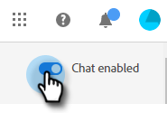

# ダイアログの概要 {#dialogue-overview}

ダイアログは個々のチャットの会話です。各ダイアログで、特定のチャット会話を表示する場所、対象となるチャット会話の対象、会話の内容を決定します。 各ダイアログには、効果を監視できる独自のレポートページもあります。

## オーディエンス条件 {#audience-criteria}

この [オーディエンス条件](/help/marketo/product-docs/demand-generation/dynamic-chat/dialogues/audience-criteria.md)ダイアログの {target=&quot;_blank&quot;} セクションでは、チャットの会話をどこでどのユーザーに表示するかを定義します

## ストリームデザイナー {#stream-designer}

この [ストリームデザイナー](/help/marketo/product-docs/demand-generation/dynamic-chat/dialogues/stream-designer.md)ダイアログの {target=&quot;_blank&quot;} セクションでは、Web サイトの訪問者との会話をデザインできます。

## レポート {#reports}

この [レポート](/help/marketo/product-docs/demand-generation/dynamic-chat/dialogues/reports.md)ダイアログの {target=&quot;_blank&quot;} セクションでは、ダイアログのパフォーマンスに関する指標を確認できます。

## すべてのダイアログを無効にする/有効にする {#disable-enable-all-dialogues}

すべての公開済みダイアログを同時に無効（または再度有効）にすることができます。

1. Dynamic Chat で、 **設定** タブをクリックします。

   

1. 切り替え **チャット有効** すべてのダイアログを無効にする（または再度オンにする）には、オフに切り替えます。

   
