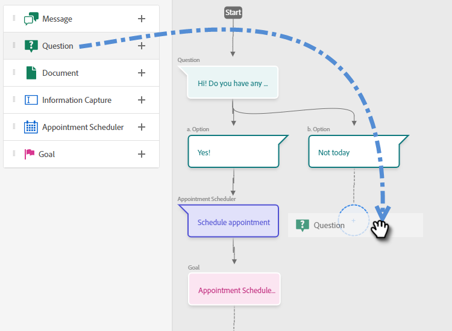

# ストリームデザイナー {#stream-designer}

次のものがあります。 _多数の_ ストリームの組み合わせが可能です。 この記事には、マーケターがサイト訪問者に製品に関する質問をする例が含まれています。 「はい」の場合、訪問者は予定をスケジュールできます。「いいえ」の場合、訪問者には、今後の通信用にメーリングリストに参加するオプションが与えられます。無料のPDF 最終的な目標は、予定をスケジュールするか、訪問者の E メールを収集することです。

>[!PREREQUISITES]
>
>ドキュメントカードを使用する前に、まず [設定する](/help/marketo/product-docs/demand-generation/dynamic-chat/integrations/using-the-document-card.md){target=&quot;_blank&quot;} をAdobeアカウントで使用します。

## ストリームデザイナーカード {#stream-designer-cards}

ストリームデザイナーには、チャット会話を形成するために追加できる複数のカードが含まれています。

<table>
 <tr>
  <td><strong>メッセージ</strong></td>
  <td>応答を必要としない文を作成する場合に使用します（例：「こんにちは。コード「SAVE25」を使用すると、今日は全品が 25% オフです）。
</td>
 </tr>
 <tr>
  <td><strong>質問</strong></td>
  <td>複数選択の質問に対して、利用可能な回答を提供する場合に使用します（例：どのような車に興味がありますか？応答 = SUV、コンパクト、トラックなど）。</td>
 </tr>
 <tr>
  <td><strong>ドキュメント</strong></td>
  <td>ダイアログにPDFドキュメントを埋め込み、訪問者のドキュメントのエンゲージメントアクティビティ（閲覧されたページ数、ダウンロードされた場合のドキュメントの数、使用された検索語）を追跡できます。</td>
 </tr>
 <tr>
  <td><strong>情報取得</strong></td>
  <td>情報を収集する場合に使用します。選択できる 3 つのフィールドは、「電子メールアドレス」、「電話番号」、「テキスト」（訪問者が独自のメッセージを書き込むことができる）です。</td>
 </tr>
 <tr>
  <td><strong>予定スケジューラー</strong></td>
  <td>訪問者に、フォローアップをスケジュールするために使用可能な日付のカレンダーを提供します。カレンダーの可用性は<a href="/help/marketo/product-docs/demand-generation/dynamic-chat/dynamic-chat-overview.md#routing">次のエージェント</a>を反映します。</td>
 </tr>
 <tr>
  <td><strong>ゴール</strong></td>
  <td>訪問者に表示されないカードはこれだけです。特定のチャット内で目標を達成した時点を決定する必要があります（例：訪問者のメールを収集することが目標の場合は、ストリームの情報キャプチャの直後に目標カードを配置します）。</td>
 </tr>
</table>

## ストリームの作成 {#create-a-stream}

1. 以下を実行した後： [ダイアログを作成しました](/help/marketo/product-docs/demand-generation/dynamic-chat/dialogues/create-a-dialogue.md){target=&quot;_blank&quot;}、 **ストリームデザイナー** タブをクリックします。

   

1. 質問カードをドラッグ＆ドロップします。

   

1. 「チャットボットの回答」で、質問を入力します。

   

   >[!NOTE]
   >
   >「Poke」はデフォルトでオンに設定されており、訪問者がチャットアイコンをクリックしなくてもチャットアイコンの横に開始の質問が表示されます。Poke は会話の最初のカードでのみ利用できます。

1. ユーザーの回答を入力し、「**保存**」をクリックします。

   

   >[!NOTE]
   >
   >**保存済みの値を編集** は、質問カードでマッピングされた属性に対して chatbot の訪問者に表示される値とは異なる値をデータベースに格納したい場合のオプションの手順です ( 例：訪問者には「検索エンジン最適化」が表示されます。この値は「SEO」として保存されます )。

1. 「はい」の場合は、予定をスケジュールしたいので、下のオプションの予定スケジューラーカードにドラッグします。

   

1. 右側の列で、「**保存**」をクリックします。

   

1. これは目標なので、予定スケジューラーの下にある目標カードをドラッグします。

   

1. 目標に名前を付け（または既存のものを選択）、「**保存**」をクリックします。

   

1. 「いいえ」の場合は、ユーザーがメーリングリストに登録するかどうかを確認したいので、その下に、別の質問カードをドラッグします。

   

1. 回答を入力し、訪問者の回答を追加します。終了したら「**保存**」をクリックします。

   

   >[!NOTE]
   >
   >「**回答を追加**」をクリックすると、更に回答を追加できます。

1. 「はい」の回答の下で、情報キャプチャカードをドラッグして、訪問者のメールを収集できます。

   

1. **タイプ**&#x200B;ドロップダウンをクリックして、「**メール**」を選択します。

   

1. チャットボットのメッセージとプレースホルダーを入力します。属性が Marketo の適切なフィールドにマッピングされていることを確認し、「**保存**」をクリックします。

   

   <table>
    <tr>
     <td><strong>タイプ</strong></td>
     <td>取得する情報のタイプ（電話、テキスト、メール）</td>
    </tr>
    <tr>
     <td><strong>チャットボットメッセージ</strong></td>
     <td>情報の提供を促すメッセージが訪問者に表示されます。</td>
    </tr>
    <tr>
     <td><strong>プレースホルダー</strong></td>
     <td>訪問者が何を入力するかを確認するのに役立つサンプルテキスト。</td>
    </tr>
    <tr>
     <td><strong>回答を属性にマッピング</strong></td>
     <td>訪問者の回答を、Marketo サブスクリプション内のユーザーレコードの対応するフィールドに同期できます。</td>
    </tr>
   </table>

1. メールの収集が目標なので、情報キャプチャの下にゴールカードをドラッグします。

   

1. 目標に名前を付け（または既存のものを選択）、「**保存**」をクリックします。

   

1. 「いいえ」の場合は、必ず回答を追加してください。1 つの選択肢は、メッセージカードを下にドラッグして、「とにかくありがとうございます」と言うことです。 しかし、この例では、代わりに無料のPDF文書を提供します。

   

1. この例では、新しいドキュメントを作成します。 名前を入力し、既にホストしているPDFの URL を入力して、「 **保存**.

   

1. を選択します。 **プレビュー** を切り替えて、ダイアログをプレビューします。

   

1. ダイアログをアクティブにする準備が整ったら、 **公開**.

   

>[!NOTE]
>
>「公開」をクリックする前に、必ず [ターゲット URL を入力しました](/help/marketo/product-docs/demand-generation/dynamic-chat/dialogues/audience-criteria.md#target){target=&quot;_blank&quot;}。

>[!MORELIKETHIS]
>
>* [ダイアログの作成](/help/marketo/product-docs/demand-generation/dynamic-chat/dialogues/create-a-dialogue.md){target=&quot;_blank&quot;}
>* [オーディエンス条件](/help/marketo/product-docs/demand-generation/dynamic-chat/dialogues/audience-criteria.md){target=&quot;_blank&quot;}
>* [レポート](/help/marketo/product-docs/demand-generation/dynamic-chat/dialogues/reports.md){target=&quot;_blank&quot;}
>* [ドキュメントカードの使用](/help/marketo/product-docs/demand-generation/dynamic-chat/dialogues/using-the-document-card.md){target=&quot;_blank&quot;}

