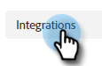

# [!DNL Dynamic Chat] 概要 {#dynamic-chat-overview}

Dynamic Chatでは、直感的なインターフェイスを利用して、web サイトを訪問する人とアカウントの両方をターゲットにすることができます。 名前、取引先責任者情報、フリーテキストなど、関連するコンテンツを収集します。 また、サイト訪問者は、ライブエージェントとチャットしたり、セールスチームとのミーティングを予約したりすることもできます。 Dynamic Chat のアクティビティとエンゲージメントデータを使用して、Marketo プログラムにメンバーを追加し、クロスチャネルアクティビティをトリガーできます。

>[!TIP]
>
>[このページ](https://experienceleague.adobe.com/docs/marketo-learn/tutorials/dynamic-chat/dynamic-chat-overview.html?lang=ja){target="_blank"}を参照して、Dynamic Chat のチュートリアルビデオを表示します。

## 統合 {#integrations}

Dynamic Chat の主要な要素は、Marketo サブスクリプションとネイティブにインターフェイスする機能です。 この統合の機能を最大限に活用するには、まずデータ同期を開始する必要があります。 Marketo データベースのサイズによっては、最初の [1 回限りの同期](/help/marketo/product-docs/demand-generation/dynamic-chat/integrations/adobe-marketo-engage.md){target="_blank"}が完了するまでに最大 24 時間かかる場合があります。

以下が同期されます。

* リードフィールドデータ
* 会社フィールドデータ
* アクティビティデータ

## ダイアログ {#dialogues}

ダイアログは、単一のチャットエンゲージメントを表します。 Web サイト訪問者に対して魅力的なチャットダイアログを開くのに必要なすべての要素を含むコンテナと考えてください。 各ダイアログで、ダイアログを表示するページ、表示するページ、ダイアログ自体の内容とフローを指定できます。 さらに、指標を見つけて、ダイアログのパフォーマンスを確認できます。 [ダイアログの詳細](/help/marketo/product-docs/demand-generation/dynamic-chat/automated-chat/dialogue-overview.md){target="_blank"}。

## 設定 {#configuration}

「設定」タブで、様々なダイアログの外観をカスタマイズします。 フォント、色、応答時間などを変更します。 [設定の詳細](/help/marketo/product-docs/demand-generation/dynamic-chat/setup-and-configuration/configuration.md){target="_blank"}。

## カレンダー {#calendar}

Outlook または Gmail のカレンダーを接続して、チャットボットでの予定スケジュールに使用します。 [カレンダーの詳細](/help/marketo/product-docs/demand-generation/dynamic-chat/setup-and-configuration/agent-settings.md#connect-calendar){target="_blank"}

## 会議 {#meetings}

ここでは、web サイト訪問者が様々なダイアログを通じてスケジュールしたすべての予定が表示されます。 [ミーティングの詳細](/help/marketo/product-docs/demand-generation/dynamic-chat/meeting-list.md){target="_blank"}

## ルーティング {#routing}

この場所では、カレンダーに接続されたすべてのエージェントのリスト、web サイト訪問者に表示される順序、カスタムのルーティングルールの作成を確認できます。 [ルーティングの詳細](/help/marketo/product-docs/demand-generation/dynamic-chat/setup-and-configuration/routing.md){target="_blank"}

## ライブチャット {#live-chat}

条件を満たす web 訪問者に、[ライブチャット](/help/marketo/product-docs/demand-generation/dynamic-chat/live-chat/live-chat-overview.md){target="_blank"}でセールス担当者とつながるよう提案します。

## 対話型フロー {#conversational-flow}

指定したアクション（フォームへの入力、リンクのクリックなど）に基づき、訪問者によってトリガーされる[対話をデザイン](/help/marketo/product-docs/demand-generation/dynamic-chat/automated-chat/conversational-flow-overview.md){target="_blank"}します。

## 生成 AI {#generative-ai}

Adobe Dynamic Chat の[生成 AI](/help/marketo/product-docs/demand-generation/dynamic-chat/generative-ai/overview.md){target="_blank"} では、インテントシグナル、ユーザーの環境設定、過去の行動をリアルタイムで処理し、チャット訪問者に関連するパーソナライズされたメッセージを生成します。

## 言語の変更 {#changing-the-language}

Dynamic Chat の言語を変更するには、次の手順に従います。

>[!IMPORTANT]
>
>プロファイルレベルで言語を変更すると、[!DNL Dynamic Chat] だけでなく、_すべて_&#x200B;の Experience Cloud アプリケーションの言語が変更されます。

1. Experience Cloud アカウントで、設定アイコンをクリックし、「**[!UICONTROL 環境設定]**」を選択します。

   

1. メールアドレスの下の現在の言語をクリックします。

   

1. 新しい言語（第 2 言語はオプション）を選択し、「**[!UICONTROL 保存]**」をクリックします。

   

   >[!NOTE]
   >
   >数十の言語から選択できますが、[!DNL Dynamic Chat] では次の言語のみをサポートしています。英語、フランス語、ドイツ語、日本語、スペイン語、イタリア語、ポルトガル語（ブラジル）、韓国語、簡体字中国語、繁体字中国語。

言語を更新すると、アプリ内のすべてが変更されます。ただし、ユーザーが個別に入力した単語（ストリーム応答など）は変更されません。

## Dynamic Chat データ保持制限 {#dynamic-chat-data-retention-limits}

Dynamic Chatの制限/パラメーターを以下に示します。 完全なリストについては、「Marketo Engage [製品説明」ページ &#x200B;](https://helpx.adobe.com/jp/legal/product-descriptions/adobe-marketo-engage---product-description.html){target="_blank"}を参照してください。

<table>
  <th>データタイプ</th>
  <th>保持期間</th>
 <tr>
  <td>エンゲージメントのない匿名リード</td>
  <td>90 日</td>
 </tr>
 <tr>
  <td>目標アクティビティ</td>
  <td>24 か月</td>
 </tr>
 <tr>
  <td>ドキュメントアクティビティ</td>
  <td>24 か月</td>
 </tr>
 <tr>
  <td>対話アクティビティの操作</td>
  <td>90 日</td>
 </tr>
 <tr>
  <td>ミーティング予約アクティビティ</td>
  <td>24 か月</td>
 </tr>
</table>

## よくある質問 {#faq}

[Dynamic Chat FAQ](/help/marketo/product-docs/demand-generation/dynamic-chat/faq.md){target="_blank"}を参照してください。
