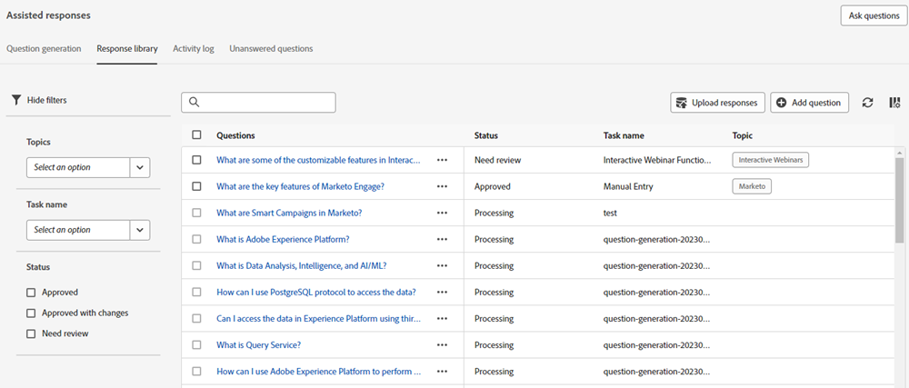
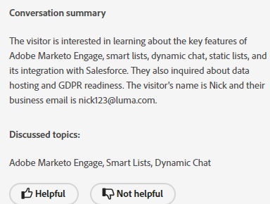
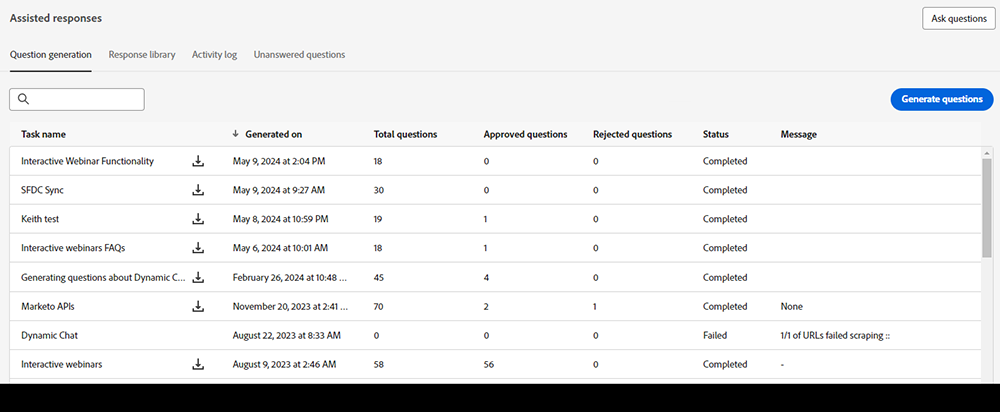
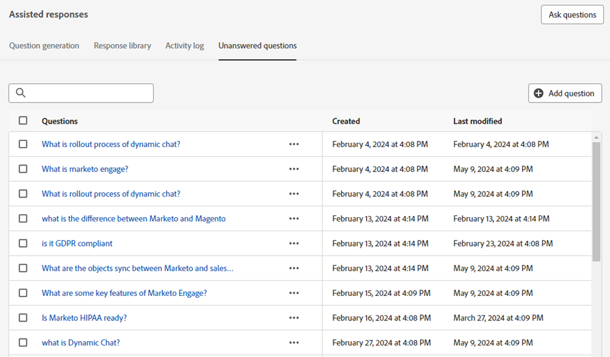
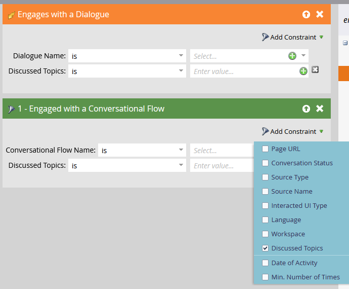

# Dynamic Chatの生成AI {#generative-ai-overview}

Adobe Dynamic Chatの生成AIを利用すれば、営業担当者の生産性を最適化し、web サイトを訪問した人の意図に関するインサイトを得て、訪問者の質問に安全に対応できます。

## 権限 {#permissions}

生成AIを使用するには、目的のユーザーに適切な[権限](/help/marketo/product-docs/demand-generation/dynamic-chat/setup-and-configuration/permissions.md)を付与します。

## 生成応答カード {#generation-response-card}

訪問者が会話の特定の時点に達したときのメッセージを作成します。 必要な主要業績評価指標を達成するために、1 回で完了する質問をいくつか設定します。 フォローアップ質問を5つまで追加し、訪問者の質問に回答できない場合は、フォールバックメッセージを含めます。

## 会話の概要 {#conversation-summary}

通常、訪問者との会話の包括的なコンテキストを取得するには、チャットの文字起こし全体をスクロールする必要があります。 会話の要約では、訪問者が興味を示したトピックも含めて、要約がリアルタイムで生成されます。 これは、複数の訪問者とチャットを切り替える際に、会話のコンテキストをすばやく確認する必要があるチャットエージェントにとって特に便利です。 エージェントの受信トレイのチャット画面に表示されるだけでなく、完了した会話の概要は、Marketo Engage データベースの訪問者の個人レコードのアクティビティログにも表示されます。

>[!NOTE]
>
>会話の概要は、ライブチャットと自動チャットの両方に対して生成されます。

## 質問の生成 {#question-generation}

[営業、マーケティング、製品などの知識でトレーニングされたインターフェイスを使用して、訪問者に対するAI支援による会話でインバウンドエクスペリエンスを向上させる](/help/marketo/product-docs/demand-generation/dynamic-chat/generative-ai/question-generation.md)。

## 回答ライブラリ {#response-library}

[ カスタマイズされた質問と回答のコレクション ](/help/marketo/product-docs/demand-generation/dynamic-chat/generative-ai/response-library.md)を作成し、すべて事前に承認しておくことで、生成AI チャットキャンペーンで使用できます。

## アクティビティログ {#activity-log}

[すべてのタスク ](/help/marketo/product-docs/demand-generation/dynamic-chat/generative-ai/activity-log.md)とその付随する詳細（名前、所有者、種類、編集したユーザーと日時など）のリストを表示します。

## 未回答の質問 {#unanswered-questions}

以前の会話の未回答の質問のリポジトリに基づいて、AIを使用して、応答ライブラリ用に追加の事前承認済み応答[を作成します。](/help/marketo/product-docs/demand-generation/dynamic-chat/generative-ai/unanswered-questions.md)

## 議論されたトピック {#discussed-topics}

Discussed Topicsは、スマートリストのトリガーやフィルターで制約として利用でき、Dynamic Chatのインサイトをさらにドリルダウンすることができます。

>[!IMPORTANT]
>
>生成AIを使用する場合は、生成AIを組み込んだAdobe Experience Cloudの機能が安全かつ責任ある方法で使用されていることを確認するために、[Adobe Experience Cloud生成AI ユーザーガイドライン ](https://www.adobe.com/legal/licenses-terms/adobe-dx-gen-ai-user-guidelines.html)に準拠する必要があります。

## よくある質問 {#faq}

**すべてのDynamic Chat ユーザーが生成AIを利用できますか？**

生成AIは、Dynamic Chat Primeのサブスクライバーのみが利用できます。 詳しくは、アドビのアカウントチーム（担当のアカウントマネージャー）にお問い合わせください。

**生成できる質問と回答の数に制限はありますか？**

はい。 この時点で1000の生涯制限があります。

**生成AIで使用できる言語は何ですか？**

現在、生成AIでは英語のみがサポートされています。
