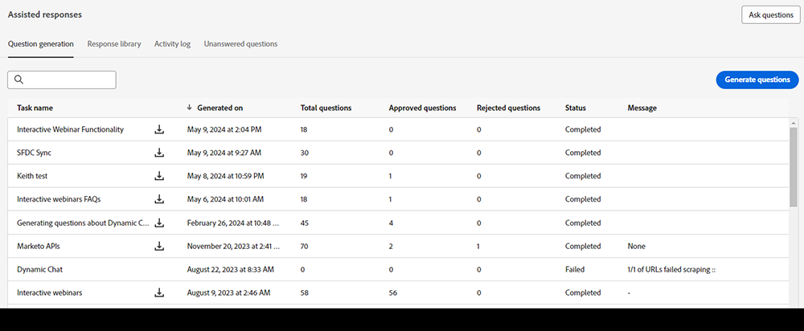

# Dynamic Chatのジェネレーティブ AI {#generative-ai-overview}

Adobe Dynamic Chatのジェネレーティブ AI を活用した機能により、営業担当者の生産性を最適化し、Web サイトの訪問者の意図に関するインサイトを得て、訪問者の質問に安全な方法で対応できます。

## 権限 {#permissions}

生成 AI を使用するには、目的のユーザーに適切な [ 権限 ](/help/marketo/product-docs/demand-generation/dynamic-chat/setup-and-configuration/permissions.md) を付与してください。

## 生成応答カード {#generation-response-card}

訪問者が会話の特定の時点に達したときのメッセージを作成します。必要な主要業績評価指標を達成するために、1 回の操作で尋ねることができる質問をいくつか設定します。 最大 5 つのフォローアップ質問を追加し、訪問者の質問に対する応答がない場合はフォールバックメッセージを含めます。

## 会話の概要 {#conversation-summary}

通常、訪問者の会話のコンテキスト全体を取得するには、チャットトランスクリプト全体をスクロールする必要があります。 会話の概要では、リアルタイムで概要が生成され、訪問者が興味を示したトピックも含まれます。 これは、複数の訪問者とのチャットを切り替える際に、会話のコンテキストをすばやく把握する必要があるチャットエージェントで特に役立ちます。 完了した会話概要は、エージェントインボックスチャット画面に表示されるだけでなく、Marketo Engage Database 内の訪問者のユーザーレコードのアクティビティログにも表示されます。

>[!NOTE]
>
>会話の概要は、ライブチャットと自動チャットの両方について生成されます。

## 質問の生成 {#question-generation}

販売、マーケティング、製品の知識を備えたトレーニングを受けたインターフェイスを使用して、AI 支援による訪問者向け会話で [ インバウンドエクスペリエンスを向上 ](/help/marketo/product-docs/demand-generation/dynamic-chat/generative-ai/question-generation.md) させます。

## 回答ライブラリ {#response-library}

ジェネレーティブ AI チャットキャンペーン内で使用するために、すべての事前承認された質問と回答の [ カスタマイズされたコレクションを作成 ](/help/marketo/product-docs/demand-generation/dynamic-chat/generative-ai/response-library.md) します。

## アクティビティログ {#activity-log}

[ すべてのタスクのリストと ](/help/marketo/product-docs/demand-generation/dynamic-chat/generative-ai/activity-log.md) タスクに付随する詳細（名前、所有者、タイプ、編集者、タイミングなど）を確認します。

## 未回答の質問 {#unanswered-questions}

以前の会話の未回答の質問のリポジトリに基づいて、AI を使用して応答ライブラリの [ 追加の事前承認済み応答を作成 ](/help/marketo/product-docs/demand-generation/dynamic-chat/generative-ai/unanswered-questions.md) します。

## 議論されたトピック {#discussed-topics}

ここで扱うトピックは、スマートリストのトリガーとフィルターで制限として使用でき、Dynamic Chatのインサイトをさらに詳しく調べることができます。

>[!IMPORTANT]
>
>生成 AI を使用する場合は、[Adobe Experience Cloud生成 AI ユーザーガイドラインに従う必要があります。これにより ](https://www.adobe.com/legal/licenses-terms/adobe-dx-gen-ai-user-guidelines.html) 生成 AI を組み込んだAdobe Experience Cloud機能が安全かつ責任ある方法で使用されるようになります。

## よくある質問 {#faq}

**ジェネレーティブ AI は、すべてのDynamic Chat ユーザーが使用できますか？**

ジェネレーティブ AI は、Dynamic Chat Primeのサブスクライバーのみが使用できます。 詳しくは、アドビのアカウントチーム（担当のアカウントマネージャー）にお問い合わせください。

**生成できる質問と回答の量に制限はありますか？**

はい。 この時点では、ライフタイム制限は 1000 です。

**生成 AI では、どの言語が利用できますか？**

現在、生成 AI では英語のみがサポートされています。
