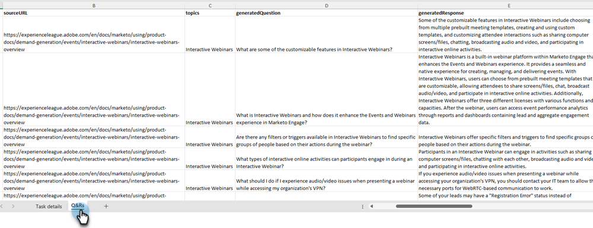

# 質問の生成 {#question-generation}

すべてのタスクと、タスクが生成された日時、質問の総数、承認ステータスなどの関連する詳細を表示します。

## 質問の生成 {#generate-questions}

1. 「生成 AI」で、 **[!UICONTROL 支援応答]**.

   

1. クリック **[!UICONTROL 質問の生成]**.

   

1. タスクに名前を付け、すべてのコンテンツが抽出されるソース URL （最大 10）を入力します。 目的のトピック/キーワードを入力し、キーボードの Enter キーを押します。 完了したら、 **[!UICONTROL Generate]**.

   

   >[!IMPORTANT]
   >
   >Marketo Engageが指定された URL からコンテンツを削除できるようにするには、まず複数の IP アドレスを許可リストに加えるする必要があります。 [詳しくは、以下を参照してください](#ip-addresses-to-allowlist).

   >[!NOTE]
   >
   >サイト/ページの情報を消去するには、サイト/ページを公開（ログインの後ろに隠さないなど）する必要があります。

1. コンテンツに基づいて、質問と応答の生成には、最大 30 分かかる場合があります。 「**[!UICONTROL OK]**」をクリックします。

   

   >[!TIP]
   >
   >「更新」をクリックして、質問生成の最新のステータスを確認します。

   

## 質問と回答のダウンロード {#download-questions-and-responses}

>[!NOTE]
>
>生成された質問と回答は、でも表示できます [応答ライブラリ](/help/marketo/product-docs/demand-generation/dynamic-chat/generative-ai/response-library.md).

1. 目的のタスクを見つけて、名前の横にあるダウンロードアイコンをクリックします。

   

1. ブラウザーでダウンロードフォルダーを見つけて、ファイルを選択します。 使用するブラウザーによって表示が異なる場合があります。

   

1. Excel ファイルで、 **[!DNL Task details]** 質問や回答を追加/編集する方法を含む、タスクに関する様々な詳細を示します。

   

   >[!NOTE]
   >
   >質問や回答を一括で追加/編集する場合、 [再アップロードする方法については、こちらを参照してください。](/help/marketo/product-docs/demand-generation/dynamic-chat/generative-ai/response-library.md).

1. この **[!DNL Q&Rs]** タブには、生成された質問や回答など、追加の詳細が表示されます。

   

## 許可リストへの IP アドレス {#ip-addresses-to-allowlist}

質疑応答の際に Web URL からコンテンツを抽出できるようにするには、以下で地域を見つけ、関連する IP アドレスが Web チームから許可リストに加えるされていることを確認してください。

<table width="450">
<thead>
  <tr>
    <th>北米</th>
    <th>ヨーロッパ</th>
    <th>APAC</th>
  </tr>
</thead>
<tbody>
  <tr>
    <td>13.68.17.252</td>
    <td>20.105.150.224</td>
    <td>20.213.91.77</td>
  </tr>
</tbody>
</table>
