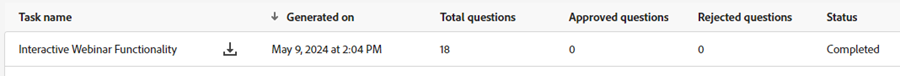
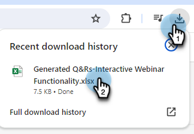
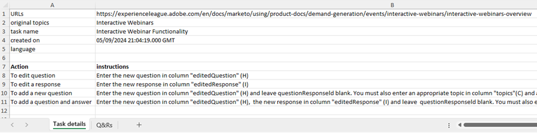
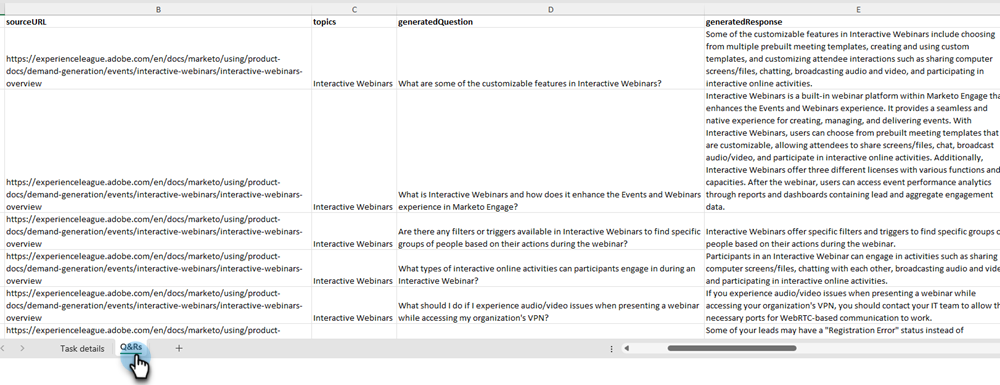

# 質問の生成 {#question-generation}

あらゆるタスクと、それらの関連情報（生成日時、質問の総数、承認ステータスなど）を確認できます。

## 質問の生成 {#generate-questions}

1. 生成AIで、**[!UICONTROL アシスト付きレスポンス]**&#x200B;をクリックします。

   

1. 「**[!UICONTROL 質問を生成]**」をクリックします。

   

1. タスクに名前を付け、すべてのコンテンツが抽出されるソース URL （最大10個）を入力します。 目的のトピック/キーワードを入力し、キーボードのEnter キーを押します。 完了したら、**[!UICONTROL 生成]**&#x200B;をクリックします。

   

   >[!IMPORTANT]
   >
   >Marketo Engageが指定されたURLからコンテンツをスクレイピングできるようにするには、最初に複数のIP アドレスを許可リストに加えるする必要があります。 [詳細は以下を参照](#ip-addresses-to-allowlist)。

   >[!NOTE]
   >
   >サイト/ページは、情報をスクレイピングするために公開する必要があります（ログインの背後に隠されないなど）。

1. コンテンツにもとづいて、質問と回答の生成には最大で30分かかります。 「**[!UICONTROL OK]**」をクリックします。

   

   >[!TIP]
   >
   >「更新」をクリックして、質問の生成の最新のステータスを確認します。

   

## 質問と回答をダウンロード {#download-questions-and-responses}

>[!NOTE]
>
>生成された質問と回答は、[応答ライブラリ ](/help/marketo/product-docs/demand-generation/dynamic-chat/generative-ai/response-library.md)でも表示できます。

1. 目的のタスクを見つけ、その名前の横にあるダウンロードアイコンをクリックします。

   

1. ブラウザーでダウンロードフォルダーを探し、ファイルを選択します。 これは、使用するブラウザーによって異なる場合があります。

   

1. **[!DNL Task details]**&#x200B;は、質問と回答の追加または編集方法など、タスクに関する様々な詳細をExcel ファイルに表示します。

   

   >[!NOTE]
   >
   >質問や回答を一括で追加/編集する場合は、[ここでそれらを再アップロードする方法を説明します](/help/marketo/product-docs/demand-generation/dynamic-chat/generative-ai/response-library.md)。

1. 「**[!DNL Q&Rs]**」タブには、生成された質問と回答など、追加の詳細が表示されます。

   

## IP アドレスから許可リストへ {#ip-addresses-to-allowlist}

質問と回答の生成中にweb URLからコンテンツを抽出できるようにするには、以下の地域を見つけ、それに関連付けられているIP アドレスがweb チームによって許可リストに加えるされていることを確認します。

<table width="450">
<thead>
  <tr>
    <th>北米</th>
    <th>ヨーロッパ</th>
    <th>APAC</th>
  </tr>
</thead>
<tbody>
  <tr>
    <td>13.68.17.252</td>
    <td>20.105.150.224</td>
    <td>20.213.91.77</td>
  </tr>
</tbody>
</table>
