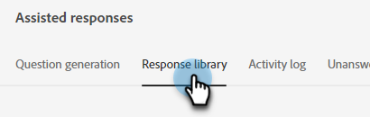

# 回答ライブラリ {#response-library}

1 か所で、すべての質問、承認ステータス、割り当てられたタスク名/トピックを表示します。

## 質問を手動で追加 {#manually-add-a-question}

1. 「生成 AI」で、「**[!UICONTROL Assisted responses]**」をクリックします。

   

1. 「**[!UICONTROL 応答ライブラリ]**」タブをクリックします。

   

1. **[!UICONTROL 質問を追加]** をクリックします。

   

1. 質問と回答を入力します。 トピックを割り当て、ユーザーが訪問者と共有できるオプションの URL を追加します。 終了したら「**[!UICONTROL 保存]**」をクリックします。

   

1. 「更新」をクリックすると、新しい質問が上部に表示され、ステータスは「[!UICONTROL &#x200B; 処理中 &#x200B;] になります。

   

1. 数分後、もう一度更新すると、ステータスは「承認済み」に変わります。

   

## 個々の質問/応答の編集 {#generate-a-new-question}

>[!NOTE]
>
>生成されたすべての質問と回答には、デフォルトで「[!UICONTROL &#x200B; レビューが必要 &#x200B;]」ステータスが割り当てられます。 「[!UICONTROL &#x200B; 承認済み &#x200B;]」の質問と回答のみが、チャット訪問者に提供されます。

1. **[!UICONTROL 応答ライブラリ]** で、目的の質問をクリックします。

   

1. 編集を行い、「**[!UICONTROL 保存]**」をクリックします。

   

## 質問/回答の一括編集とアップロード {#bulk-edit-and-upload-questions-responses}

[ ダウンロードした Excel ファイル ](/help/marketo/product-docs/demand-generation/dynamic-chat/generative-ai/question-generation.md#download-questions-and-responses){target="_blank"} で一括編集を行う手順を以下に示します。 これらは、ファイルの「タスクの詳細」タブでも確認できます。

<table>
<thead>
  <tr>
    <th>アクション</th>
    <th>入力ガイド</th>
  </tr>
</thead>
<tbody>
  <tr>
    <td>質問の編集</td>
    <td>「editedQuestion」列（列 H）に新しい質問を入力します。</td>
  </tr>
  <tr>
    <td>応答の編集</td>
    <td>「editedResponse」列（列 I）に新しい応答を入力します</td>
  </tr>
  <tr>
    <td>新しい質問を追加</td>
    <td>「editedQuestion」列（列 H）に新しい質問を入力し、questionResponsed を空白のままにします。 また、適切なトピックを「topics」列（列 C）に、ソース URL を「sourceUr!」列に入力する必要があります。</td>
  </tr>
  <tr>
    <td>質問と回答を追加</td>
    <td>「editedQuestion」列（列 H）に新しい質問を入力し、「editedResponse」列（列 I）に新しい応答を入力して、questionResponse を空白のままにします。 また、列「topics」（列 C）に適切なトピックを入力する必要があります</td>
  </tr>
</tbody>
</table>

1. ファイルの編集が完了したら、「応答ライブラリ **[!UICONTROL 」タブに戻り、「]** 応答をアップロード **&#x200B;**&#x200B;をクリックします。

   

1. 該当するタスク名を入力します。 ファイルをドラッグ&amp;ドロップするか、デバイスで参照して選択します。 終了したら「**[!UICONTROL 保存]**」をクリックします。

   

1. 確認が表示され、準備が完了しました。

   

## 質問をフィルタリング {#filter-your-questions}

デフォルトでは、質問は作成日時の順序でリストされ、最新の質問が最初に表示されます。 特定の質問を検索する場合は、フィルターを適用して検索を絞り込みます。 トピック、タスク名、承認ステータスでフィルタリングします。

