# 回答ライブラリ {#response-library}

すべての質問、承認ステータス、割り当てられたタスク名やトピックを1か所で表示できます。

## 手動で質問を追加する {#manually-add-a-question}

1. 生成AIで、**[!UICONTROL アシスト付きレスポンス]**&#x200B;をクリックします。

   

1. 「**[!UICONTROL 応答ライブラリ]**」タブをクリックします。

   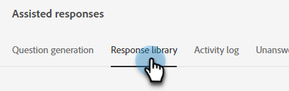

1. 「**[!UICONTROL 質問を追加]**」をクリックします。

   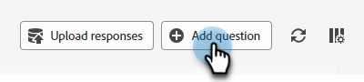

1. 質問と回答を入力します。 トピックを割り当て、ユーザーが訪問者と共有できるオプションのURLを追加します。 終了したら「**[!UICONTROL 保存]**」をクリックします。

   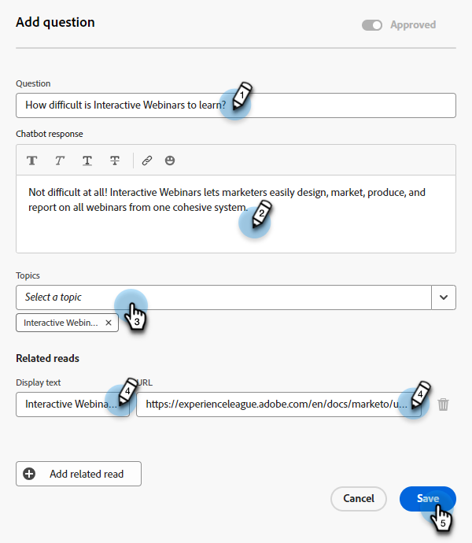

1. 「更新」をクリックすると、新しい質問が上部に表示され、ステータスは「[!UICONTROL 処理中]」です。

   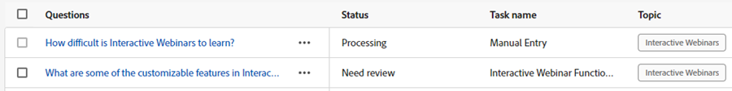

1. 数分後、もう一度更新すると、ステータスが「承認済み」に変わります。

   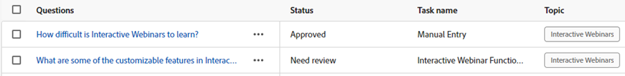

## 個々の質問/回答の編集 {#generate-a-new-question}

>[!NOTE]
>
>生成されたすべての質問と回答には、デフォルトで「[!UICONTROL 要レビュー]」ステータスが割り当てられます。 チャット訪問者が利用できるのは、「[!UICONTROL 承認済み]」の質問と応答のみです。

1. **[!UICONTROL 応答ライブラリ]**&#x200B;で、目的の質問をクリックします。

   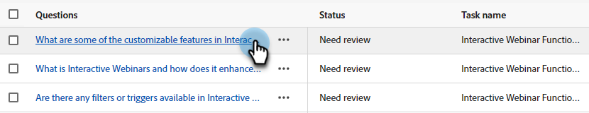

1. 編集を行い、「**[!UICONTROL 保存]**」をクリックします。

   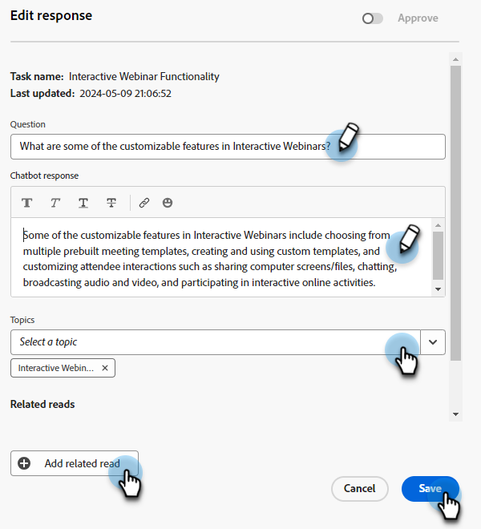

## 質問/回答の一括編集とアップロード {#bulk-edit-and-upload-questions-responses}

[&#x200B; ダウンロードしたExcel ファイル &#x200B;](/help/marketo/product-docs/demand-generation/dynamic-chat/generative-ai/question-generation.md#download-questions-and-responses){target="_blank"}で一括編集を行う方法については、以下を参照してください。 ファイルの「タスクの詳細」タブにも表示されます。

<table>
<thead>
  <tr>
    <th>アクション</th>
    <th>入力ガイド</th>
  </tr>
</thead>
<tbody>
  <tr>
    <td>質問を編集</td>
    <td>「editedQuestion」列（H列）に新しい質問を入力します</td>
  </tr>
  <tr>
    <td>応答を編集</td>
    <td>「editedResponse」（列I）に新しい応答を入力します。</td>
  </tr>
  <tr>
    <td>新しい質問を追加</td>
    <td>「editedQuestion」（H列）の列に新しい質問を入力し、questionResponseldを空白のままにします。 また、列「topics」（列C）に適切なトピックを入力し、列「sourceUr!」にソース URLを入力する必要があります。</td>
  </tr>
  <tr>
    <td>質問と回答の追加</td>
    <td>新しい質問を「editedQuestion」（列H）の列に入力し、「editedResponse」（列I）の列に新しい回答を入力して、questionResponseを空白のままにします。 列「トピック」（列C）に適切なトピックを入力する必要があります</td>
  </tr>
</tbody>
</table>

1. ファイルの編集が完了したら、**[!UICONTROL 応答ライブラリ]** タブに戻り、**[!UICONTROL 応答をアップロード]**&#x200B;をクリックします。

   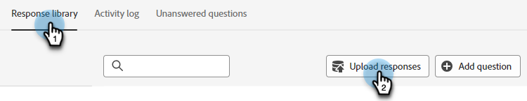

1. 該当するタスク名を入力します。 ファイルをドラッグ&amp;ドロップするか、デバイスで参照して選択します。 終了したら「**[!UICONTROL 保存]**」をクリックします。

   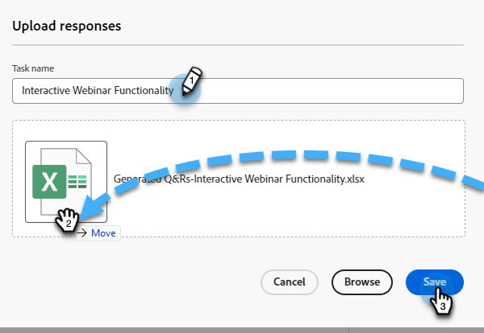

1. 確認が表示され、すべての設定が完了しました。

   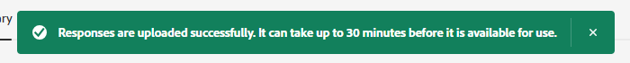

## 質問を絞り込む {#filter-your-questions}

デフォルトでは、質問は作成日時ごとに順番にリストされ、新しい質問が最初に表示されます。 特定の質問を探している場合は、フィルターを適用して検索を絞り込みましょう。 トピック、タスク名、承認ステータスなどでフィルタリングできます。

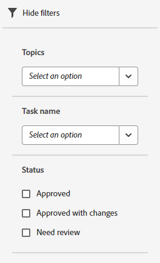
