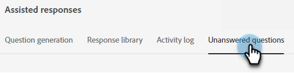
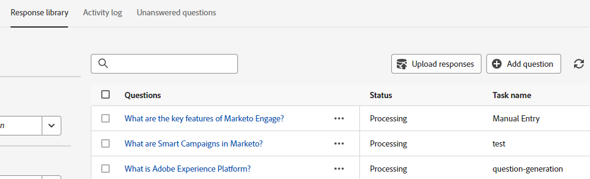

# 未回答の質問 {#unanswered-questions}

チャットボットが回答できなかったすべての質問や、「役に立たない」とマークされた訪問者の質問を確認し、この貴重な情報を使用して、事前に承認された追加の応答を作成します。

>[!NOTE]
>
>未回答の質問のリストは、24 時間ごとに、午前 0 時（PST）に自動的に更新されます。

1. 「生成 AI」で、 **[!UICONTROL 支援応答]**.

   

1. 「」をクリックします **[!UICONTROL 未回答の質問]** タブ。

   

1. 回答を作成する未回答の質問を選択します。

   

1. 回答を入力します。 トピックを割り当て、ユーザーが訪問者と共有できるオプションの URL を追加します。 終了したら「**[!UICONTROL 保存]**」をクリックします。

   

1. 未回答の質問に回答し、応答ライブラリに自動的に追加されます。

   
