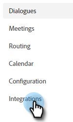
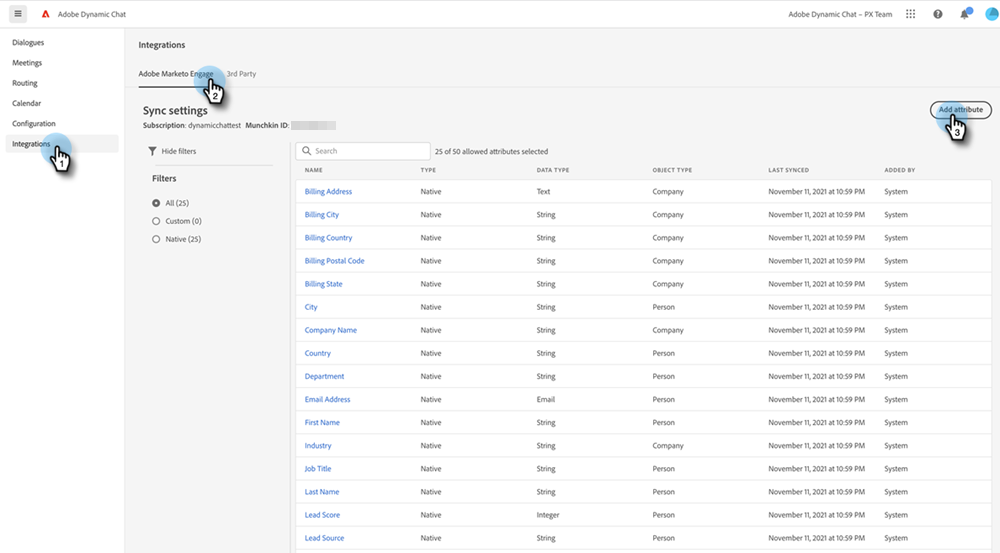

# Adobe Marketo Engage {#adobe-marketo-engage}

## Dynamic Chat の接続 {#connecting-dynamic-chat}

[初期設定](/help/marketo/product-docs/demand-generation/dynamic-chat/setup-and-configuration/initial-setup.md){target="_blank"}が完了したら、Dynamic ChatをAdobe Marketo Engage サブスクリプションに接続する1回限りの同期を実行します。

>[!NOTE]
>
>Dynamic Chatでは、[Marketo ネイティブ ](https://experienceleague.adobe.com/ja/docs/marketo-developer/marketo/rest/lead-database/field-types){target="_blank"}とカスタムの人物フィールドおよび会社フィールドの同期をサポートしています。

1. マイ Marketo で、**[!UICONTROL 動的チャット]**&#x200B;タイルをクリックします。

   

   >[!NOTE]
   >
   >タイルが表示されない場合は、Marketo 管理者にお問い合わせください。

1. 以前に Adobe ID を使用してアプリケーションにアクセスしたことがある場合は、動的チャットに直接アクセスできます。 そうでない場合、[Adobe ID を設定](https://helpx.adobe.com/jp/manage-account/using/create-update-adobe-id.html){target="_blank"}します。

1. Marketo インスタンスに接続するには、**[!UICONTROL 統合]**&#x200B;を選択します。

   

1. Marketo カードで、「**[!UICONTROL 同期を開始]**」をクリックします。

   

1. Marketo インスタンスから最大 50 個の属性（標準フィールドまたはカスタムフィールド）を選択し、動的チャットに同期して、オーディエンスのターゲティング、データマッピング、パーソナライゼーションに使用します。 終了したら「**[!UICONTROL 次へ]**」をクリックします。

   

1. 選択内容を確認します。 「**[!UICONTROL 確認]**」をクリックして同期を開始します。

   

>[!NOTE]
>
>データベースのサイズに応じて、同期が完了するまでに 2～24 時間かかる場合があります。

## 属性の追加 {#add-an-attribute}

初期同期後、次の手順に従って属性を追加します。

1. **[!UICONTROL 統合]**&#x200B;で、「**[!UICONTROL Adobe Marketo Engage]**」タブが選択されていることを確認し、**[!UICONTROL 属性を追加]**」をクリックします。

   

1. 追加する属性を選択し、「**[!UICONTROL 次へ]**」をクリックします。

   

1. 選択内容を確認し、「**[!UICONTROL 確認]**」をクリックします。

   

## 属性の削除 {#remove-an-attribute}

初期同期後、次の手順に従って属性を削除します。

>[!NOTE]
>
>属性が現在どのダイアログでも使用されていない場合にのみ、属性を削除するオプションが表示されます。

1. **[!UICONTROL 統合]**&#x200B;で、「**[!UICONTROL Adobe Marketo Engage]**」タブが選択されていることを確認し、削除する属性をクリックします。

   

1. 「**[!UICONTROL 属性を削除]**」をクリックします。

   

>[!MORELIKETHIS]
>
>[初期設定](/help/marketo/product-docs/demand-generation/dynamic-chat/setup-and-configuration/initial-setup.md){target="_blank"}
