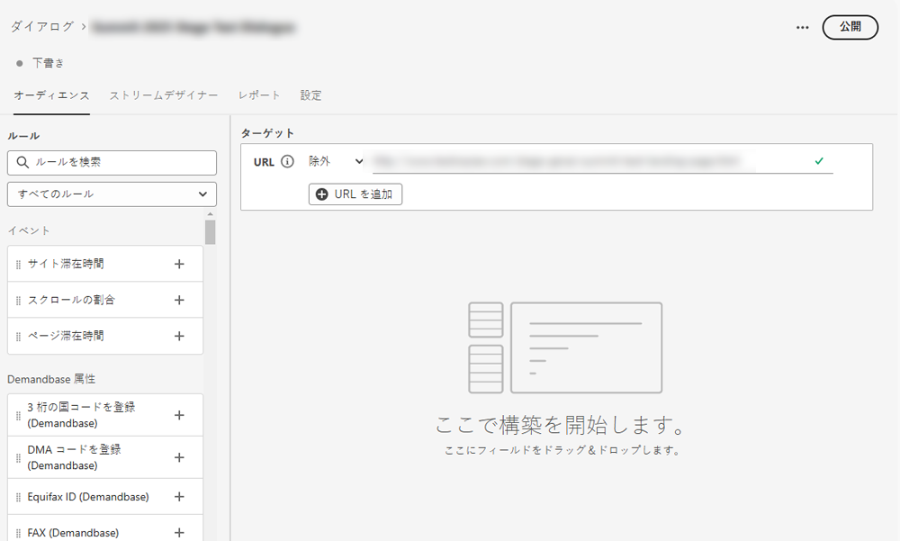
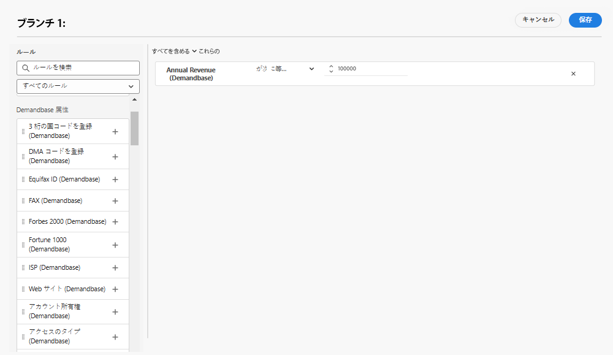
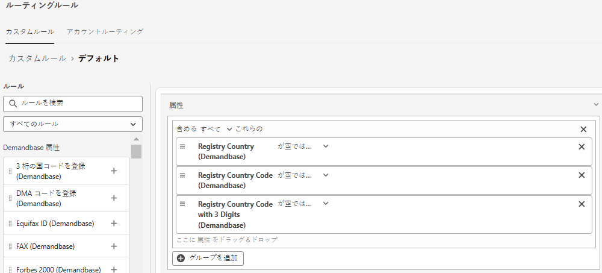

# Demandbase {#demandbase}

Demandbase ユーザは、Dynamic Chat でのダイアログターゲティング、条件付きブランディング、カスタムルーティングに Demandbase のユーザ属性を使用できます。

## Dynamic Chat の API キーへのアクセス {#access-the-api-key-for-dynamic-chat}

以下の手順は、_Demandbase アカウント_&#x200B;で実行する必要があります。

1. Demandbase で、「_設定_」アイコンをクリックします。

1. _統合_&#x200B;で、「**アカウントコネクタ**」を選択します。

1. 「**+ 新規作成**」ボタンをクリックします。

1. _統合名_&#x200B;ドロップダウンで、「**Adobe Dynamic Chat**」を選択します。

1. 「**サーバーサイド**」ラジオボタンを選択します。

1. 「**作成**」をクリックします。

1. 「_コピー_」アイコンを使用して、ページ下部の API トークン文字列をコピーします。

>[!NOTE]
>
>詳しくは、Demandbase のヘルプサイトの[統合にデータを送信する Demandbase の設定（アカウントコネクタ）](https://support.demandbase.com/hc/en-us/articles/360057169531-Set-Up-Demandbase-to-Send-Data-to-an-Integration-Account-Connector){target="_blank"}を参照してください。

## 統合機能 {#integration-features}

ダイアログや対話型フローを作成しながら、ネイティブ属性とカスタム属性に加えて、Demandbase 属性に基づいてオーディエンスのターゲットを設定します。

条件分岐、ダイアログ、対話型フローの条件として Demandbase 属性を使用します。

カスタムルーティングロジックを定義する際は、Demandbase 属性を使用します。

