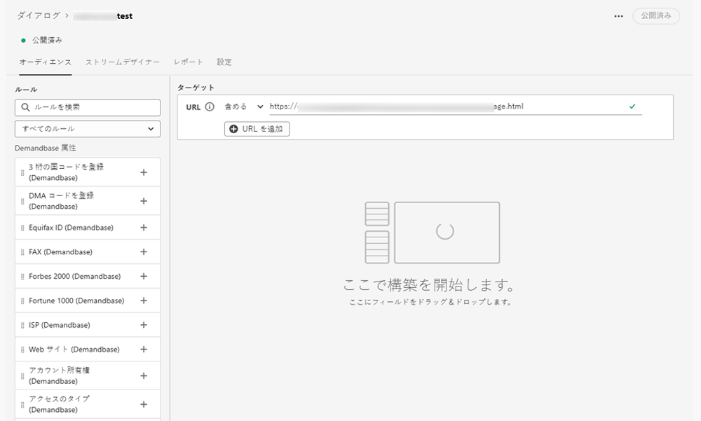

# Demandbase {#demandbase}

Demandbase ユーザは、Dynamic Chat でのダイアログターゲティング、条件付きブランディング、カスタムルーティングに Demandbase のユーザ属性を使用できます。

**統合機能**

ダイアログや対話型フローを作成しながら、ネイティブ属性とカスタム属性に加えて、Demandbase 属性に基づいてオーディエンスのターゲットを設定します。

条件分岐、ダイアログ、対話型フローの条件として Demandbase 属性を使用します。

カスタムルーティングロジックを定義する際は、Demandbase 属性を使用します。

