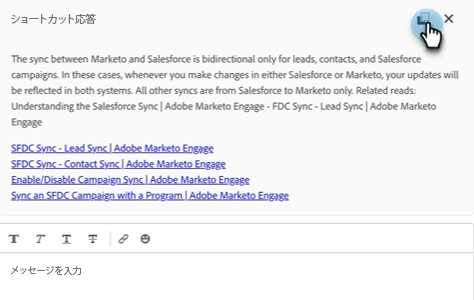

# エージェントのインボックス {#agent-inbox}

エージェントは、エージェントインボックス内にライブチャットをフィールド化します。 アクティブな会話に加えて、過去の会話、訪問者情報などを確認できます。

## 可用性の切り替え {#availability-toggle}

エージェントインボックス画面の右上に、ステータスを利用可能または利用不可に設定するオプションがあります。

>[!IMPORTANT]
>
>**これは次を上書きします** この [ライブチャットの利用](/help/marketo/product-docs/demand-generation/dynamic-chat/setup-and-configuration/agent-settings.md#live-chat-availability){target="_blank"} エージェント設定でを確立しました。 ステータスは、元に戻すか、使用可能な次の時間ブロックに切り替えるまで保持されます。

>[!NOTE]
>
>ステータスを使用不可に設定しても、アクティブなチャットには影響しません。

## ライブチャット通知 {#live-chat-notifications}

通知について詳しくは、 [ライブチャットの概要](/help/marketo/product-docs/demand-generation/dynamic-chat/live-chat/live-chat-overview.md#live-chat-notifications){target="_blank"}.

## 会話 {#conversations}

エージェントのインボックス画面の左側で、アクティブな会話のみを表示するか、それらすべてを表示するかを選択できます。

>[!NOTE]
>
>自分や他のエージェントからの過去の（非アクティブな）会話は表示できますが、自分のアクティブな会話しか表示できません。

## 訪問者情報 {#visitor-information}

エージェントインボックス画面の右側に、名前、役職、メールアドレス、電話番号、CRM ステータスが（上から下に）表示されます。 渡されない情報は、ダッシュ（–）として表示されます。

## セッションの終了 {#end-a-session}

エージェントは、次のボタンをクリックするだけでセッションを手動で終了できます **セッションを終了** ボタンが訪問者情報の隣に表示されます。

## アクティビティ履歴 {#activity-history}

訪問者情報の下には、アクティビティ履歴があります。 アクティビティのタイプや日付を表示したり、チャットトランスクリプトを表示したりできます。

>[!NOTE]
>
>過去 90 日間の情報のみが表示されます。

## カレンダーの共有 {#calendar-sharing}

ライブチャットウィンドウの下部には、自分または別のエージェントのカレンダーをチャット訪問者と共有できるアイコンがあります。

1. カレンダーアイコンをクリックします。

   

1. 目的のエージェントカレンダーを選択し、 **送信**.

   

1. チャット訪問者は会議を予約できます。

   

## 会話の概要 {#conversation-summary}

会話の概要では、訪問者が興味を示したトピックなど、概要の概要をリアルタイムで生成します。 すべてのチャット画面の右下に表示されます。

