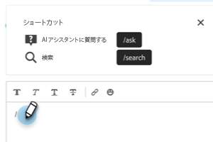
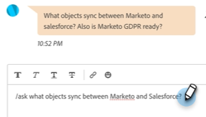
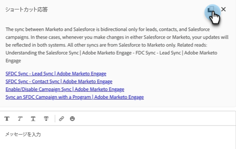

# エージェントのインボックス {#agent-inbox}

エージェントがエージェントインボックス内のライブチャットをフィールド化します。 アクティブな会話に加えて、過去の会話や訪問者情報なども確認できます。

## 可用性の切り替え {#availability-toggle}

エージェントのインボックス画面の右上に、ステータスを使用可能または使用不可に設定するオプションがあります。

>[!IMPORTANT]
>
>**これは** の [ライブチャットの可用性](/help/marketo/product-docs/demand-generation/dynamic-chat/setup-and-configuration/agent-settings.md#live-chat-availability){target="_blank"} エージェントの設定でが確立されました。 ステータスは、元の状態に切り替えるか、使用可能な次の時間ブロックに切り替えるまで保持されます。

>[!NOTE]
>
>ステータスを [ 使用不可 ] に設定しても、アクティブなチャットには影響しません。

## ライブチャット通知 {#live-chat-notifications}

ライブチャットがエージェントにルーティングされると、画面の上部に青いバナーが表示され、受け入れを求められます。

>[!TIP]
>
>また、ブラウザー通知を設定するオプションもあります。ブラウザー通知は、Dynamic Chatにログインしていない場合に通知を受け取ります。
>
>* でのブラウザー通知の有効化 [Google Chrome](https://support.google.com/chrome/answer/3220216?hl=en&amp;co=GENIE.Platform%3DDesktop){target="_blank"}
>* でのブラウザー通知の有効化 [Mozilla Firefox](https://support.mozilla.org/en-US/kb/push-notifications-firefox){target="_blank"}

### 注意事項 {#things-to-note}

* エージェントは、「チャットを受け入れる」メッセージがタイムアウトするまでに、45 秒の応答時間があります。
* 現時点では、エージェントごとに 10 のライブチャットの制限があります

## 会話 {#conversations}

[ エージェントの受信トレイ ] 画面の左側で、アクティブな会話のみを表示するか、すべての会話を表示するかを選択できます。

>[!NOTE]
>
>過去の（非アクティブな）会話を自分や他のエージェントから見ることができますが、自分のアクティブな会話のみを見ることができます。

## 訪問者情報 {#visitor-information}

エージェントのインボックス画面の右側に、名前、役職、電子メールアドレス、電話番号、CRM ステータスを（上から下へ）表示できます。 渡されない情報はダッシュ (-) で表示されます。

## アクティビティ履歴 {#activity-history}

訪問者情報の下に、アクティビティ履歴が表示されます。 アクティビティのタイプと日付を表示し、チャットの記録を表示することもできます。

>[!NOTE]
>
>情報は、過去 90 日間のみ表示されます。

## カレンダーの共有 {#calendar-sharing}

ライブチャットウィンドウの下部には、自分や他のエージェントのカレンダーをチャット訪問者と共有できるアイコンが表示されます。

1. カレンダーアイコンをクリックします。

   

1. 目的のエージェントカレンダーを選択し、 **送信**.

   

1. チャットの訪問者は会議を予約できます。

   
