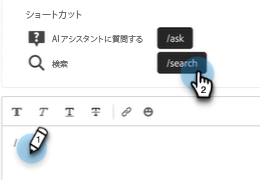
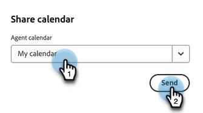

# エージェントのインボックス {#agent-inbox}

エージェントは、エージェントインボックス内でライブチャットに対応します。アクティブな会話に加えて、過去の会話、訪問者情報などを確認できます。

## 空き時間の切り替え {#availability-toggle}

エージェントインボックス画面の右上に、ステータスを対応可能または対応不可に設定するオプションがあります。

>[!IMPORTANT]
>
>**これにより、エージェント設定で行った[ライブチャットの空き時間](/help/marketo/product-docs/demand-generation/dynamic-chat/setup-and-configuration/agent-settings.md#live-chat-availability){target="_blank"}が上書きされます**。ステータスは、元に戻すか、空き時間の次のブロックに切り替わるまで保持されます。

>[!NOTE]
>
>ステータスを対応不可に設定しても、アクティブなチャットには影響しません。

## ライブチャット通知 {#live-chat-notifications}

通知について詳しくは、[ライブチャットの概要](/help/marketo/product-docs/demand-generation/dynamic-chat/live-chat/live-chat-overview.md#live-chat-notifications){target="_blank"}を参照してください。

## 会話 {#conversations}

エージェントのインボックス画面の左側で、アクティブな会話のみを表示するか、それらすべてを表示するかを選択できます。

>[!NOTE]
>
>自分や他のエージェントからの過去の（非アクティブな）会話が表示されますが、表示できるのは自分のアクティブな会話のみです。

## 訪問者情報 {#visitor-information}

エージェントインボックス画面の右側に、名前、役職、メールアドレス、電話番号、CRM ステータスが（上から下に）表示されます。渡されない情報は、ダッシュ（-）として表示されます。

## セッションの終了 {#end-a-session}

エージェントは、訪問者情報の横にある「**セッションを終了**」ボタンをクリックするだけで、セッションを手動で終了できます。

## ショートカット {#shortcuts}

>[!NOTE]
>
>この機能は生成 AI の一部で、Dynamic Chat Prime サブスクリプションから利用できます。詳しくは、アドビのアカウントチーム（担当のアカウントマネージャー）にお問い合わせください。

生成 AI [応答ライブラリ](/help/marketo/product-docs/demand-generation/dynamic-chat/generative-ai/response-library.md)を活用したショートカットは、訪問者とチャットする際に、その場でヘルプを得るための優れた方法です。テキストボックスにスラッシュ（`/`）を入力し、`ask` または `search` を選択するだけです。

**尋ねる**&#x200B;は、質問への回答に関するヘルプを求めます。

1. テキストボックスに「`/ask`」を入力または選択します。質問を入力し、キーボードの Enter キーを押します。

   

1. 回答が表示されます。コピーアイコンをクリックすると、テキストボックスに貼り付けることができます。訪問者に送信する前にテキストを編集できます。

   

**検索**&#x200B;は、特定のテキストに関連するページの検索に役立ちます。

1. テキストボックスに「`/search`」を入力または選択します。

   

1. 検索対象を入力し、キーボードの Enter キーを押します。

   

1. 該当するリンクが表示されます。コピーアイコンをクリックすると、テキストボックスに貼り付けることができます。情報を訪問者に送信する前に編集を行うことができます。

   

## アクティビティ履歴 {#activity-history}

訪問者情報の下には、アクティビティ履歴があります。アクティビティのタイプや日付を表示したり、チャットトランスクリプトを表示したりできます。

>[!NOTE]
>
>過去 90 日間の情報のみが表示されます。

## カレンダーの共有 {#calendar-sharing}

ライブチャットウィンドウの下部には、自分または別のエージェントのカレンダーをチャット訪問者と共有できるアイコンがあります。

1. カレンダーアイコンをクリックします。

   

1. 目的のエージェントカレンダーを選択し、「**送信**」をクリックします。

   

1. チャット訪問者は会議を予約できます。

   

## 会話の概要 {#conversation-summary}

>[!NOTE]
>
>この機能は生成 AI の一部で、Dynamic Chat Prime サブスクリプションから利用できます。詳しくは、アドビのアカウントチーム（担当のアカウントマネージャー）にお問い合わせください。

会話の概要では、訪問者が興味を示したトピックなどの簡単な概要をリアルタイムで生成します。すべてのチャット画面の右下に表示されます。

>[!NOTE]
>
>また、完了した会話の概要は、Marketo Engage データベース内の訪問者の個人レコードのアクティビティログでも確認できます。
