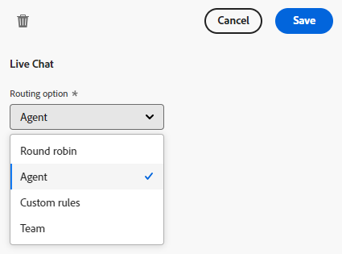

# ライブチャットの概要 {#live-chat-overview}

ライブチャットを使用すると、web サイトの訪問者がセールスエージェントとリアルタイムでチャットできるようになります。

>[!NOTE]
>
>Dynamic Chat 選択パッケージの場合、ライブチャットは、100 エンゲージメントの有効制限がある体験版の機能です。この制限に達すると、ライブエージェントとのチャットをリクエストした訪問者は接続されず、代わりにグローバルフォールバックメッセージを受信します。制限を増やすには、アドビアカウント担当者に連絡して、パッケージのアップグレードオプションについてお問い合わせください。

## ライブチャットエージェントの追加 {#add-live-chat-agents}

ライブチャットを開始するには、ライブチャットエージェントを [Adobe Admin Console のユーザ](/help/marketo/product-docs/demand-generation/dynamic-chat/setup-and-configuration/add-or-remove-chat-users.md#add-a-chat-user){target="_blank"}として追加し、[ライブチャット権限](/help/marketo/product-docs/demand-generation/dynamic-chat/setup-and-configuration/permissions.md){target="_blank"}を付与する必要があります。この処理が完了したら、[ライブチャットカード](#using-the-live-chat-card)を新規または既存のダイアログに追加します。

訪問者がダイアログを通じてエージェントとのチャットをリクエストすると、エージェントには複数の[通知オプション](/help/marketo/product-docs/demand-generation/dynamic-chat/live-chat/agent-inbox.md#live-chat-notifications){target="_blank"}が表示されます。通知をクリックすると、[エージェントのインボックス](/help/marketo/product-docs/demand-generation/dynamic-chat/live-chat/agent-inbox.md){target="_blank"}に移動し、訪問者とのチャットを開始できます。

>[!NOTE]
>
>ライブエージェントのアバターは、エージェントのアドビアカウントプロファイルのプロファイル画像を使用します。画像を更新するには、[以下の手順](https://helpx.adobe.com/jp/manage-account/using/edit-adobe-account-personal-profile.html){target="_blank"}に従います。

## ライブチャットカードの使用 {#using-the-live-chat-card}

訪問者がライブエージェントとチャットする場合は、[ストリームデザイナー](/help/marketo/product-docs/demand-generation/dynamic-chat/automated-chat/stream-designer.md){target="_blank"}のライブチャットカードを使用します。

>[!IMPORTANT]
>
>ライブチャットカードは、常にブランチの最後のカードである必要があります。カードがブランチ内のランダムなポイントに配置されている場合、突然エージェントに接続されて訪問者を驚かせる可能性があります。

### ベストプラクティス {#best-practices}

* ライブチャットカードの前に質問カードを使用して、訪問者に接続を希望するかどうかを尋ねます。
* 訪問者が接続に同意したら、情報取得カードを使用して、氏名、メールアドレス、役職などの情報を収集します（少なくとも名前とメールアドレスをリクエストすることをお勧めします）。

## ライブチャットカードのオプション {#live-chat-card-options}

ストリーム内のライブチャットカードをクリックすると、訪問者のルーティング方法を選択できます。ラウンドロビン、エージェント、カスタムルールまたはチームから選択します。

<table> 
 <tbody> 
  <tr> 
   <td><b>ラウンドロビン</b></td>
   <td>チャットは、エージェントに順番に割り当てられます。</td>
  </tr> 
  <tr> 
   <td><b>エージェント</b></td>
   <td>チャットを受信する特定のエージェントを選択します。</td>
  </tr>
    <tr> 
   <td><b>カスタムルール</b></td>
   <td>訪問者のルーティング先を検討する際には、すべてのカスタムルールがサイクルスルーされます。訪問者がカスタムルールに該当しない場合は、<a href="/help/marketo/product-docs/demand-generation/dynamic-chat/setup-and-configuration/agent-management.md#live-chat-fallback" target="_blank">ライブチャットのフォールバックメッセージ</a>が表示されます。</td>
  </tr> 
  <tr> 
   <td><b>チーム</b></td>
   <td>チャットを受信する特定のチームを選択します。このオプションを選択すると、そのチーム内でラウンドロビンで割り当てられます。</td>
  </tr>
 </tbody> 
</table>

## ライブチャット通知 {#live-chat-notifications}

>[!IMPORTANT]
>
>ライブチャットのブラウザー通知を受信するには、すべてのライブチャットエージェントが、プロンプトが表示された際に Dynamic Chat のブラウザー通知を有効にする必要があります。

### 通知を有効にする {#enabling-notifications}

ライブチャットエージェントには、ログイン時に画面の上部に「ライブチャット通知を受信するには、ブラウザー通知を有効にしてください」というバナーが表示されます。「**有効にする**」をクリックします。

ライブチャットエージェントには、ブラウザーに通知の表示を求めるプロンプトが表示されます。「**許可**」をクリックします。

エージェントがブラウザーで許可した後もブラウザー通知を受信しない場合は、OS の通知設定でブラウザーの通知を有効にする必要がある場合があります。

[Mac の手順](https://support.apple.com/ja-jp/guide/mac-help/change-notifications-settings-mh40583/mac){target="_blank"}

[Windows の手順](https://support.microsoft.com/ja-jp/windows/change-notification-settings-in-windows-8942c744-6198-fe56-4639-34320cf9444e){target="_blank"}

### ライブチャットがエージェントにルーティングされる場合 {#when-a-live-chat-is-routed-to-an-agent}

ライブチャットがエージェントにルーティングされると、画面の上部に青いバナーが表示され、承認を求められ、通知を見逃さないように通知音が鳴ります。

>[!TIP]
>
>また、Dynamic Chat にログインしていない場合にアラートが届くようにブラウザー通知を設定するオプションもあります。
>
>* [Google Chrome](https://support.google.com/chrome/answer/3220216?hl=ja&amp;co=GENIE.Platform%3DDesktop){target="_blank"} でブラウザー通知を有効にする
>* [Mozilla Firefox](https://support.mozilla.org/ja-JP/kb/push-notifications-firefox){target="_blank"} でブラウザー通知を有効にする

### 失敗したアクション通知 {#failed-action-notifications}

ミーティング予約やライブチャットなどのアクションが失敗すると、ユーザにメールで通知されます。

### 注意事項 {#things-to-note}

* エージェントは、「チャットを承認」メッセージがタイムアウトになるまでに 100 秒以内に応答する必要があります。その後、訪問者は[フォールバックメッセージ](/help/marketo/product-docs/demand-generation/dynamic-chat/setup-and-configuration/agent-management.md#live-chat-fallback){target="_blank"}を受け取ります。ルーティングオプションが&#x200B;**チーム**&#x200B;に設定にされている Dynamic Chat Prime サブスクライバーの場合、フォールバックメッセージが表示される前に、もう 1 人のエージェントに対して試行されます。
* 現時点では、エージェントあたりのライブチャット数は 10 に制限されています。

>[!MORELIKETHIS]
>
>[エージェントのインボックス](/help/marketo/product-docs/demand-generation/dynamic-chat/live-chat/agent-inbox.md){target="_blank"}
