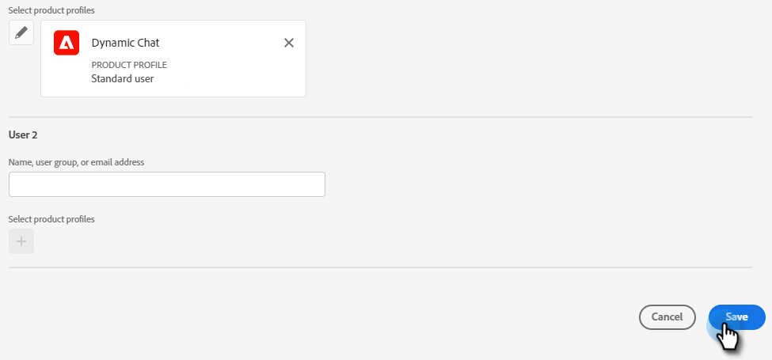
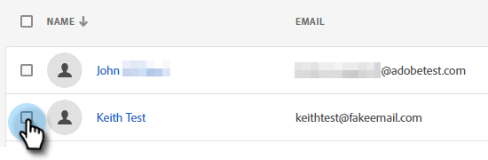

# チャットユーザーの追加または削除 {#add-or-remove-chat-users}

以下の手順に従って、チャットユーザーを追加または削除します。

## チャットユーザーを追加 {#add-a-chat-user}

1. [Adobe Admin Console](https://adminconsole.adobe.com/){target="_blank"}.にログインします。

   

1. **Dynamic Chat** をクリックします。

   

   >[!NOTE]
   >
   >複数の Marketo サブスクリプションがある場合は、次の手順の前に、目的のサブスクリプションを選択します。

1. 「**ユーザー**」タブをクリックします。

   

1. 「**ユーザーを追加**」ボタンをクリックします。

   

1. 追加するユーザーの名前、ユーザーグループ、メールアドレスを入力します。姓と名はオプションです。

   

1. 「**+**」アイコンをクリックし、目的の製品プロファイルを選択します。

   

1. 「**保存**」をクリックします。

   

## Dynamic Chat アクセスを Marketo のロールに追加 {#add-dynamic-chat-access-to-marketo-role}

新しく追加したチャットユーザーの Marketo のロールに Dynamic Chat 権限がまだない場合は、以下の方法で追加できます。

1. Marketo で、「**管理者**」をクリックし、「**ユーザー＆ロール**」を選択します。

   

1. 「**ロール**」タブをクリックします。

   

1. リストから、変更するロールを選択し、「**ロールの編集**」をクリックします。

   

1. 「**Dynamic Chat にアクセス**」を選択して、「**保存**」をクリックします。

   

## チャットユーザーを削除 {#remove-a-chat-user}

1. [Adobe Admin Console](https://adminconsole.adobe.com/){target="_blank"}.にログインします。

   

1. **Dynamic Chat** をクリックします。

   

   >[!NOTE]
   >
   >複数の Marketo サブスクリプションがある場合は、次の手順の前に、目的のサブスクリプションを選択します。

1. 「**ユーザー**」タブをクリックします。

   

1. 削除するユーザーを選択します。

   

1. 「**ユーザーを削除**」ボタンをクリックします。

   

1. 「**ユーザーを削除**」をクリックして確定します。

   

>[!MORELIKETHIS]
>
>* [Adobe Admin Console ユーザー](https://helpx.adobe.com/jp/enterprise/using/users.html){target="_blank"}
>* [ユーザーを個別に管理](https://helpx.adobe.com/jp/enterprise/using/manage-users-individually.html){target="_blank"}
