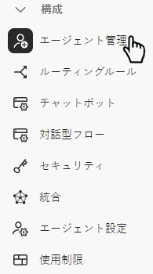
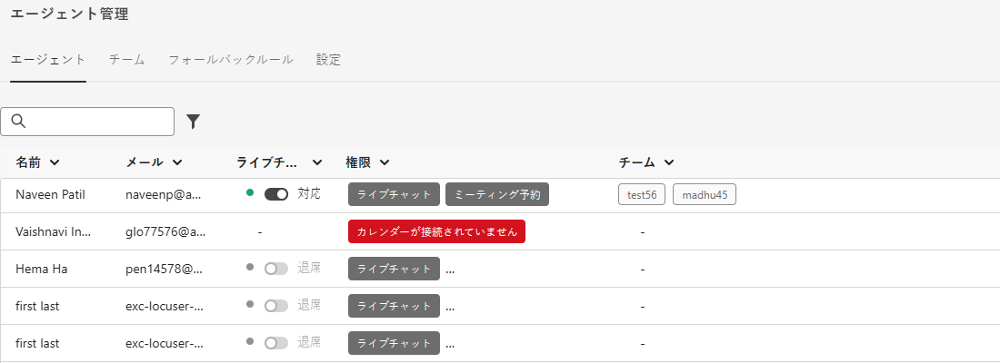

# エージェント管理 {#agent-management}

Agent Management で、Dynamic Chatインスタンス内のエージェントのリストを表示し、チームを管理し、フォールバックルールを設定します。

## エージェント {#agents}

このタブには、Dynamic Chatインスタンス内のすべてのエージェントが一覧表示され、名前、メールアドレス、ライブチャットステータスなどの情報が含まれます。

>[!NOTE]
>
>代理人は表示されません _のみ_ 追加された？ Adobe Admin Console に追加してから、ここに表示されるまでに最大 2 時間かかる場合があります。

## チーム {#teams}

管理者は、エージェントのチームを作成して、特定の販売エージェントのグループへのルーティングを容易にすることができます。

>[!AVAILABILITY]
>
>Teams にアクセスするにはDynamic Chatプライムサブスクリプションが必要です。 詳しくは、アドビのアカウントチーム（担当のアカウントマネージャー）にお問い合わせください。

### チームの作成 {#create-a-team}

1. クリック **+ チームを作成**.

   

1. チームに名前を付けます。

   

1. 「」をクリックします **エージェントの追加** ドロップダウンから目的のエージェントを選択します。

   

1. 「**作成**」をクリックします。

   

## フォールバックルール {#fallback-rules}

### 会議のフォールバック {#meeting-fallback}

標準（システム） メッセージを選択するか、ミーティング予約が利用できないときに訪問者に表示するカスタム メッセージを作成します。

### ライブチャットフォールバック {#live-chat-fallback}

標準（システム）メッセージを選択するか、訪問者がライブチャットを使用できないときに確認できるカスタムメッセージを作成します。

>[!NOTE]
>
>の選択 **会議予約オプションを含める** チェックボックスをオンにすると、ライブチャットに使用できるエージェントがない場合に、チャット訪問者が会議を予約できるようになります。

>[!TIP]
>
>カスタムメッセージを作成する際に、フォントのスタイル設定、リンクの使用、絵文字の挿入を行うことができます。 `:)`
