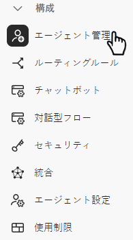
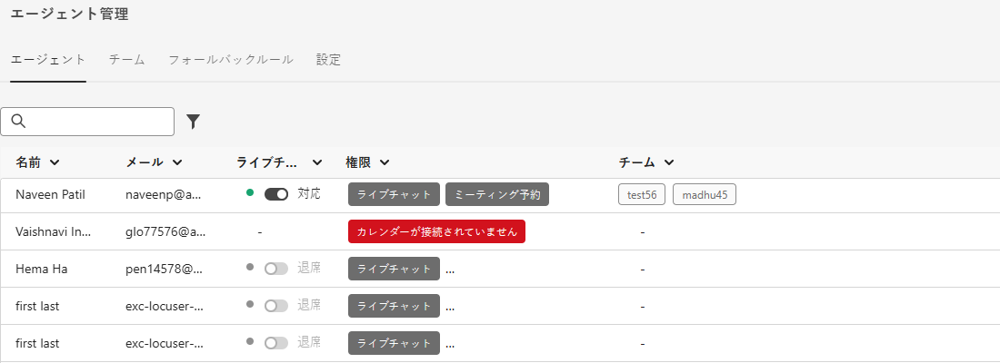
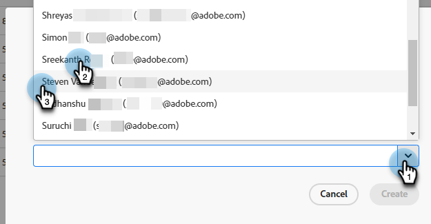
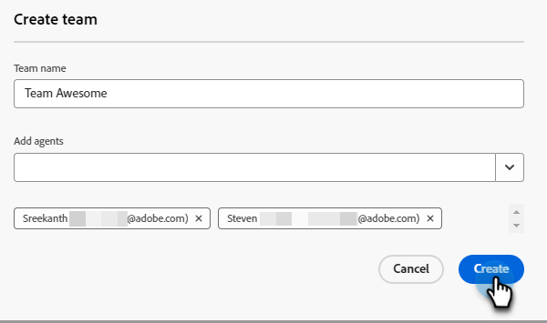

# エージェント管理 {#agent-management}

エージェント管理では、Dynamic Chat インスタンスのエージェントのリストを表示し、チームを管理し、フォールバックルールを設定します。

## エージェント {#agents}

このタブには、Dynamic Chat インスタンスのすべてのエージェントがリストされ、名前、メールアドレス、ライブチャットのステータスなどの情報が含まれます。

{width="800" zoomable="yes"}

>[!NOTE]
>
>最近追加したエージェントがここに表示されない場合、Adobe Admin Consoleで追加してから最大2時間かかる場合があります。

## チーム {#teams}

管理者は、エージェントのチームを作成して、特定のセールスエージェントのグループへのルーティングを簡単に行うことができます。

>[!AVAILABILITY]
>
>チームにアクセスするには、Dynamic Chat Prime サブスクリプションが必要です。 詳しくは、アドビのアカウントチーム（担当のアカウントマネージャー）にお問い合わせください。

### チームの作成 {#create-a-team}

1. 「**+ チームを作成**」をクリックします。

   

1. チームに名前を付けます。

   

1. **エージェントを追加**&#x200B;ドロップダウンをクリックし、目的のエージェントを選択します。

   

1. 「**作成**」をクリックします。

   

## フォールバックルール {#fallback-rules}

### ミーティングのフォールバック {#meeting-fallback}

ミーティング予約が利用できない場合に訪問者に表示される標準（システム）メッセージを選択するか、カスタムメッセージを作成します。

### ライブチャットのフォールバック {#live-chat-fallback}

ライブチャットが利用できない場合に訪問者に表示される標準（システム）メッセージを選択するか、カスタムメッセージを作成します。

>[!NOTE]
>
>* 「_ミーティング予約オプションを含める_」チェックボックスをオンにすると、ライブチャットに対応できるエージェントがいない場合、チャット訪問者にはミーティングを予約するオプションが提供されます。
>
>* **ライブチャットカードとしてのカスタムルール／チームの場合**：エージェントの確認中に、エージェントが使用できない場合や接続できない場合は、「使用可能なエージェント」（ストリームに配置されたルーティングロジック／ルールに関係なく、その時点で使用可能なすべてのエージェント）を試すためにラウンドロビンにフォールバックします。

>[!TIP]
>
>カスタムメッセージを作成する場合、フォントのスタイルを設定したり、リンクを使用したり、絵文字を挿入したりできます。

## 設定 {#settings}

### 同時ライブチャット制限 {#concurrent-live-chat}

エージェントが一度に実行できる同時アクティブチャットの数を設定します。 1 ～ 10の範囲で設定できます。

### 訪問者の待機時間の制限 {#visitor-wait-time}

訪問者がフォールバックメッセージを受信するまでに、訪問者がライブエージェントに接続されるのを待つ最大時間（秒単位）を制御します。 10 ～ 500秒の範囲で設定できます。

