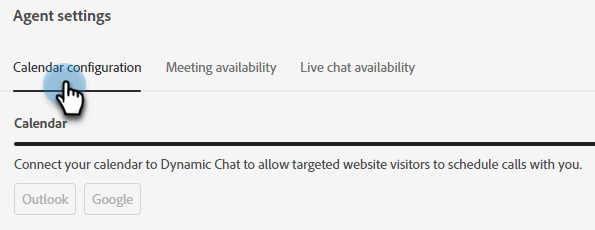

# エージェント設定 {#agent-settings}

カレンダーを設定して、会議／ライブチャットの可用性を設定します。

>[!PREREQUISITES]
>
>エージェントに適切な[権限](/help/marketo/product-docs/demand-generation/dynamic-chat/setup-and-configuration/permissions.md){target="_blank"}が付与されていることを確認します。

## カレンダーを接続 {#connect-calendar}

「カレンダー設定」タブで、Outlook または Gmail のカレンダーを接続して、チャットボットでの予定スケジュール設定に使用します。

ユーザのカレンダーが動的チャットに接続されると、そのユーザはキューに追加され、web サイトの訪問者が予定をスケジュールする際に使用できるようになります。

>[!NOTE]
>
>1 ユーザにつき 1 つのカレンダーを接続できます。複数のカレンダーで会議を受け取る場合は、複数のユーザを追加し、各ユーザにカレンダーを連携させる必要があります。

また、カレンダーに予定をスケジュールするときに訪問者に送信される、招待の本文をカスタマイズすることもできます。下部のチェックボックスを選択して、「Google Meet」リンクまたは「Microsoft Teams」リンクを含めることもできます（接続されたカレンダーに応じて異なります）。

>[!TIP]
>
>トークンアイコン（波括弧）を使用して、ユーザ属性または会社属性を使用して会議予約確認メールをパーソナライズします。

### 権限 {#permissions}

Outlook で設定すると、Dynamic Chat に対して次の権限が付与されます。

* カレンダーへの完全なアクセス
* サインインしてプロファイルを読む
* アクセス権を付与したデータへのアクセスを維持する
* メールボックスの設定を読み取る

Google で設定すると、Dynamic Chat に対して次の権限が付与されます。

* カレンダーを作成、変更または削除する
* 個々のカレンダーイベントを更新する
* イベントを表示できるユーザなど、設定を変更する
* カレンダーを共有するユーザを変更する
* 名前、メールアドレス、言語設定、プロファイル画像へのアクセス

## 会議予約の空き時間 {#meeting-booking-availability}

会議予約を受け取るためのタイムゾーンおよび時刻／曜日の空き時間を設定します。

<table>
 <tbody>
  <tr>
   <td><b>ミーティング期間</b></td>
   <td>訪問者に表示される、空いている会議時間枠の長さを決定します。</td>
  </tr>
  <tr>
   <td><b>ミーティング間のバッファ時間</b></td>
   <td>会議後のバッファーとして設定した時間。30 分に設定すると、カレンダーで予定されている会議の終了から 30 分後まで、誰も会議を予約できません。</td>
  </tr>
 </tbody>
</table>

>[!TIP]
>
>右側の「**+**」記号をクリックして、同じ日の複数の時間ブロック（例：午前 8 時から正午&#x200B;_および_&#x200B;午後 1 時から午後 5 時）を選択できます。

## ライブチャットの可用性 {#live-chat-availability}

ライブチャットを受け取るためのタイムゾーンおよび時刻／曜日の空き時間を設定します。

アプリにログインしている場合は、受信チャットのアプリ内通知が届きます。ログインしていない場合は、ブラウザー通知が表示されます（既に[設定](/help/marketo/product-docs/demand-generation/dynamic-chat/live-chat/agent-inbox.md#live-chat-notifications){target="_blank"}している場合）。

>[!IMPORTANT]
>
>* エージェントインボックスの [ 利用可能 ](/help/marketo/product-docs/demand-generation/dynamic-chat/live-chat/agent-inbox.md#availability-toggle){target="_blank"} 切替スイッチ **は上書きされます** 「_ライブチャットの利用可能_」タブに入力された内容。 したがって、エージェントが 1p～5p で利用可能になるようにスケジュールされていても、3p ですぐに休憩する必要がある場合は、エージェントの設定を変更する必要はありません。 使用可否の切り替えステータスは、手動で変更されるまで、エージェントの使用可否の次のブロックに達するまで、またはエージェントが指定したタイムゾーンの午前 0 時まで保持されます（詳しくは、次の箇条書きを参照してください）。
>
>* エージェントが可用性トグルを使用してステータスを「使用可能」に変更すると、可用性スケジュールで指定されたタイムゾーンの午前 0 時に、ステータスが自動的にリセットされます（使用不可に切り替わります）。 タイムゾーンを指定しない場合は、デフォルトで UTC （協定世界時）になります。

>[!TIP]
>
>右側の「**+**」記号をクリックして、同じ日の複数の時間ブロック（例：午前 8 時から正午&#x200B;_および_&#x200B;午後 1 時から午後 5 時）を選択できます。

## エージェントプロファイル写真

エージェントは自分のプロファイル写真をアップロードできますが、そのアクションは Dynamic Chat では実行されません。`account.adobe.com/profile` に移動する必要があります。詳細情報はこちら：[アカウントプロファイルの更新](https://helpx.adobe.com/jp/manage-account/using/edit-adobe-account-personal-profile.html)。

>[!NOTE]
>
>`experience.adobe.com` に表示されるプロファイル画像はサポートされて&#x200B;**いません**。
