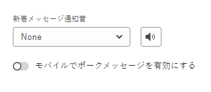
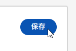
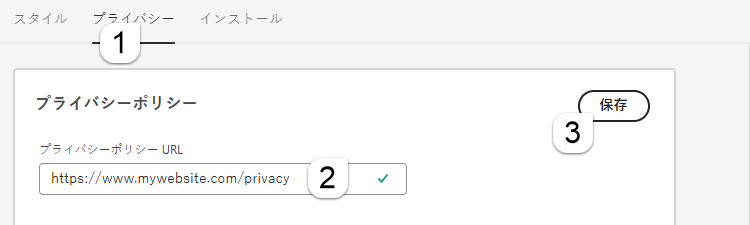

# 設定 {#configuration}

チャットボットダイアログウィンドウのルックアンドフィールをカスタマイズする方法を説明します。

開始するには、**設定** の下の **Chatbot** をクリックします。

カスタマイズオプションは複数あります。

## 「スタイル」タブ {#style-tab}

### スタイル {#style}

ここで、色、フォント、ボットウィジェットの配置、チャットボットの名前/アバターなど、ダイアログが表示されるチャットボットのルックアンドフィールを定義します。

各カテゴリのカラーは、[16 進数のカラー値](https://color.adobe.com/create/color-wheel){target="_blank"}（例：白 = #ffffff、赤 = #bf1932 など）で特定されます。

「アンカー」を使用すると、サイト訪問者はチャットボックスを開いたり閉じたりできます。アイコンを右下に表示するか左下に表示するかを選択できます。パディング（アイコンと web ページの下部の間のスペースの量）を増減させることもできます。

### ボット設定 {#agent-settings}

ボット設定では、上部に表示されるラベルをチャットボックスに追加できます（例：「Adobeアシスタント」）。 また、応答遅延（秒）を決定し、チャットアバターを変更することもできます。独自のアバター画像をアップロードするには、「**+**」ボタンをクリックします。

>[!NOTE]
>
>カスタムアバターは、256 kb 未満の正方形の画像で、200x200 px 未満である必要があります。サポートされているファイルタイプは、.jpg、.png、.gif、.webp、.svg などです。

**新しいメッセージ通知サウンド**

ドロップダウンをクリックして、セッションでチャットボットがトリガーされるたびに訪問者のサウンドを選択します。 複数のサウンドから選択できます。

**モバイルでポーク メッセージを有効にする**

スライダーを選択すると、「ポーク」が有効になります。これは、訪問者がクリックしなくてもチャットアイコンの横に開始質問を表示するもので、モバイルデバイスからチャットしてくる訪問者に対して有効になります。

>[!NOTE]
>
>Poke は、会話の最初の [ カード ](/help/marketo/product-docs/demand-generation/dynamic-chat/automated-chat/stream-designer.md#stream-designer-cards){target="_blank"} でのみ使用できます。

変更が完了したら、忘れずに「**保存**」をクリックしてください。

## 「プライバシー」タブ {#privacy-tab}

「**プライバシー**」タブをクリックし、サイトのプライバシーポリシーの URL を追加または編集します（オプション）。

## 「インストール」タブ {#installation-tab}

チャットボットを web サイトに表示するには、まずDynamic Chat JavaScript スニペットをインストールする必要があります。 必要なコードを検索またはコピーするには、このタブをクリックしてください。この操作に慣れていない場合は、web チームまたは IT 部門に問い合わせてください。

>[!TIP]
>
>サイトでコンテンツセキュリティポリシー（CSP）を使用している場合に追加すべきコードを以下に示します。

>[!NOTE]
>
>Marketo サポートは、HTML のトラブルシューティングについては対応できません。HTML のサポートについては、web 開発者にご相談ください。
