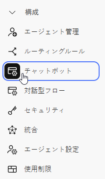
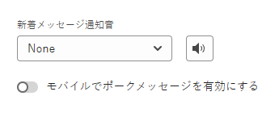
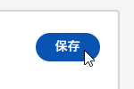
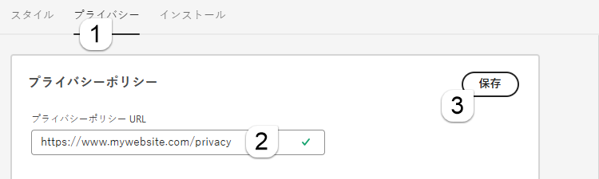
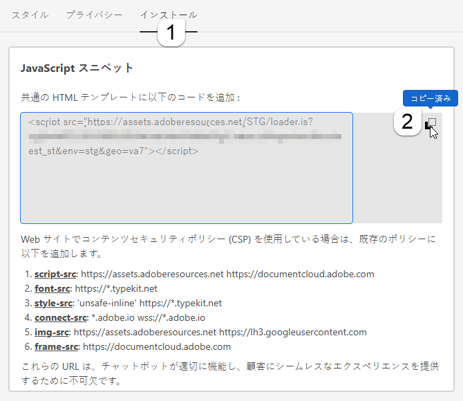

# 設定 {#configuration}

チャットボットダイアログウィンドウのルックアンドフィールをカスタマイズする方法を説明します。

開始するには、「**設定**」の下の「**チャットボット**」をクリックします。

カスタマイズオプションは複数あります。

## 「スタイル」タブ {#style-tab}

### スタイル {#style}

ここでは、ボットウィジェットの色、フォント、配置、チャットボットの名前とアバターなど、ダイアログが表示されるチャットボットのルックアンドフィールを定義します。

各カテゴリのカラーは、[16 進数のカラー値](https://color.adobe.com/create/color-wheel){target="_blank"}（例：白 = #ffffff、赤 = #bf1932 など）で特定されます。

「アンカー」を使用すると、サイト訪問者はチャットボックスを開いたり閉じたりできます。 アイコンを右下に表示するか左下に表示するかを選択できます。 パディング（アイコンと web ページの下部の間のスペースの量）を増減させることもできます。

### ボット設定 {#agent-settings}

ボット設定で、チャットボックスの上部に表示されるラベルを追加できます（例：「Adobe Assistant」）。 また、応答遅延（秒）を決定し、チャットアバターを変更することもできます。 独自のアバター画像をアップロードするには、「**+**」ボタンをクリックします。

>[!NOTE]
>
>カスタムアバターは、256 kb 未満の正方形の画像で、200x200 px 未満である必要があります。 サポートされているファイルタイプは、.jpg、.png、.gif、.webp、.svg などです。

**新着メッセージ通知音**

ドロップダウンをクリックして、セッションでチャットボットがトリガーされるたびに訪問者に通知するサウンドを選択します。 選択できるサウンドは複数あります。

**モバイルでポークメッセージを有効にする**

訪問者がモバイルデバイスからチャットインする場合、訪問者がチャットアイコンの横に開いている質問をクリックせずに表示する「ポーク」を有効にするには、スライダーを選択します。

>[!NOTE]
>
>ポークは会話の最初の[カード](/help/marketo/product-docs/demand-generation/dynamic-chat/automated-chat/stream-designer.md#stream-designer-cards){target="_blank"}でのみ利用できます。

変更が完了したら、**保存**&#x200B;をクリックすることを忘れないでください。

## 「プライバシー」タブ {#privacy-tab}

「**プライバシー**」タブをクリックし、サイトのプライバシーポリシーの URL を追加または編集します（オプション）。

## 「インストール」タブ {#installation-tab}

Web サイトにチャットボットを表示するには、まず Dynamic Chat JavaScript スニペットをインストールする必要があります。 必要なコードを検索またはコピーするには、このタブをクリックしてください。 この操作に詳しくない場合は、web チームまたはIT部門にお問い合わせください。

>[!TIP]
>
>サイトでコンテンツセキュリティポリシー（CSP）を使用している場合に追加すべきコードを以下に示します。

>[!NOTE]
>
>Marketo サポートは、HTML のトラブルシューティングについては対応できません。 HTMLのサポートについては、web デベロッパーにお問い合わせください。
