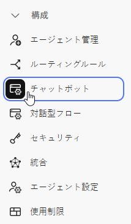

# 設定 {#configuration}

チャットボットダイアログウィンドウのルックアンドフィールをカスタマイズする方法を説明します。

始めるには、「**設定**」をクリックします。

カスタマイズオプションは複数あります。

## 「スタイル」タブ {#style-tab}

### スタイル {#style}

ここでは、色、フォント、ボットウィジェットの配置、およびチャットボットの名前/アバターなど、ダイアログが表示されるチャットボットのルックアンドフィールを定義します。

各カテゴリの色は、 [16 進数のカラー値](https://color.adobe.com/create/color-wheel){target="_blank"} ( 例：白= #ffffff、赤= #bf1932など )。

「アンカー」を使用すると、サイト訪問者はチャットボックスを開いたり閉じたりできます。アイコンを右下に表示するか左下に表示するかを選択できます。パディング（アイコンと web ページの下部の間のスペースの量）を増減させることもできます。

### エージェント設定 {#agent-settings}

エージェント設定で、チャットボックスの上部に表示されるラベルを追加できます（例：「アドビボット」）。また、応答遅延（秒）を決定し、チャットアバターを変更することもできます。独自のアバター画像をアップロードするには、「**+**」ボタンをクリックします。

>[!NOTE]
>
>カスタムアバターは、256 kb 未満の正方形の画像で、200x200 px 未満である必要があります。サポートされているファイルタイプは、.jpg、.png、.gif、.webp、.svg などです。

変更が完了したら、忘れずに「**保存**」をクリックしてください。

## 「プライバシー」タブ {#privacy-tab}

「**プライバシー**」タブをクリックし、サイトのプライバシーポリシーの URL を追加または編集します（オプション）。

## 「インストール」タブ {#installation-tab}

Web サイトに Chatbot を表示するには、まず JavaScriptDynamic Chatスニペットをインストールする必要があります。 必要なコードを検索またはコピーするには、このタブをクリックしてください。この操作に慣れていない場合は、web チームまたは IT 部門に問い合わせてください。

>[!TIP]
>
>サイトでコンテンツセキュリティポリシーを利用する場合、チャットボットが期待どおりに動作するには、次の URL を許可リストに登録する必要が生じる場合があります。
>
>* `*.adoberesources.net`
>* `*.adobe.io`
>* `*.typekit.net`

>[!NOTE]
>
>Marketo サポートは、HTML のトラブルシューティングについては対応できません。HTML のサポートについては、web 開発者にご相談ください。
