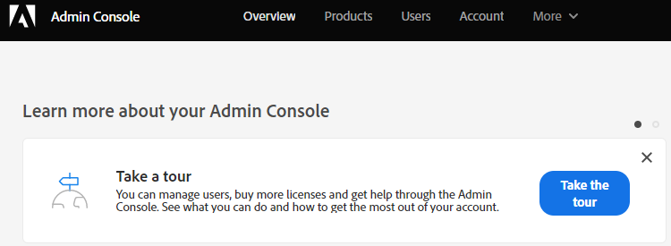

# 初期設定 {#initial-setup}

以下の手順に従って、Dynamic Chat を設定します。

## Admin Console へのアクセス {#access-admin-console}

>[!NOTE]
>
>**管理者権限が必要。**

1. Marketo インスタンスに対して [!DNL Dynamic Chat] を有効にすると、指定されたシステム管理者にウェルカムメールが送信されます。 そのメールで、「**[!UICONTROL 開始する]**」をクリックします。

   

1. 以前に Adobe ID を使用してアプリケーションにアクセスしたことがある場合は、Adobe Admin Console にすぐに移動します。 そうでない場合、[Adobe ID を設定](https://helpx.adobe.com/jp/manage-account/using/create-update-adobe-id.html){target="_blank"}します。

   

## ユーザーの追加 {#add-users}

1. Admin Console にログインしたら、次にユーザーを追加します。 そのプロセスは[ここに文書化されています](/help/marketo/product-docs/demand-generation/dynamic-chat/setup-and-configuration/add-or-remove-chat-users.md#add-a-chat-user){target="_blank"}。

次に、[Dynamic ChatをMarketo](/help/marketo/product-docs/demand-generation/dynamic-chat/integrations/adobe-marketo-engage.md){target="_blank"}に接続します。
