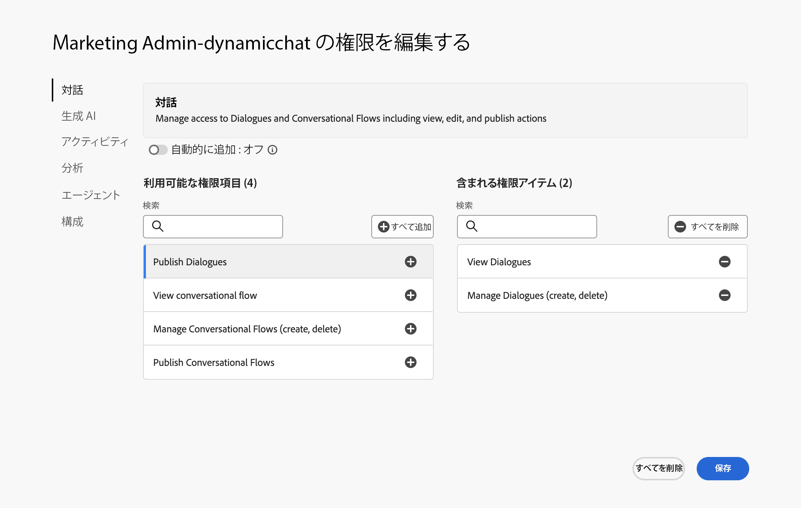
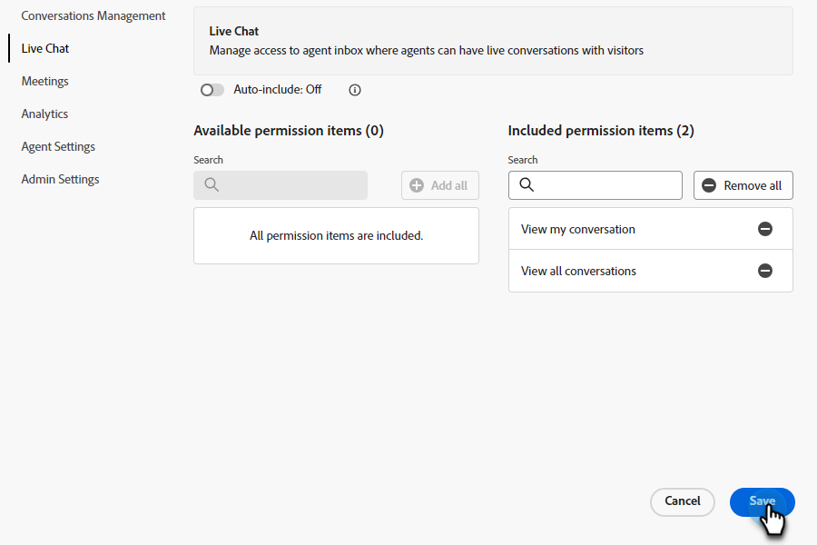

# 権限 {#permissions}

事前に定義された権限を持つ 5 つのデフォルトプロファイルが、Dynamic Chatで編集できます。 また、権限のカスタムセットを使用してカスタムプロファイルを作成することもできます。 2 つを見てみましょう。

## 既存の権限を編集 {#edit-existing-permissions}

1. Adobe Analytics の [Adobe Admin Console](https://adminconsole.adobe.com/){target="_blank"}をクリックし、 **Dynamic Chat**.

   

1. Adobe Analytics の **製品プロファイル** 「 」タブで、編集するプロファイルを選択します。 この例では、「 **Live Agent**.

   

1. 次をクリック： **権限** タブをクリックします。

   

1. 編集する縦断の領域を選択します。 この例では、Live Chat を選択しています。 鉛筆アイコンをクリックします。

   

1. 使用可能な権限項目が左側に表示されます。 権限を 1 つずつ追加するか、またはすべてを一度に追加するかを選択できます。 この例では、1 つのみ使用可能なので、追加します。 「**+**」をクリックします。

   

   >[!NOTE]
   >
   >自動インクルードを有効にすると、含まれるリストにすべての権限項目が追加されます。 新しい権限項目が利用可能になると、その製品プロファイルに自動的に含まれます。

1. 「**保存**」をクリックします。

   

これで、他のすべてのDynamic Chat領域に対して、この手順を繰り返せます。

## プロファイルの作成 {#create-a-profile}

1. Adobe Analytics の [Adobe Admin Console](https://adminconsole.adobe.com/){target="_blank"}をクリックし、 **Dynamic Chat**.

   

1. Adobe Analytics の **製品プロファイル** タブ、クリック **新しいプロファイル**.

   

1. **名前** 製品プロファイル。 オプションで、表示名や説明を入力したり、ユーザーが追加または削除されたときに通知を受け取るように選択したりできます。 終了したら「**保存**」をクリックします。

   

1. 新しいプロファイルが「製品プロファイル」タブに表示されます。 選択します。

   

1. 次に、 [上のセクション](#edit-existing-permissions) を選択します。

## 権限のリスト {#list-of-permissions}

以下に、各領域で使用可能なすべての権限のリストが表示されます。

<table>
<thead>
  <tr>
    <th style="width:25%">Dynamic Chat領域</th>
    <th>権限</th>
  </tr>
</thead>
<tbody>
  <tr>
    <td>会話管理</td>
    <td><li>ダイアログを表示</li>
    <li>ダイアログを管理（作成、削除）</li>
    <li>公開ダイアログ</li>
    <li>対話型フローの表示</li>
    <li>対話型フローの管理（作成、削除）</li>
    <li>対話フローの公開</li></td>
  </tr>
  <tr>
    <td>ライブチャット</td>
    <td><li>マイスレッドの表示</li>
    <li>すべての会話を表示</li>
  </tr>
  <tr>
    <td>会議</td>
    <td><li>すべての会議を管理</li>
  </tr>
  <tr>
    <td>Marketo Measure Analytics</td>
    <td><li>グローバルパフォーマンスレポートの表示</li>
    <li>ライブチャットレポートを表示</li>
    <li>会議レポートを表示</li>
    <li>レポートの書き出し</li></td>
  </tr>
  <tr>
    <td>エージェント設定</td>
    <td><li>ライブチャットの可用性を管理</li>
    <li>カレンダーの連携</li>
    <li>カレンダーの可用性の管理</li></td>
  </tr>
  <tr>
    <td>管理者設定</td>
    <td><li>ラウンドロビンを表示</li>
    <li>カスタムルールの表示</li>
    <li>カスタムルールの管理（追加、編集、削除）</li>
    <li>顧客リストの表示 <b>*</b></li>
    <li>アカウントの管理（追加、編集、削除） <b>*</b></li>
    <li>Chatbot 設定の管理</li>
    <li>対話型フロー設定の管理</li>
    <li>プライバシーとセキュリティの管理</li>
    <li>統合を管理</li>
    <li>エージェントの管理</li>
    <li>エージェントチームの表示 <b>*</b></li>
    <li>エージェントチームの管理（追加、編集、削除） <b>*</b></li></td>
  </tr>
</tbody>
</table>

**&#42;** 現在、Dynamic Prime ユーザーのみが利用できます

## デフォルトのプロファイル権限 {#default-profile-permissions}

以下に、5 つのデフォルトプロファイルと、デフォルトで有効になっている権限を示します。

<table>
<thead>
  <tr>
    <th style="width:25%">プロファイル</th>
    <th>デフォルトの権限</th>
  </tr>
</thead>
<tbody>
  <tr>
    <td>マーケティングユーザ</td>
    <td><i>会話管理</i>
    <li>ダイアログを表示</li>
    <li>ダイアログを管理（作成、削除）</li>
    <li>公開ダイアログ</li>
    <li>対話型フローの表示</li>
    <li>対話型フローの管理（作成、削除）</li>
    <li>対話フローの公開</li>
     
    <i>ライブチャット</i>
    <li>該当なし</li>
     
    <i>会議</i>
    <li>該当なし</li>
     
    <i>分析</i>
    <li>グローバルパフォーマンスレポートの表示</li>
    <li>ライブチャットレポートを表示</li>
    <li>会議レポートを表示</li>
     
    <i>エージェント設定</i>
    <li>該当なし</li>
     
    <i>管理者設定</i>
    <li>ラウンドロビンを表示</li>
    <li>カスタムルールの表示</li>
    <li>顧客リストの表示 <b>*</b></li>
    <li>エージェントチームの表示 <b>*</b></li>
    </td>
  </tr>
  <tr>
    <td><b>Live Agent</b></td>
    <td><i>会話管理</i>
    <li>ダイアログを表示</li>
    <li>対話型フローの表示</li>
     
    <i>ライブチャット</i>
    <li>マイスレッドの表示</li>
     
    <i>会議</i>
    <li>該当なし</li>
     
    <i>分析</i>
    <li>グローバルパフォーマンスレポートの表示</li>
    <li>ライブチャットレポートを表示</li>
    <li>会議レポートを表示</li>
     
    <i>エージェント設定</i>
    <li>ライブチャットの可用性を管理</li>
    <li>カレンダーの連携</li>
    <li>カレンダーの可用性の管理</li>
     
    <i>管理者設定</i>
    <li>ラウンドロビンを表示</li>
    <li>カスタムルールの表示</li>
    <li>顧客リストの表示 <b>*</b></li>
    <li>エージェントチームの表示 <b>*</b></li>
    </td>
  </tr>
  <tr>
    <td><b>カレンダーエージェント</b></td>
    <td><i>会話管理</i>
    <li>ダイアログを表示</li>
    <li>対話型フローの表示</li>
     
    <i>ライブチャット</i>
    <li>該当なし</li>
     
    <i>会議</i>
    <li>該当なし</li>
     
    <i>分析</i>
    <li>グローバルパフォーマンスレポートの表示</li>
    <li>ライブチャットレポートを表示</li>
    <li>会議レポートを表示</li>
     
    <i>エージェント設定</i>
    <li>カレンダーの連携</li>
    <li>カレンダーの可用性の管理</li>
     
    <i>管理者設定</i>
    <li>ラウンドロビンを表示</li>
    <li>カスタムルールの表示</li>
    <li>顧客リストの表示 <b>*</b></li>
    <li>エージェントチームの表示 <b>*</b></li>
    </td>
  </tr>
  <tr>
    <td><b>マーケティング管理者</b></td>
    <td><i>会話管理</i>
    <li>ダイアログを表示</li>
    <li>ダイアログを管理（作成、削除）</li>
    <li>公開ダイアログ</li>
    <li>対話型フローの表示</li>
    <li>対話型フローの管理（作成、削除）</li>
    <li>対話フローの公開</li>
     
    <i>ライブチャット</i>
    <li>該当なし</li>
     
    <i>会議</i>
    <li>該当なし</li>
     
    <i>分析</i>
    <li>グローバルパフォーマンスレポートの表示</li>
    <li>ライブチャットレポートを表示</li>
    <li>会議レポートを表示</li>
    <li>レポートの書き出し</li>
     
    <i>エージェント設定</i>
    <li>該当なし</li>
     
    <i>管理者設定</i>
    <li>ラウンドロビンを表示</li>
    <li>カスタムルールの表示</li>
    <li>カスタムルールの管理（追加、編集、削除）</li>
    <li>顧客リストの表示 <b>*</b></li>
    <li>アカウントの管理（追加、編集、削除） <b>*</b></li>
    <li>Chatbot 設定の管理</li>
    <li>対話型フロー設定の管理</li>
    <li>プライバシーとセキュリティの管理</li>
    <li>統合を管理</li>
    <li>エージェントチームの表示 <b>*</b></li>
    </td>
  </tr>
  <tr>
    <td><b>セールス管理者</b></td>
    <td><i>会話管理</i>
    <li>ダイアログを表示</li>
    <li>対話型フローの表示</li>
     
    <i>ライブチャット</i>
    <li>マイスレッドの表示</li>
    <li>すべての会話を表示</li>
     
    <i>会議</i>
    <li>すべての会議を管理</li>
     
    <i>分析</i>
    <li>グローバルパフォーマンスレポートの表示</li>
    <li>ライブチャットレポートを表示</li>
    <li>会議レポートを表示</li>
    <li>レポートの書き出し</li>
     
    <i>エージェント設定</i>
    <li>ライブチャットの可用性を管理</li>
    <li>カレンダーの連携</li>
    <li>カレンダーの可用性の管理</li>
     
    <i>管理者設定</i>
    <li>ラウンドロビンを表示</li>
    <li>カスタムルールの表示</li>
    <li>カスタムルールの管理（追加、編集、削除）</li>
    <li>顧客リストの表示 <b>*</b></li>
    <li>アカウントの管理（追加、編集、削除） <b>*</b></li>
    <li>エージェントの管理</li>
    <li>エージェントチームの表示 <b>*</b></li>
    <li>エージェントチームの管理 <b>*</b></li>
    </td>
  </tr>
</tbody>
</table>

**&#42;** 現在、Dynamic Prime ユーザーのみが利用できます
