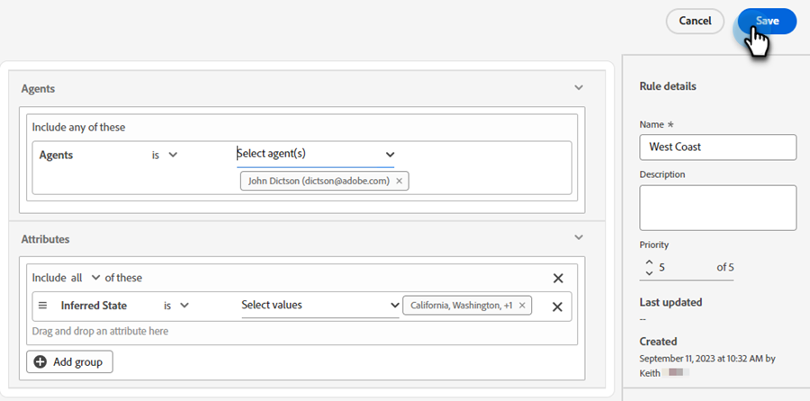

# ルーティング {#routing}

動的チャットで予約された会議は、2 つの方法でルーティングできます。ラウンドロビン、またはカスタムルールを使用します。

ラウンドロビン：会議はエージェントに順次割り当てられます。エージェントが 5 人いてエージェント 3 が最後の会議に出席した場合、エージェント 4 が次の会議に出席し、次にエージェント 5 がその次の会議に出席し、その後はエージェント 1 に戻ります。

カスタムルール：選択した属性に基づいて、特定のエージェントを選択して会議を割り当てることができます。

>[!NOTE]
>
>アカウントルーティングは最も優先順位が高くなります。 訪問者が会話のポイントに到達して会議の予約またはライブチャットの開始を行うと、他のルーティングオプションが考慮される前に、最初に [ アカウントのルーティング ](#account-routing) がオンになります。

## カスタムルールの作成 {#create-a-custom-rule}

この例では、CA、OR、WA の推測される状態から、エージェントの John にすべての会議を送信します。

1. 「設定」で、「**ルーティングルール**」をクリックします。

   

1. 「**カスタムルール**」タブがデフォルトで開きます。

   

1. 「**ルールを作成**」をクリックします。

   

1. ルールに名前を付けます。 オプションで、説明を追加し、その優先度レベルを設定できます。 「**次へ**」をクリックします。

   

1. 目的のエージェントを選択します。

   

1. 目的の属性の上にドラッグします。

   

1. 目的の値を見つけて選択します。

   

1. 目的の値をすべて選択したら、「**保存**」をクリックします。

   

## アカウントのルーティング {#account-routing}

ターゲットアカウントとそれぞれの販売所有者を特定してアップロードし、それらのアカウントからの訪問者をそれぞれのアカウント所有者に直接転送します。

### アカウントを追加 {#add-an-account}

この例では、レゴのすべての従業員を直接 Steven エージェントにルーティングします。

1. 「アカウントのルーティング」タブで、「**+ アカウントを追加**」をクリックします。

   

   >[!TIP]
   >
   >**アカウントリストをアップロード** をクリックして、CSV をアップロードすることで、複数のアカウントを一度に作成できます。

1. 会社の名前とドメインを入力し、目的のエージェントを選択します。

   
