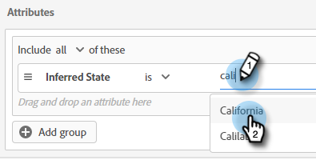

# ルーティング {#routing}

動的チャットで予約された会議は、2 つの方法でルーティングできます。ラウンドロビン、またはカスタムルールを使用します。

ラウンドロビン：会議はエージェントに順次割り当てられます。エージェントが 5 人いてエージェント 3 が最後の会議に出席した場合、エージェント 4 が次の会議に出席し、次にエージェント 5 がその次の会議に出席し、その後はエージェント 1 に戻ります。

カスタムルール：選択した属性に基づいて、特定のエージェントを選択して会議を割り当てることができます。

>[!NOTE]
>
>最も優先度が高いアカウントルーティングが指定されます。 訪問者が会話のポイントに到達して、会議を予約したり、ライブチャットを開始したりしたとき。 [アカウントルーティング](#account-routing) は、他のルーティングオプションが考慮される前に最初にチェックされます。

## カスタムルールの作成 {#create-a-custom-rule}

この例では、CA、OR、WA の推測される状態から、エージェントの John にすべての会議を送信します。

1. 「設定」で、 **ルーティングルール**.

   

1. 「**カスタムルール**」タブをクリックします。

   

1. 「**ルールを作成**」をクリックします。

   

1. ルールに名前を付けます。 オプションで、説明を追加し、その優先度レベルを設定できます。 「**次へ**」をクリックします。

   

1. 目的のエージェントを選択します。

   

1. 目的の属性の上にドラッグします。

   

1. 目的の値を見つけて選択します。

   

1. 目的の値をすべて選択したら、「**保存**」をクリックします。

   

## アカウントルーティング {#account-routing}

ターゲットアカウントとそれぞれの販売所有者を特定してアップロードし、それらのアカウントから来た訪問者をそれぞれのアカウント所有者に直接ルーティングします。

### アカウントの追加 {#add-an-account}

この例では、Lego から Steven エージェントにすべての従業員を直接ルーティングします。

1. 「アカウントルーティング」タブで、 **+アカウントを追加**.

   

   >[!TIP]
   >
   >一度に複数のアカウントを作成するには、 **顧客リストをアップロード** CSV をアップロードしています。

1. 会社の名前、ドメインを入力し、目的のエージェントを選択します。

   
