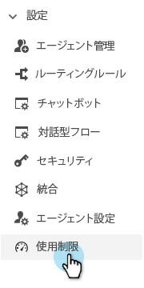
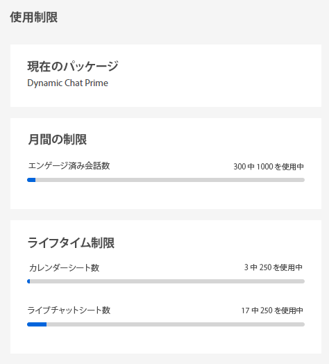

# 使用の制限 {#usage-limits}

使用制限ページにアクセスして、パッケージ情報や使用制限ステータスなどの重要な情報を確認します。

1. 「Configuration」で、 **[!UICONTROL 使用の制限]**.

   

1. 現在のパッケージ、関与している会話の 1 か月の制限ステータス、およびカレンダー/ライブチャットの席のライフタイムリミットのステータスを表示します。

   

>[!NOTE]
>
>毎月の制限は、毎月 1 日に自動的にリセットされます。
