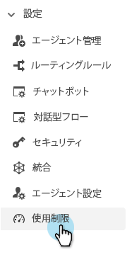
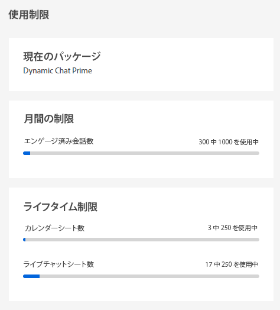

# 使用制限 {#usage-limits}

使用制限ページにアクセスして、パッケージ情報や使用制限ステータスなどの重要な情報を確認します。

1. 設定で、「**[!UICONTROL 使用制限]**」をクリックします。

   

1. 現在のパッケージ、エンゲージ済み対話の月別の制限ステータス、カレンダー／ライブチャットのシートの有効制限のステータスを表示します。

   

>[!NOTE]
>
>月別の制限は、毎月の初日に自動的にリセットされます。
