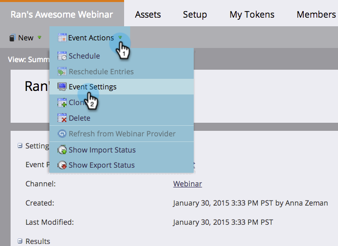
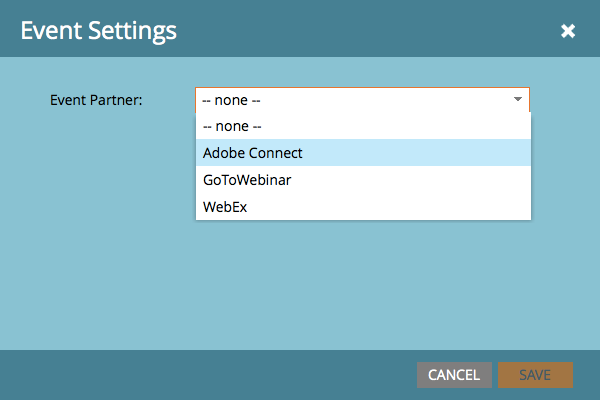
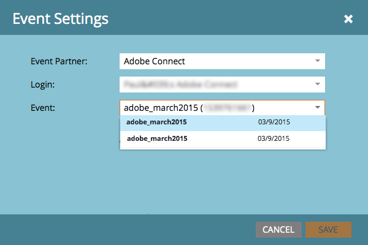
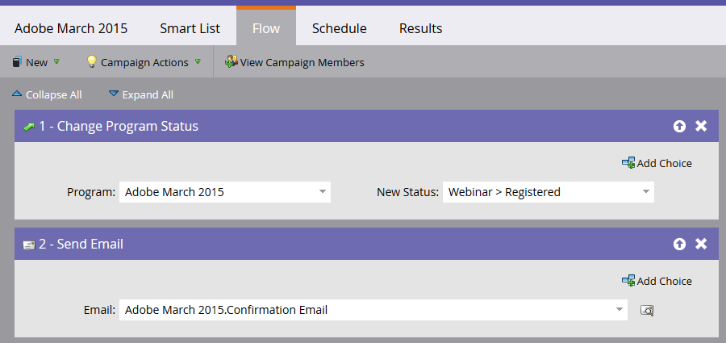

# Adobe Connect を使用したイベントの作成 {#create-an-event-with-adobe-connect}

Adobe Connect と同期すると、ウェビナーへの登録と参加を Marketo 内部で管理できるようになるので、エンゲージメントを見逃す心配がありません。

>[!PREREQUISITES]
>
>* [Adobe Connect と Marketo のリンク](/help/marketo/product-docs/administration/additional-integrations/add-adobe-connect-as-a-launchpoint-service.md)
>* [新しいイベントプログラムの作成](/help/marketo/product-docs/demand-generation/events/understanding-events/create-a-new-event-program.md)

まず、Adobe Connectでミーティングまたはセミナーが作成されていることを確認します。 ヘルプが必要な場合は、[Adobe Connect ユーザーガイド ](https://helpx.adobe.com/jp/adobe-connect/using/user-guide.html)を参照してください。

Adobe Connect で作成するミーティングとセミナーは、Marketo で資格情報を入力するときに指定するフォルダーに作成する必要があります。 ミーティングとセミナーを作成したら、確認メールや ICS ファイルで使用する関連の連絡情報（電話番号など）を書きとめておきます。

>[!CAUTION]
>
>イベントホストとして、参加者に送信されたリンクを介してアプリ内および&#x200B;**not**&#x200B;から参加します。

>[!NOTE]
>
>Adobe Connect オンサイトは現在サポートされていません。

1. 新しいイベントのホームで、「**[!UICONTROL イベントアクション]**」を選択し、「**[!UICONTROL イベント設定]**」を選択します。

   

   >[!NOTE]
   >
   >ドロップダウンに「**[!UICONTROL イベント設定]**」が表示されない場合は、イベントのチャネルに「[!UICONTROL 適用先]」で「**[!UICONTROL ウェビナー]**」が選択されていることを確認してください。

1. 「**[!UICONTROL イベントパートナー]**」で、「**[!UICONTROL Adobe Connect]**」を選択します。

   

1. **[!UICONTROL ログイン]** ID を選択し、**[!UICONTROL イベント]**&#x200B;を選択します。

   

1. 「**[!UICONTROL 保存]**」をクリックします。

   

   これで、Adobe Connect イベントが Marketo イベントと同期されました。

   >[!NOTE]
   >
   >Marketo が送信するフィールドは、姓、名、メールアドレスです。

   >[!TIP]
   >
   >個人の一意の URL をメールに挿入するには、`{{member.webinar url}}` というトークンを使用します。 メールが送信されると、このトークンは、Adobe Connect からの各リード固有の確認 URL に自動的に変換されます
   >
   >配信停止やマーケティング中断したリードにも届くように、確認メールは&#x200B;**オペレーショナル**&#x200B;メールに設定してください。

   ウェビナーに新規登録したリードは、[!UICONTROL 新規ステータス]が「登録」に設定されたときに、[!UICONTROL プログラムステータスを変更]フローステップによってウェビナープロバイダーにプッシュされます。 その他のステータスではプッシュされません。 また、[!UICONTROL  プログラムステータスの変更] フローステップを#1し、[!UICONTROL 電子メールの送信] フローステップを#2します。

   

   >[!CAUTION]
   >
   >ネストされたメールプログラムを使用して確認メールを送信しないでください。 代わりに、上に示しているように、イベントプログラムのスマートキャンペーンを使用します。

   >[!TIP]
   >
   >Marketo にデータが表示されるまでには、最大 48 時間かかる場合があります。 48 時間待っても何も表示されない場合は、イベントの「**[!UICONTROL 概要]**」タブの「イベントアクション」メニューから「ウェビナープロバイダーから更新」を選択してください。

   >[!MORELIKETHIS]
   >
   >* [Adobe Connect を  [!DNL LaunchPoint]  サービスとして追加](/help/marketo/product-docs/administration/additional-integrations/add-adobe-connect-as-a-launchpoint-service.md)
   >* [イベントチャネルの編集](/help/marketo/product-docs/demand-generation/events/understanding-events/edit-an-event-channel.md)
