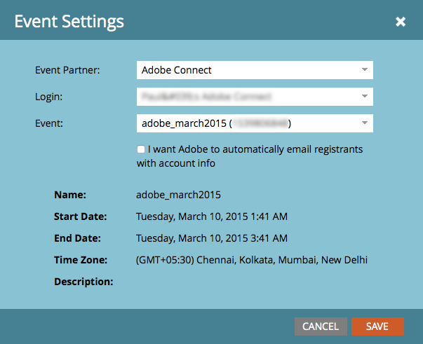

# Adobe Connect を使用したイベントの作成 {#create-an-event-with-adobe-connect}

Adobe Connect と同期すると、ウェビナーへの登録と参加を Marketo 内部で管理できるようになるので、リードの管理を見逃す心配がありません。

>[!PREREQUISITES]
>
>* [Adobe Connect と Marketo のリンク](/help/marketo/product-docs/administration/additional-integrations/add-adobe-connect-as-a-launchpoint-service.md)
>* [新しいイベントプログラムの作成](/help/marketo/product-docs/demand-generation/events/understanding-events/create-a-new-event-program.md)

まず、Adobe Connect でミーティングまたはセミナーを作成していることを確認します。ヘルプが必要な場合は、[Adobe Connect ユーザーガイド](https://helpx.adobe.com/jp/adobe-connect/using/user-guide.html)をご覧ください。

Adobe Connect で作成するミーティングとセミナーは、Marketo で資格情報を入力するときに指定するフォルダーに作成する必要があります。ミーティングとセミナーを作成したら、確認メールや ICS ファイルで使用する関連の連絡情報（電話番号など）を書きとめておきます。

>[!CAUTION]
>
>イベントホストは、出席者に送信される&#x200B;**リンク経由ではなく**、アプリ内から参加する必要があります。

>[!NOTE]
>
>現時点では、Adobe Connect On-Site はサポートされていません。

1. 新しいイベントのホームで、「**[!UICONTROL イベントアクション]**」を選択し、「**[!UICONTROL イベント設定]**」を選択します。

   

   >[!NOTE]
   >
   >ドロップダウンに **[!UICONTROL イベント設定]** が表示されない場合は、イベントのチャネルで、「**[!UICONTROL 適用先]**」の下で [!UICONTROL &#x200B; ウェビナーを使用したイベント &#x200B;] が選択されていることを確認します。

1. 「**[!UICONTROL イベントパートナー]**」で、「**[!UICONTROL Adobe Connect]**」を選択します。

   

1. **[!UICONTROL ログイン]** ID を選択し、**[!UICONTROL イベント]**&#x200B;を選択します。

   

1. 「**[!UICONTROL 保存]**」をクリックします。

   

   作業は以上です。これで、Adobe Connect イベントが Marketo イベントと同期されました。

   >[!NOTE]
   >
   >Marketo が送信するフィールドは、姓、名、メールアドレスです。

   >[!TIP]
   >
   >個人の一意の URL をメールに挿入するには、`{{member.webinar url}}` というトークンを使用します。メールが送信されると、このトークンは、Adobe Connect からの各リード固有の確認 URL に自動的に変換されます
   >
   >配信停止やマーケティング中断したリードにも届くように、確認メールは&#x200B;**オペレーショナル**&#x200B;メールに設定してください。

   ウェビナーに登録したユーザーは、[!UICONTROL &#x200B; 新しいステータス &#x200B;] が「登録済み」に設定されている [!UICONTROL &#x200B; プログラムステータスの変更 &#x200B;] フローステップを通じてウェビナープロバイダーにプッシュされます。 その他のステータスではプッシュされません。また、[!UICONTROL プログラムステータスを変更]フローステップ #1 と[!UICONTROL メールを送信]フローステップ #2 を必ず設定してください。

   

   >[!CAUTION]
   >
   >ネストされたメールプログラムを使用して確認メールを送信しないでください。代わりに、上に示しているように、イベントプログラムのスマートキャンペーンを使用します。

   >[!TIP]
   >
   >Marketo にデータが表示されるまでには、最大 48 時間かかる場合があります。48 時間待っても何も表示されない場合は、イベントの「**[!UICONTROL 概要]**」タブの「イベントアクション」メニューから「ウェビナープロバイダーから更新」を選択してください。

   >[!MORELIKETHIS]
   >
   >* [Adobe Connect as a Service [!DNL LaunchPoint]  追加 ](/help/marketo/product-docs/administration/additional-integrations/add-adobe-connect-as-a-launchpoint-service.md)
   >* [イベントチャネルの編集](/help/marketo/product-docs/demand-generation/events/understanding-events/edit-an-event-channel.md)
