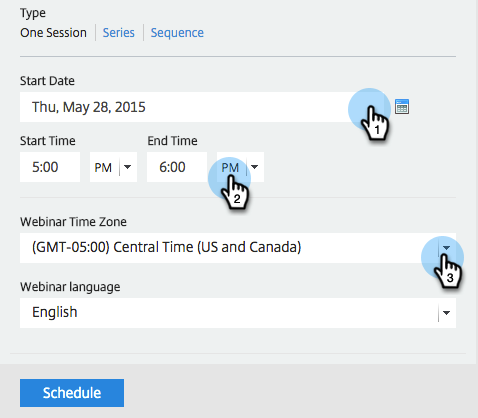

# GotoWebinar {#create-an-event-with-gotowebinar}を使用してイベントを作成

>[!PREREQUISITES]
>
>* [LaunchPointサービス追加としてのGoToWebセミナー](/help/marketo/product-docs/administration/additional-integrations/add-gotowebinar-as-a-launchpoint-service.md)
>* [新しいイベントプログラムの作成](/help/marketo/product-docs/demand-generation/events/understanding-events/create-a-new-event-program.md)
>* 適切な[フローアクション](http://docs.marketo.com/display/DOCS/Flow+Actions)を設定して、エンゲージメントを追跡します。

まず、GoToWebinarでウェビナーを作成します。 GoToWebinarの作成時の設定は、Marketorが使用するものと、GoToWebinarのみが使用するものがあります。

Marketorイベントを作成し、GoToWebセミナーを関連付けると、登録情報と出席情報を共有できるようになります。 GoToWebinarの作成については、『[GoToWebinarユーザーガイド](http://docs.marketo.com/display/docs/assets/gotowebinar-user-guide.pdf)』を参照してください。

以下は、Marketoが使用する設定のリストです。

## タイトルと説明{#title-and-description}

**ウェビナー名**  — ウェビナー名を入力します。この名前は、Marketorで表示できます。

**説明** （オプション） — ウェビナーの説明を入力します。説明はマーケティング担当者に表示できます。

## 日付と時刻{#date-time}

`Enter the following information for your webinar and it will be pulled into Marketo via the`アダプタ。この情報に変更を加えた場合、変更をマーケターに表示するには、**イベントアクション**&#x200B;の下の「ウェビナープロバイダー&#x200B;**から更新」リンクをクリックする必要があります。**

**開始日** -開始日を入力します。これは、Marketoで表示できます。

**開始時刻** -開始時刻を入力します。これは、Marketoで表示できます。

**終了時間**  — 終了時間を入力します。これは、Marketoで表示できます。

**タイムゾーン**  — 該当するタイムゾーンを選択します。Marketoで表示できます。

**「 —** set」を「 **One Session**」に設定します。

>[!NOTE]
>
>マーケティング担当者は、現在、ウェビナーの繰り返しをサポートしていません。 Marketorの各イベントとGoToWebinarのウェビナーの間に、1つのセッションを設定する必要があります。

>[!TIP]
>
>GoToWebinarで設定する追加のフィールドがあり、統合に影響を与えません。 これらのフィールドの詳細については、この記事では説明しないので、[GoToWebinarユーザーガイド](http://docs.marketo.com/display/docs/assets/gotowebinar-user-guide.pdf)を参照してください。 追加のGoToWebセミナーのヘルプが必要な場合は、[ヘルプサイト](http://support.logmeininc.com/gotowebinar)を参照してください。

さあ、マーケットに飛び込もう！

1. イベントを選択します。 「**イベントアクション**」をクリックし、「**イベント設定**」を選択します。

   

   >[!NOTE]
   >
   >選択するイベントのチャネルタイプは、**ウェビナー**&#x200B;でなければなりません。

1. **イベント** **パートナー**&#x200B;リストから&#x200B;**GoToWebinar**&#x200B;を選択します。

   

1. アカウントを選択します。

   

1. ウェビナーを選択します。

   

1. 「**保存**」をクリックします。

   

1. 素晴らしい！ これで、イベントは&#x200B;**GoToWebinar**&#x200B;によって同期され、スケジュールされます。

   

   >[!NOTE]
   >
   >Marketorが送信するフィールドは次のとおりです。名、姓、電子メールアドレス。 これらのフィールドは必須で、空にすることはできません。

   >[!TIP]
   >
   >この一意のURLを確認電子メールに入力するには、電子メールで次のトークンを使用します。`{{member.webinar url}}`. 確認URLが送信されると、このトークンは、ユーザー固有の確認URLに自動的に解決されます。
   >
   >確認の電子メールを&#x200B;**操作**&#x200B;に設定し、登録済みで登録を取り消している可能性のあるユーザーが、確認情報を引き続き受け取るようにします。

   

   >[!CAUTION]
   >
   >確認電子メールを送信する際に、ネストされた電子メールプログラムを使用しないでください。 代わりに、イベントプログラムのスマートキャンペーンを使用します。

   >[!TIP]
   >
   >データがマーケティング担当者に表示されるまで、最大48時間かかる場合があります。 それでも何も表示されない状態が続くのを待った後で、イベントーの&#x200B;**概要**&#x200B;タブにあるイベントの操作メニューから、「ウェビナープロバイダーから更新&#x200B;**」を選択します。**

ウェビナーにサインアップした人は、「新しいステータス」が「登録済み」に設定されている場合に、プログラムステータスの変更フローステップを通じてウェビナーのプロバイダーにプッシュされます。 その他の状態では、その人を押しのけることはありません。 また、プログラムステータスの変更のフロー手順#1と、電子メールの送信のフロー手順#2を必ず行ってください。

## スケジュールの表示{#viewing-the-schedule}

[プログラムスケジュール表示](http://docs.marketo.com/display/docs/program+schedule+view)で、イベントのカレンダーエントリをクリックします。 スケジュールは、画面の右側に表示されます。

>[!NOTE]
>
>イベントのスケジュールを変更するには、GoToWebinarでウェビナーを編集する必要があります。

