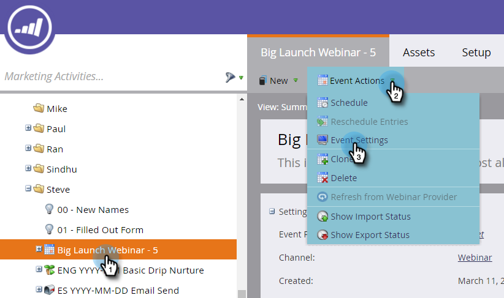
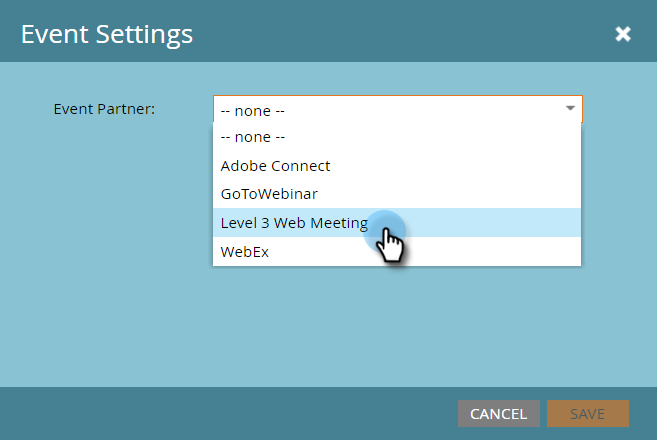
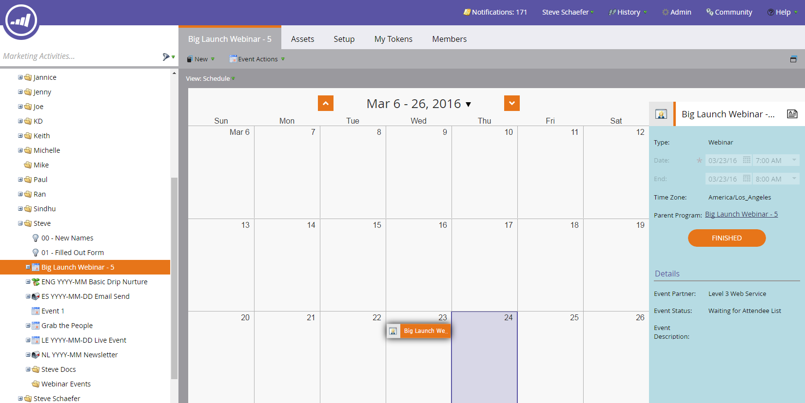

# [!DNL Level 3 Web Meeting] を使用したイベントの作成 {#create-an-event-with-level-web-meeting}

>[!PREREQUISITES]
>
>* [&#x200B; [!DNL Level 3 Web Meeting]  を  [!DNL LaunchPoint]  サービスとして追加](/help/marketo/product-docs/administration/additional-integrations/add-level-3-web-meeting-as-a-launchpoint-service.md)
>* [新しいイベントプログラムの作成](/help/marketo/product-docs/demand-generation/events/understanding-events/create-a-new-event-program.md)
>* 適切な[フローアクション](/help/marketo/product-docs/core-marketo-concepts/smart-campaigns/flow-actions/add-a-flow-step-to-a-smart-campaign.md)を設定して、エンゲージメントをトラック

まず、[!DNL Level 3] でウェビナーを作成します。 ヘルプが必要な場合は、[[!DNL Level 3]  リソースライブラリ &#x200B;](https://www.level3.com/en/resource-library/)を参照してください。 [!DNL BrightTalk]と非常に似ています。  Marketo は、[!DNL Level 3] フィールドの小さなサブセットを使用します。

* **名前** - Web キャストの名前。
* **開始日** - Web キャストの開始日。
* **終了日** - Web キャストの終了日。
* **タイムゾーン** - Web キャストのタイムゾーン設定。
* **説明** - Web キャストの説明。

1. 新しいイベントを選択します。 **[!UICONTROL イベントアクション]**／**[!UICONTROL イベント設定]をクリックします。**

   

1. 「[!UICONTROL イベントパートナー]」で、「**[!UICONTROL レベル 3 Web 会議]**」を選択します。

   

1. 「[!UICONTROL ログイン]」で、「[!DNL Level 3] ログイン」を選択します。

   

1. [!UICONTROL &#x200B; イベント &#x200B;]で、使用する[!DNL Level 3] イベントを選択します。

   

1. 「**[!UICONTROL 保存]**」をクリックします。

   

   イベントは[!DNL Level 3]に接続されました。

## スケジュールの表示  {#viewing-the-schedule}

プログラムスケジュール表示で、イベントのカレンダーエントリをクリックします。 画面の右側にスケジュールが表示されます。

