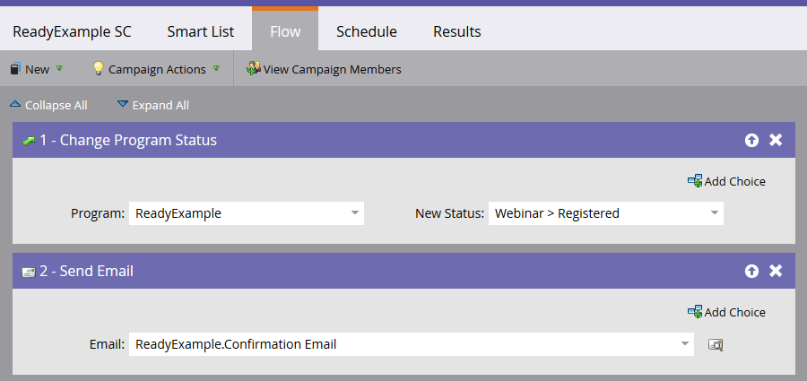
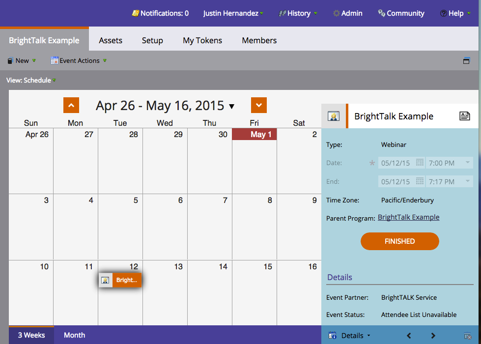

# ReadyTalk を使用したイベントの作成 {#create-an-event-with-readytalk}

>[!PREREQUISITES]
>
>* [ReadyTalk を LaunchPoint サービスとして追加](/help/marketo/product-docs/administration/additional-integrations/add-readytalk-as-a-launchpoint-service.md)
>* [新しいイベントプログラムの作成](/help/marketo/product-docs/demand-generation/events/understanding-events/create-a-new-event-program.md)
>* 適切な[フローアクション](/help/marketo/product-docs/core-marketo-concepts/smart-campaigns/flow-actions/add-a-flow-step-to-a-smart-campaign.md)を設定して、エンゲージメントをトラック

まず、ReadyTalk カンファレンスセンターでイベントが設定されていることを確認します。ヘルプが必要な場合は、[ReadyTalk リソースセンター](https://www.readytalk.com/resources/readytalk)をご覧ください。登録タイプを選択する際、「**ミーティング前に事前登録**」を選択します。「_ミーティング時に登録_」を選択した場合、Marketo は登録済みステータスを&#x200B;**取り込みません**。ウェビナーが&#x200B;_終了した後_&#x200B;に、「出席済み」の個人ステータスを取り込みます。

「**新しい登録をメール経由で通知**」は、チェックしないままにします。

ReadyTalk を使用して確認メールを送信する場合は、説明も追加する必要があります。終わったら、ReadyTalk でイベントを選択します。

>[!NOTE]
>
>オペレーター支援イベントをスケジュールするには、カンファレンスセンターのホーム画面の左側にある「**イベントサービスをリクエスト**」リンクをクリックして、イベントチームとのイベントのスケジュールを設定します。

これで、イベントを Marketo にリンクする準備が整いました。

1. イベントを選択し、「**イベントアクション**」をクリックし、最後に「**イベント設定**」をクリックします。

   

   >[!NOTE]
   >
   >選択するイベントのチャネルタイプは、**ウェビナー**&#x200B;である必要があります。

1. 「**イベントパートナー**」で、「**ReadyTalk**」を選択します。

   

1. 「**ログイン**」で、「ReadyTalk ログイン」を選択します。

   

1. 「**イベント**」で、リンクするイベントを選択し、「**保存**」をクリックします。

   

   作業は以上です。これで、イベントが同期されました。

   >[!NOTE]
   >
   >Marketo が送信するフィールドは、姓、名、メールアドレスです。

   >[!TIP]
   >
   >登録後の確認メールにこの固有 URL を挿入するには、メールに `{{member.webinar url}}` トークンを使います。確認 URL が送信されるときに、このトークンは各リード固有の確認 URL に自動的に変換されます。
   >
   >登録する人が、配信停止を希望する場合に確認情報を受け取れるように、確認メールを「オペレーショナル」に設定します。

   

   >[!CAUTION]
   >
   >ネストされたメールプログラムを使用して確認メールを送信しないでください。代わりに、上に示しているように、イベントプログラムのスマートキャンペーンを使用します。

   >[!TIP]
   >
   >Marketo にデータが表示されるまでには、最大 48 時間かかる場合があります。48 時間待っても何も表示されない場合は、イベントの「**概要**」タブの「イベントアクション」メニューから「**ウェビナープロバイダーから更新**」を選択してください。

## スケジュールの表示 {#viewing-the-schedule}

プログラムスケジュール表示で、イベントのカレンダーエントリをクリックします。画面の右側にスケジュールが表示されます。

ウェビナーに新規登録したリードは、新規ステータスが「登録」に設定されたときに、プログラムステータスを変更フローステップによってウェビナープロバイダーにプッシュされます。その他のステータスではプッシュされません。また、プログラムステータスを変更フローステップ #1 とメールを送信フローステップ #2 を必ず設定してください。
