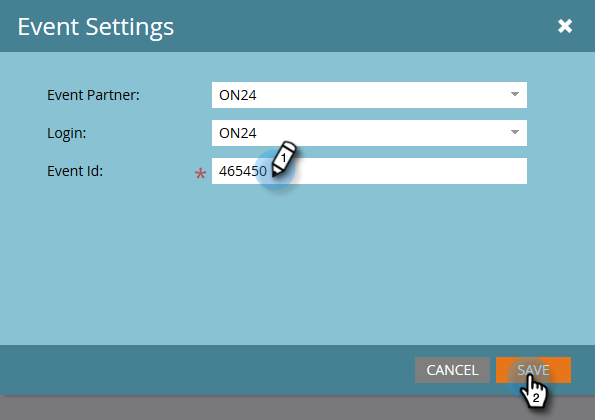

# イベント設定の指定とマーケティングとウェビナーとの同期 {#configure-event-settings-and-sync-marketo-with-your-webinar}

Marketorイベントを設定し、MarkettoとON24を接続するには、次の手順に従います。

## イベントの設定 {#set-the-event}

1. ON24ウェビナーに関連付けるイベントを選択し、 **イベントアクション** ドロップダウンをクリックして、「 **イベント設定**」を選択します。

   

1. イベントパートナーとしてON24を選択します。

   

1. ログインアカウント（表示名など）を選択します。

   

1. イベントIDを入力します（ON24から取得します）。 「 **保存**」をクリックします。

   

   >[!NOTE]
   >
   >ピーク時には、ON24がイベント情報をMarketorに提供するまで15 ～ 20分かかる場合があります。 「セッションIDが無効です」というメッセージが表示された場合は、後でもう一度お試しください。

## スケジュールの設定 {#set-the-schedule}

ON24ウェビナーに関連付けられたイベントを設定すると、イベントスケジュールにON24からのデータが入力されます。 [イベントスケジュール]ダイアログボックスにアクセスするには、次の手順に従います。

1. イベントを選択します。 「 **イベントアクション** 」ドロップダウンをクリックし、「 **スケジュール」を選択します。**

   

1. 「 **開始日」、「終了日**」および「 **タイムゾーン**」を選択します。 「 **保存**」をクリックします。

   

   >[!NOTE]
   >
   >ON24でイベント情報を更新する場合、新しいデータ入力を確認するには、イベントアクションメニューのウェビナープロバイダー **(WebViewer** )で「更新」をクリックする必要があります。

   [子キャンペーンとローカルアセットの作成](create-child-campaigns-and-local-assets.md)

次の手順に進むことができます。.

>[!NOTE]
>
>**関連記事**
>
>* [On24アダプタイベントについて](understanding-marketo-on24-adapter-events.md)
>* [子キャンペーンとローカルアセットの作成](create-child-campaigns-and-local-assets.md)

>

