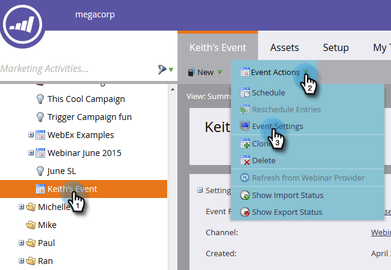
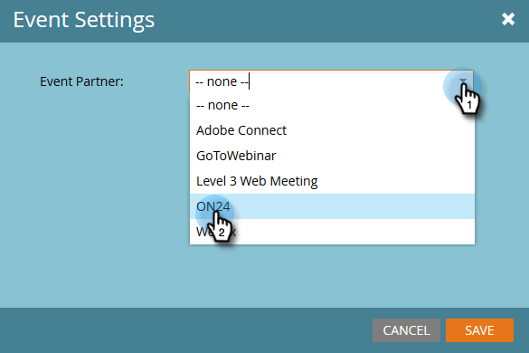
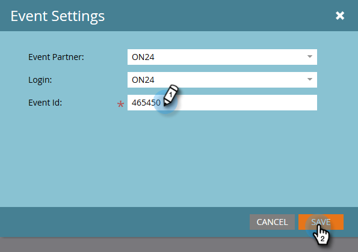

# イベントの設定と Marketo とウェビナーの同期 {#configure-event-settings-and-sync-marketo-with-your-webinar}

Marketo イベントを設定して Marketo と ON24 を接続するには、次の手順に従います。

## イベントの設定 {#set-the-event}

1. ON24 ウェビナーに関連付けるイベントを選択し、**[!UICONTROL イベントアクション]**&#x200B;ドロップダウンをクリックして、「**[!UICONTROL イベントの設定]**」を選択します。

   

1. [!UICONTROL イベントパートナー]として「ON24」を選択します。

   

1. [!UICONTROL ログイン]アカウント（表示名など）を選択します。

   

1. [!UICONTROL イベント ID] を入力します（ON24 から取得）。 「**[!UICONTROL 保存]**」をクリックします。

   

   >[!NOTE]
   >
   >ON24 が Marketo でイベント情報を利用できるようになるまでには、ピーク時で 15 ～ 20 分かかる場合があります。 「無効なセッション ID」というメッセージが表示された場合は、後でもう一度やり直してください。

## スケジュールを設定 {#set-the-schedule}

ON24 ウェビナーに関連付けられたイベントを設定すると、イベントスケジュールに ON24 のデータが入力されます。 [!UICONTROL イベントスケジュール]ダイアログボックスにアクセスするには、次の手順に従います。

1. イベントを選択します。 **[!UICONTROL イベントアクション]**&#x200B;ドロップダウンをクリックして「**[!UICONTROL スケジュール]」を選択します。**

   

1. **[!UICONTROL 開始日]**、**[!UICONTROL 終了日]**、**[!UICONTROL タイムゾーン]**&#x200B;を選択します。 「**[!UICONTROL 保存]**」をクリックします。

   

   >[!NOTE]
   >
   >ON24 でイベント情報を更新する場合は、[!UICONTROL イベントアクション]メニューの「**[!UICONTROL ウェビナープロバイダーから更新]**」をクリックし、新しいデータが入力されることを確認する必要があります。

次の[子キャンペーンとローカルアセットの作成](/help/marketo/product-docs/demand-generation/events/create-an-event/create-an-event-with-the-marketo-on24-adapter/create-child-campaigns-and-local-assets.md){target="_blank"}手順に進むことができます。

>[!MORELIKETHIS]
>
>[Marketo ON24 アダプターイベントについて](/help/marketo/product-docs/demand-generation/events/create-an-event/create-an-event-with-the-marketo-on24-adapter/understanding-marketo-on24-adapter-events.md){target="_blank"}
