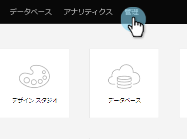
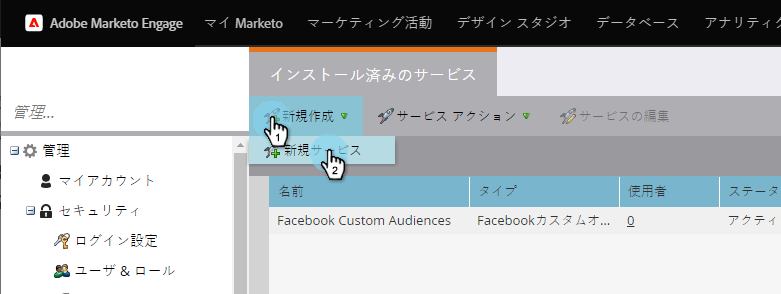

# Marketor {#enter-your-on-credentials-in-marketo}にON24資格情報を入力します

ON24イベント統合を開始します。 資格情報を編集または削除する必要が生じた場合は、これらの手順も以下のとおりです。

## 資格情報を入力{#enter-credentials}

1. Marketorにログインし、**管理者**&#x200B;をクリックします。

   

1. 統合で、**LaunchPoint**&#x200B;をクリックします。

   

1. 「インストール済みのサービス」で、「**新規**」をクリックし、「**新規サービス**」をクリックします。

   

1. New Serviceダイアログボックスで、次の情報を入力します。

   * **表示名**  — マーケティング担当者で使用する名前を入力します。資格情報を共有する場合は、自分の名前、またはグループの名前を指定できます。
   * **サービス**  — ドロップダウンメニュー **から「On24** 」を選択します。
   * **クライアントキー**  — サインインに使用するON24クライアントキーを入力します。クライアントキーは、文字と数字を組み合わせた32桁の文字列です。
   * **クライアントID**  — サインインに使用する4桁のON24クライアントIDを入力します。ON24アカウントマネージャーからクライアントIDとクライアントキーを直接取得できます。

   

1. 「**作成**」をクリックします。

   

1. 資格情報は、検証が完了すると、インストール済みのサービスページに追加されます。 エラーが発生した場合は、資格情報を保存できません。

## 資格情報の編集{#edit-credentials}

パスワードの有効期限が切れた場合や、既存の秘密鍵証明書を変更する必要がある場合は、秘密鍵証明書を編集できます。

1. 「Installed Services」タブで、編集する秘密鍵証明書を選択し、「**Edit Service**」をクリックします。

   

1. 「Edit Service」ダイアログ・ボックスで情報を更新し、「**Save**」をクリックします。

   

## サービスの削除{#delete-a-service}

1. 「インストール済みのサービス」タブで、削除するサービスを選択し、「**サービスアクション**」ドロップダウンをクリックして、「**サービスを削除**」を選択します。

   

1. 「**削除**」をクリックします。

   

次のステップは、ON24](/help/marketo/product-docs/demand-generation/events/create-an-event/create-an-event-with-the-marketo-on24-adapter/create-your-webinar-event-in-on24.md)でウェビナーイベントを作成することです。[

>[!MORELIKETHIS]
>
>[ON24アダプタイベントについて](/help/marketo/product-docs/demand-generation/events/create-an-event/create-an-event-with-the-marketo-on24-adapter/understanding-marketo-on24-adapter-events.md)
