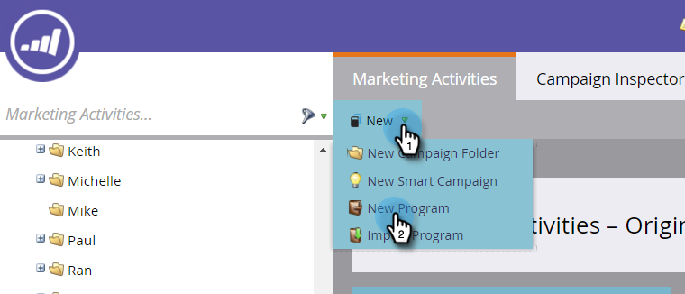
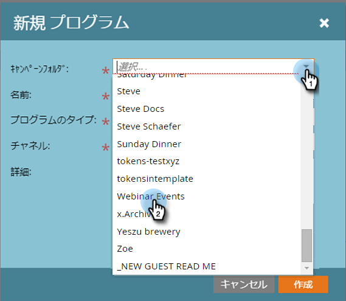
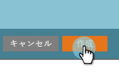
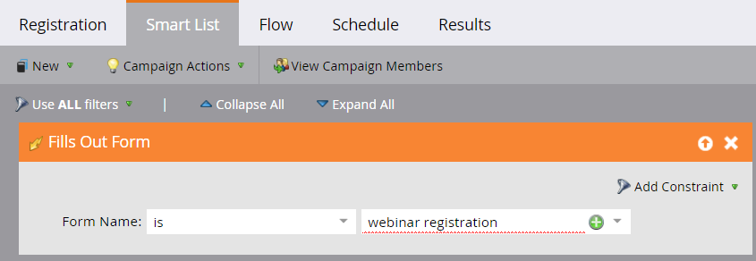

# ON24イベント統合の例 {#example-on-event-integration}

以下は、キャンペーンを含むON24ウェビナーのサンプルイベントです。 イベントを構築する場合は、キャンペーンを実行する前に必ずテストしてください。

## マーケティングアクティビティでの新しいイベントの作成 {#create-a-new-event-in-marketing-activities}

1. 「 **新規** / **新規プログラム**」を選択します。

   

1. イベントが存在する **キャンペーンフォルダ** を選択します。

   

1. イベントの **名前** を入力します。

   

1. 「 **プログラムタイプ**」で「**イベント**」を選択します。

   

1. イベントの**チャネル**として「**ウェビナー**」を選択します。

   

1. 「 **作成**」をクリックします。

   

## 招待(バッチキャンペーン)  {#invite-batch-campaign}

* **スマートリスト** -イベントに招待するユーザーを定義します。
* **フロー**

   * 電子メールを送信 — ローカルアセットの電子メールの場合、命名には次の規則が適用されます。EventName.EmailName。 グローバル電子メールを使用することもできます。
   * 進行状況の変更 — ウェビナー/招待に設定します。

* **スケジュール** — 招待を送信する日付を設定します。

## 登録/確認(トリガーキャンペーン) {#registration-confirmation-trigger-campaign}

* **スマートリスト**

   * 「 **Fills Out Form**」に基づいてキャンペーンをトリガーします。 フォームが存在するランディングページは、 **制約を使用して必ず含めてください**。特に、フォームが複数のランディングページで使用されている場合はその制約を使用します。

>[!CAUTION]
>
>登録データをMarketorにプッシュするには、Marketoフォームを使用してイベントに対してユーザーを登録するか、Marketoフォーム以外のフォームを適切なAPI統合に統合する必要があります。 これは、イベントパートナーの統合を成功させるうえで重要です。 **注**:Marketor以外のランディングページでMarketorフォームを使用している場合、トリガーはForm **Nameを使用してForm** Inputフォームに入力します。

* **フロー**

   * **進行状況の変更** — ウェビナー/登録済に設定します。 **注意**:このフローステップは、子キャンペーンを設定する場合に必要です。 個人の進行状況ステータスが「 **登録済み**」に変わると、マーケティング担当者は登録情報を「ON24」にプッシュします。

   * **電子メールの送信** — 確認の電子メール( **登録済みの未登録のユーザーが引き続き電子メールを受け取れるように「** 操作」に設定)

**注**:登録エラーが発生して返品された場合、そのユーザーは電子メールの確認を受け取りません。

## Reminder(Batchキャンペーン) {#reminder-batch-campaign}

* **スマートリスト** -プログラムの **メンバーを使用してフィルタリングし** 、ステータスを「 **登録済み**」に設定します。

* **フロー** — 電子メールの送信（リマインダーの電子メール）。

**注**:同様のキャンペーンを使用して、招待されたがまだ登録していない人に *別の* 、フォローアップ電子メールを送信できます。

## フォローアップキャンペーン(バッチまたはトリガーキャンペーン) {#follow-up-campaign-batch-or-trigger-campaign}

* **スマートリスト** -プログラムステータスの変更に基づいてトリガーします。

* **フロー** — 電子メールの送信。 選択肢を使用して、プログラムステータスに基づいて異なる電子メールを送信します。

>[!MORELIKETHIS]
>
>* [ON24アダプタイベントについて](understanding-marketo-on24-adapter-events.md)

>

