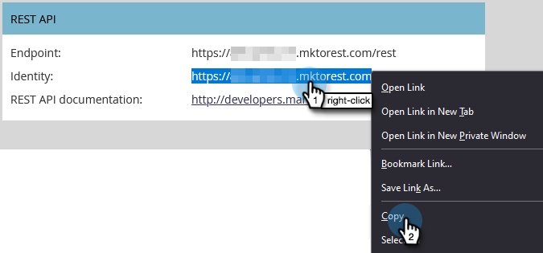

# Marketoとの ON24 統合の設定{#set-up-the-on24-integration-with-marketo}

ON24 イベント統合の設定方法を以下に示します。

## API 専用のロールの作成 {#Create an API Only Role}

1. My Marketo で、「**管理者**」をクリックします。

   

1. 「セキュリティ」で「**ユーザーと役割**」をクリックします。

   

1. 「**役割**」タブをクリックしてから、「**新規の役割**」をクリックします。

   

1. ロール名を入力します。 を開きます。 **API にアクセス** メニューを開き、「読み取り/書き込みカスタムオブジェクト」と「読み取り/書き込み担当者」を選択します。 「**作成**」をクリックします。

   

## ユーザーを新規作成する {#create-a-new-user}

1. 引き続き「ユーザーとロール」で、 **ユーザー** タブをクリックし、 **新しいユーザーの招待**.

   

1. 新しいユーザーの情報を入力し、 **次へ**.

   

1. 先ほど作成した ON24 API のみのロールを選択します。 を選択します。 **API のみ** チェックボックス。 「**次へ**」をクリックします。

   

1. 「**送信**」をクリックします。

   

>[!NOTE]
>
>API のみのユーザーには招待状は必要ありません。

## ON24 接続のセットアップ {#set-up-on24-connection}

1. 引き続き「管理者」セクションで、「 **LaunchPoint**.

   

1. クリック **新規** その後 **新しいサービス**.

   

1. 表示名を選択します。 次をクリック： **サービス** ドロップダウンして「 」を選択します。 **カスタム**. 説明を入力します。 「 API のみのユーザー」ドロップダウンをクリックし、作成したユーザーを選択します [上記の手順で](#create-a-new-user). 「**作成**」をクリックします。

   

1. 作成したカスタム LaunchPoint サービスを見つけ、「詳細を表示」をクリックします。

   

1. クライアント ID をハイライトし、右クリックしてコピーし、保存します（後で必要になります）。 クライアントの秘密鍵に対してこの手順を繰り返します。

   

1. 左側のツリーで、「Web サービス」をクリックします。

   

1. 「REST API」で、ハイライト表示し、右クリックし、コピーして、ID の最初の部分を保存します（.com の「m」まで）。

   

1. 保存したクライアント ID、クライアントの秘密鍵、ID を使用して、ON24 アカウントに移動します。 残りの手順は、ここで実行され、以下が実行されます。 [概要](https://on24support.force.com/Support/s/article/Connect-Marketo-ON24-Connect-Data-Integration#Step6){target=&quot;_blank&quot;}。
