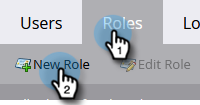

# ON24 と Marketo の統合設定{#set-up-the-on24-integration-with-marketo}

ON24 イベント統合の設定方法を以下に示します。

## API 専用ロールの作成 {#create-an-api-only-role}

1. My Marketo で、「**管理者**」をクリックします。

   

1. 「セキュリティ」で「**ユーザーと役割**」をクリックします。

   

1. 「**役割**」タブをクリックしてから、「**新規の役割**」をクリックします。

   

1. ロール名を入力します。**Access API** メニューを開き、「読み取り／書き込みカスタムオブジェクト」および「読み取り／書き込み担当者」を選択します。「**作成**」をクリックします。

   

## 新規ユーザを作成 {#create-a-new-user}

1. 「ユーザ＆ロール」で、「**ユーザ**」タブをクリックし、「**新規ユーザを招待**」をクリックします。

   

1. 新規ユーザの情報を入力し、「**次へ**」をクリックします。

   

1. 作成した ON24 API 専用ロールを選択します。「**API 専用**」チェックボックスを選択します。「**次へ**」をクリックします。

   

1. 「**送信**」をクリックします。

   

>[!NOTE]
>
>API 専用ユーザの場合、招待は必要ありません。

## ON24 接続の設定 {#set-up-on24-connection}

1. 「管理者」セクションで、「**LaunchPoint**」をクリックします。

   

1. 「**新規**」をクリックしてから、「**新規サービス**」をクリックします。

   

1. 表示名を選択します。「**サービス**」ドロップダウンをクリックし、「**カスタム**」を選択します。説明を入力します。API 専用ユーザドロップダウンをクリックし、[上記の手順](#create-a-new-user)で作成したユーザを選択します。「**作成**」をクリックします。

   

1. 作成したカスタム LaunchPoint サービスを探し、「詳細を表示」をクリックします。

   

1. クライアント ID をハイライト表示し、右クリックしてコピーし、保存します（後で必要になります）。クライアント秘密鍵に対して繰り返します。

   

1. 左側のツリーで、「web サービス」をクリックします。

   

1. 「REST API」で、ID の最初の部分（.com の「m」まで）をハイライト表示、右クリック、コピーおよび保存します。

   

1. 保存したクライアント ID、クライアント秘密鍵および ID を使用して、ON24 アカウントに移動します。残りの手順はそこで実行します。[ON24 ドキュメント](https://support.on24.com/hc/ja-jp/articles/21420762650523-Data-Integration-Setup-Instructions-When-Using-Marketo-Registration-Option-1){target="_blank"}を参照してください。
