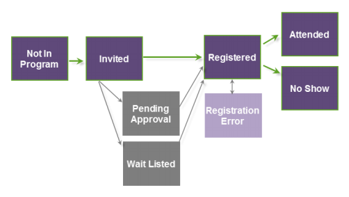

# ウェビナープログラムのステータスについて {#understanding-webinar-program-statuses}

プログラムステータスは、イベントのメンバーとして人が進行する様々なイベントステータスを表します。 これらはチャネルタイプに関連付けられています。 Marketo には、**ウェビナー**&#x200B;というビルトインのチャネルタイプがあります。 ステータスは、バッチとトリガーキャンペーンの両方で使用できます。

ユーザは、プログラムのステータス間を線形的に移動し、逆には移動しません。 例えば、ステータスが&#x200B;**Attended**&#x200B;の人は、**Registered**&#x200B;に戻ることができません。

次に、ウェビナーチャネルに関連するプログラムステータスの簡単な説明を示します。

>[!TIP]
>
>ステータスを手動で更新するには、**イベントアクション**&#x200B;ドロップダウンリストで「**ウェビナープロバイダーから更新**&#x200B;を」クリックします。

**プログラムに含まれていない** - このステータスを使用して、イベントからユーザを削除します。

**招待済み** - このステータスを使用して、イベントにユーザを追加します。

**承認待ち** - このステータスを使用して、確認メールの送信を保留します。 詳しくは、[ON24 イベント登録のアップデート](/help/marketo/product-docs/demand-generation/events/create-an-event/create-an-event-with-the-marketo-on24-adapter/on24-event-registration-updates.md){target="_blank"}を参照してください。

**待機リスト** - このステータスを使用して、追加のシートが利用可能になるまでユーザーを待機させます。

**却下** - このステータスを使用して、ユーザのイベントへの登録を拒否します。

**登録済み** - ON24 統合を使用している場合、このステータスによりユーザが ON24 にプッシュされます。 ON24 がユーザが正常に登録されたと応答すると、そのユーザのステータスがアップデートされます。

**登録エラー** - このステータスは、ユーザがイベントに登録しようとした際にエラーが発生したことを反映しています。

>[!NOTE]
>
>登録エラーが発生した場合は、プログラムの「メンバー」タブの「ステータスの理由」列を見て、そのユーザの追加情報を取得できます。 エラーが修正されたら、Marketo 内でユーザのプログラムステータスを手動で「登録済み」に変更できます。

**出席** - ウェビナーの終了時に、ON24 は出席者のリストを返します。 このステータスは Marketo に自動的に取り込まれます。

**オンデマンドで出席** - アーカイブバージョンのウェビナーに参加した人は、このステータスを受け取ります。

**欠席** - ウェビナーの終了時および ON24 から出席データを取り込むと、登録したが出席しなかった人のステータスが「欠席」にアップデートされます。 ON24 が最終的な出席情報を準備して Marketo で利用できるようにするには、30 分から 3 時間かかる場合があります。

>[!NOTE]
>
>Marketo が「欠席」ステータスを引き出すには、ユーザは *Marketo* で登録されている必要があります。 No On24 データフィードから取得された番組はキャプチャできません。

>[!MORELIKETHIS]
>
>[Marketo ON24 アダプターイベントについて](/help/marketo/product-docs/demand-generation/events/create-an-event/create-an-event-with-the-marketo-on24-adapter/understanding-marketo-on24-adapter-events.md){target="_blank"}
